

  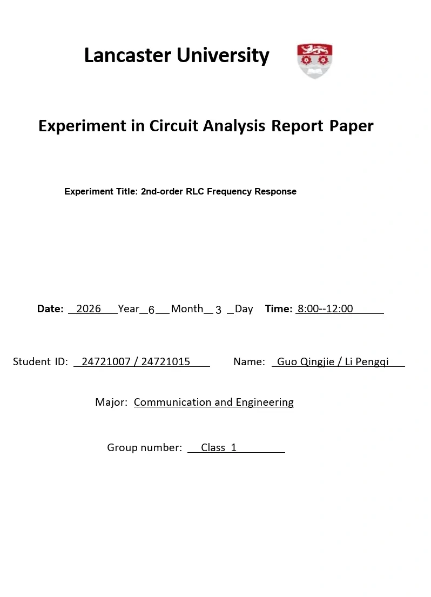

## 1. Introduction

The main objective of this laboratory exercise is to investigate the frequency response of second-order RLC resonant circuits. Resonance is a fundamental phenomenon in AC circuits containing both inductance and capacitance. In a series RLC circuit, resonance occurs when the inductive reactance and capacitive reactance cancel each other. Under this condition, the circuit impedance is minimized and the current reaches its maximum value. In a parallel RLC circuit, resonance occurs when the inductive and capacitive branch currents cancel each other, so the equivalent impedance reaches a maximum.

This experiment consists of two main sections. In **Section 1**, a series RLC circuit was tested with two external resistors, $10\text{ }\Omega$ and $100\text{ }\Omega$. The resonance frequency, cutoff frequencies, bandwidth, quality factor, current-frequency curve, and capacitor voltage magnification were measured. In **Section 2**, a parallel RLC circuit was driven by a current-source circuit. In the practical measurement, a $51\text{ k}\Omega$ series resistor was used with the function generator to approximate a current source. In the simulation, the op-amp current-source structure from the lab reference circuit was used.

A key part of this report is the use of measured component values instead of only nominal values. The measured inductance, capacitance, inductor winding resistance, capacitor equivalent series resistance, and function generator internal resistance were included in the adjusted theoretical calculations. This provides a more realistic comparison among theory, simulation, and measurement.

## 2. Equipment and Components Used

The following instruments and components were used:

* **Function Waveform Generator**: Used to provide the sinusoidal input voltage.
* **Digital Oscilloscope (2-Channel)**: Used to observe waveforms and measure peak-to-peak voltage.
* **LCR Meter**: Used to measure component values and quality factors.
* **Multisim**: Used to simulate the series and parallel RLC frequency responses.
* **Breadboard and Jumper Wires**: Used for practical circuit assembly.
* **Resistors**: $10\text{ }\Omega$, $100\text{ }\Omega$, and $51\text{ k}\Omega$.
* **Inductor**: Rated near $20\text{ mH}$ / $22\text{ mH}$.
* **Capacitor**: Rated $47\text{ nF}$.

## 3. Theoretical Background & Adjusted Equations

### 3.1 Series RLC Circuit

For a series RLC circuit, the total impedance is

$$
Z(j\omega)=R+j\left(\omega L-\frac{1}{\omega C}\right)
$$

The current is

$$
I=\frac{V_S}{Z(j\omega)}
$$

At resonance,

$$
\omega_0L=\frac{1}{\omega_0C}
$$

Therefore, the resonant frequency is

$$
f_0=\frac{1}{2\pi\sqrt{LC}}
$$

Using the measured component values,

$$
L=19.9595\text{ mH},\quad C=44.2445\text{ nF}
$$

the adjusted theoretical resonance frequency is

$$
f_0\approx 5.36\text{ kHz}
$$

The practical circuit contains additional resistance. Therefore, the total series resistance is estimated as

$$
R_{\text{total}}=R+R_s+r_L+r_C
$$

where $R_s$ is the function generator internal resistance, $r_L$ is the inductor winding resistance, and $r_C$ is the capacitor ESR.

For the two series cases:

$$
R_{\text{total},10\Omega}=10.11+52.15+76.3286+14.4147\approx 153.00\text{ }\Omega
$$

$$
R_{\text{total},100\Omega}=99.35+52.15+76.3286+14.4147\approx 242.24\text{ }\Omega
$$

The adjusted bandwidth is

$$
B=\frac{R_{\text{total}}}{2\pi L}
$$

and the quality factor is

$$
Q_0=\frac{f_0}{B}
$$

The current was calculated from the measured voltage across the external resistor:

$$
I=\frac{V_R}{R}
$$

For a series RLC circuit, the capacitor voltage at resonance is magnified. The expected relationship is

$$
\frac{V_{C0}}{V_S}\approx Q_0
$$

### 3.2 Parallel RLC Circuit

For the practical parallel RLC test, the function generator was connected in series with a $51\text{ k}\Omega$ resistor to approximate a current source. Since $51\text{ k}\Omega$ is much larger than the function generator internal resistance, the source current is approximately constant.

The approximate source current is

$$
i_0\approx\frac{V_S}{R_i+R_s}
$$

where

$$
R_i=51\text{ k}\Omega,\quad R_s=52.15\text{ }\Omega
$$

With $V_S=5.12\text{ V}_{pp}$,

$$
i_0\approx\frac{5.12}{51000+52.15}=0.100\text{ mA}_{pp}
$$

For the Multisim simulation, the op-amp current-source reference structure was used. The ideal op-amp keeps its inverting and non-inverting inputs nearly equal, so the current through the current-setting resistor is approximately

$$
i_0=\frac{V_1}{R_1}
$$

In a parallel resonant circuit, the equivalent impedance is maximum at resonance. Therefore, if it is driven by a current source,

$$
V_o=i_0Z
$$

and $V_o$ reaches a maximum at resonance.

The quality factor is calculated by

$$
Q=\frac{f_0}{B}
$$

where

$$
B=f_2-f_1
$$

For the parallel circuit comparison, the theoretical quality factor was taken as the measured inductor quality factor:

$$
Q_{\text{theory}}=Q_L\approx8.39
$$

## 4. Experimental Procedure

### 4.1 Component Calibration

The resistors, inductor, capacitor, and function generator internal resistance were measured before the main test. These measured values were used in the adjusted theoretical model and the Multisim simulation.

    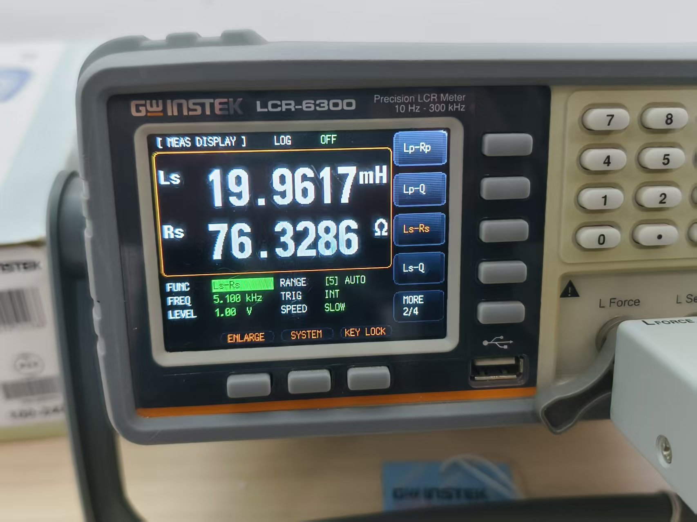

    <em>Figure 1: LCR meter measurement of the inductor in series model.</em>

    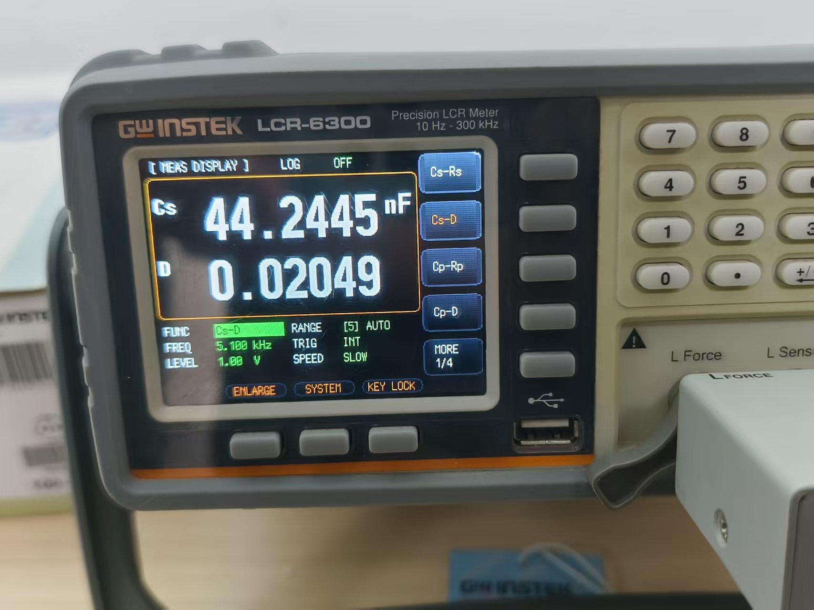

    <em>Figure 2: LCR meter measurement of the capacitor.</em>

### 4.2 Series RLC Practical Measurement

The series RLC circuit was assembled on the breadboard. The function generator provided the sinusoidal input voltage. Oscilloscope CH1 monitored the input voltage $V_S$, and CH2 monitored the resistor voltage $V_R$. The frequency was swept from $2\text{ kHz}$ to $10\text{ kHz}$.

    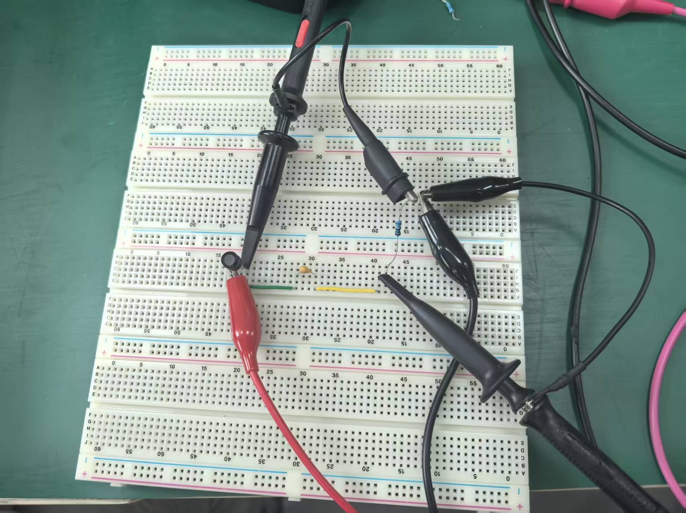

    <em>Figure 3: Actual breadboard setup for the series RLC resonance measurement.</em>

The resonance frequency was obtained from the maximum value of $V_R$, because $I=V_R/R$. The cutoff frequencies were obtained when the current dropped to $I_{\max}/\sqrt{2}$. The same procedure was repeated for $R=10.11\text{ }\Omega$ and $R=99.35\text{ }\Omega$.

### 4.3 Oscilloscope Observation

The oscilloscope was used to monitor the waveforms and confirm the peak-to-peak voltage readings during the experiment.

    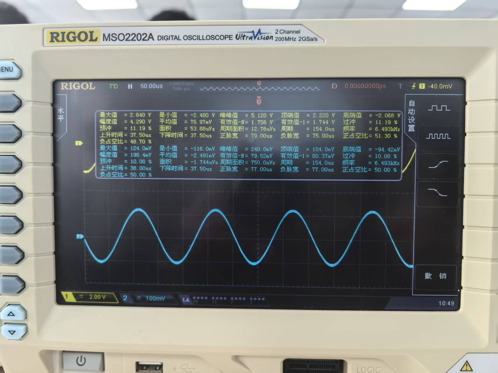

    <em>Figure 4: Representative oscilloscope waveform recorded during the RLC resonance experiment.</em>

### 4.4 Parallel RLC Practical Measurement

The parallel RLC circuit was assembled on the breadboard. The practical circuit used a $51\text{ k}\Omega$ resistor in series with the function generator to approximate a current source. The output voltage $V_o$ was measured across the parallel RLC network.

    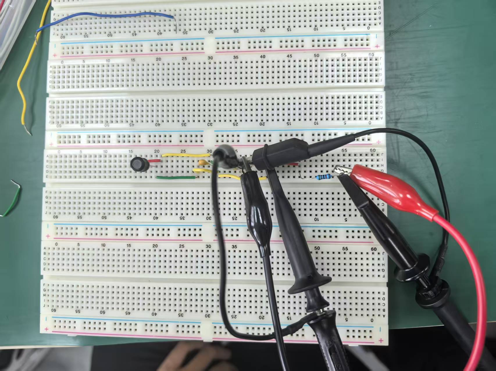

    <em>Figure 5: Actual breadboard setup for the parallel RLC resonance measurement.</em>

## 5. Practical Measurements, Simulation, and Analysis

### 5.1 Calibrated Component Values

| Component Name | Nominal Value | Measured Value | Notes |
| :--- | :--- | :--- | :--- |
| $R_1$ | $10\text{ }\Omega$ | $10.11\text{ }\Omega$ | Used in series RLC Case 1 |
| $R_2$ | $100\text{ }\Omega$ | $99.35\text{ }\Omega$ | Used in series RLC Case 2 |
| Function generator internal resistance | — | $52.15\text{ }\Omega$ | Included in adjusted model |
| $L_s$ | $20\text{ mH}$ / $22\text{ mH}$ | $19.9595\text{ mH}$ | $r_L=76.3286\text{ }\Omega$, $Q_L=8.38693$ |
| $C_s$ | $47\text{ nF}$ | $44.2445\text{ nF}$ | $r_C=14.4147\text{ }\Omega$, $Q_C=48.80$ |
| Current-source resistor $R_i$ | $51\text{ k}\Omega$ | $51\text{ k}\Omega$ | Used in practical parallel RLC measurement |

### 5.2 Adjusted Theoretical Values

| Case | Total Resistance Used | Theory $f_0$ | Theory Bandwidth $B$ | Theory $Q$ |
| :--- | :--- | :--- | :--- | :--- |
| Series RLC, $R=10.11\text{ }\Omega$ | $153.00\text{ }\Omega$ | $5.36\text{ kHz}$ | $1.22\text{ kHz}$ | $4.39$ |
| Series RLC, $R=99.35\text{ }\Omega$ | $242.24\text{ }\Omega$ | $5.36\text{ kHz}$ | $1.93\text{ kHz}$ | $2.77$ |
| Parallel RLC | Current-source drive | $5.36\text{ kHz}$ | $0.64\text{ kHz}$ | $8.39$ |

### 5.3 Multisim Simulation: Series RLC with $R=10.11\text{ }\Omega$

The simulated circuit includes the function generator internal resistance, inductor winding resistance, and capacitor ESR.

    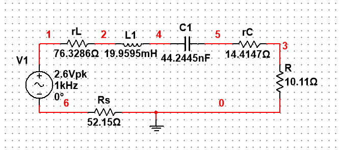

    <em>Figure 8: Multisim schematic of the series RLC circuit with $R=10.11\text{ }\Omega$.</em>

The simulated current-frequency response is shown below. The cutoff points were selected at $I_{\max}/\sqrt{2}$.

    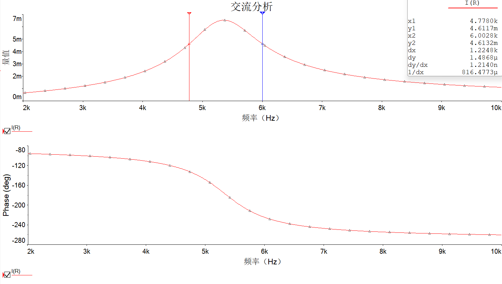

    <em>Figure 10: Simulated $I-f$ response of the series RLC circuit with $R=10.11\text{ }\Omega$.</em>

| Quantity | Simulation Value |
| :--- | :--- |
| Resonance frequency $f_0$ | $5.3626\text{ kHz}$ |
| Maximum current $I_{\max}$ | $6.5353\text{ mA}$ |
| Cutoff current $I_{\text{cutoff}}$ | $4.6212\text{ mA}$ |
| Lower cutoff frequency $f_1$ | $4.7780\text{ kHz}$ |
| Upper cutoff frequency $f_2$ | $6.0028\text{ kHz}$ |
| Bandwidth $B$ | $1.2248\text{ kHz}$ |
| Quality factor $Q$ | $4.38$ |

### 5.4 Practical Measurement: Series RLC with $R=10.11\text{ }\Omega$

Current is calculated by

$$
I=\frac{V_R}{10.11\text{ }\Omega}
$$

| Frequency ($f$) | $V_S$ | $V_R$ | Calculated Current ($I$) | Notes |
| :--- | :--- | :--- | :--- | :--- |
| 2.00 kHz | 5.20 Vpp | 40 mVpp | 3.96 mApp |  |
| 3.00 kHz | 5.20 Vpp | 78 mVpp | 7.72 mApp |  |
| 4.00 kHz | 5.20 Vpp | 178 mVpp | 17.61 mApp |  |
| 4.45 kHz | 5.20 Vpp | 284 mVpp | 28.09 mApp | **f1** |
| 4.50 kHz | 5.20 Vpp | 316 mVpp | 31.26 mApp |  |
| 4.70 kHz | 5.20 Vpp | 372 mVpp | 36.80 mApp |  |
| 4.80 kHz | 5.20 Vpp | 388 mVpp | 38.38 mApp |  |
| 4.90 kHz | 5.20 Vpp | **400 mVpp** | **39.56 mApp** | **f0** |
| 4.95 kHz | 5.20 Vpp | 396 mVpp | 39.17 mApp |  |
| 5.00 kHz | 5.20 Vpp | 316 mVpp | 31.26 mApp | Possible reading uncertainty |
| 5.50 kHz | 5.20 Vpp | 284 mVpp | 28.09 mApp | **f2** |
| 6.00 kHz | 5.20 Vpp | 208 mVpp | 20.57 mApp |  |
| 7.00 kHz | 5.20 Vpp | 132 mVpp | 13.06 mApp |  |
| 8.00 kHz | 5.20 Vpp | 100 mVpp | 9.89 mApp |  |
| 10.00 kHz | 5.20 Vpp | 68 mVpp | 6.73 mApp |  |

**Table 1: Summary of Series RLC Resonance for $R=10.11\text{ }\Omega$**

| Quantity | Measured Value |
| :--- | :--- |
| Resonance frequency $f_0$ | $4.90\text{ kHz}$ |
| Maximum resistor voltage $V_{R,\max}$ | $400\text{ mV}_{pp}$ |
| Maximum current $I_{\max}$ | $39.56\text{ mA}_{pp}$ |
| Lower cutoff frequency $f_1$ | $4.45\text{ kHz}$ |
| Upper cutoff frequency $f_2$ | $5.50\text{ kHz}$ |
| Bandwidth $B$ | $1.05\text{ kHz}$ |
| Quality factor $Q_0$ | $4.67$ |
| Capacitor voltage $V_{C0}$ | $24.4\text{ V}_{pp}$ |
| $V_{C0}/V_S$ | $4.69$ |

### 5.5 Multisim Simulation: Series RLC with $R=99.35\text{ }\Omega$

Only the external resistor was changed from $10.11\text{ }\Omega$ to $99.35\text{ }\Omega$. Other non-ideal component values were kept the same.

    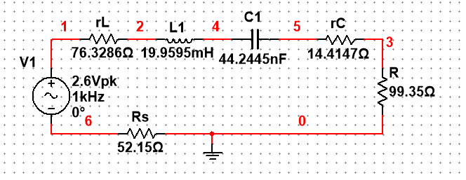

    <em>Figure 9: Multisim schematic of the series RLC circuit with $R=99.35\text{ }\Omega$.</em>

    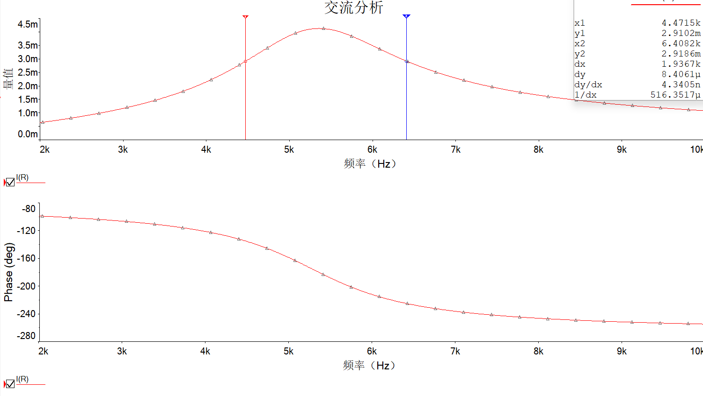

    <em>Figure 11: Simulated $I-f$ response of the series RLC circuit with $R=99.35\text{ }\Omega$.</em>

| Quantity | Simulation Value |
| :--- | :--- |
| Resonance frequency $f_0$ | $5.3610\text{ kHz}$ |
| Maximum current $I_{\max}$ | $4.1280\text{ mA}$ |
| Cutoff current $I_{\text{cutoff}}$ | $2.9189\text{ mA}$ |
| Lower cutoff frequency $f_1$ | $4.4715\text{ kHz}$ |
| Upper cutoff frequency $f_2$ | $6.4082\text{ kHz}$ |
| Bandwidth $B$ | $1.9367\text{ kHz}$ |
| Quality factor $Q$ | $2.77$ |

### 5.6 Practical Measurement: Series RLC with $R=99.35\text{ }\Omega$

Current is calculated by

$$
I=\frac{V_R}{99.35\text{ }\Omega}
$$

| Frequency ($f$) | $V_S$ | $V_R$ | Calculated Current ($I$) | Notes |
| :--- | :--- | :--- | :--- | :--- |
| 2.00 kHz | 5.12 Vpp | 344 mVpp | 3.46 mApp |  |
| 3.00 kHz | 5.12 Vpp | 760 mVpp | 7.65 mApp |  |
| 4.00 kHz | 5.12 Vpp | 1.52 Vpp | 15.30 mApp |  |
| 4.20 kHz | 5.12 Vpp | 1.72 Vpp | 17.31 mApp | **f1** |
| 4.80 kHz | 5.12 Vpp | 2.36 Vpp | 23.75 mApp |  |
| 4.90 kHz | 5.12 Vpp | 2.44 Vpp | 24.56 mApp |  |
| 4.95 kHz | 5.12 Vpp | **2.44 Vpp** | **24.56 mApp** | **f0** |
| 5.00 kHz | 5.12 Vpp | 2.44 Vpp | 24.56 mApp |  |
| 5.25 kHz | 5.12 Vpp | 2.28 Vpp | 22.95 mApp |  |
| 5.30 kHz | 5.12 Vpp | 2.28 Vpp | 22.95 mApp |  |
| 5.35 kHz | 5.12 Vpp | 2.20 Vpp | 22.14 mApp |  |
| 5.50 kHz | 5.12 Vpp | 2.08 Vpp | 20.94 mApp |  |
| 6.00 kHz | 5.12 Vpp | 1.72 Vpp | 17.31 mApp | **f2** |
| 8.00 kHz | 5.12 Vpp | 920 mVpp | 9.26 mApp |  |
| 10.00 kHz | 5.12 Vpp | 680 mVpp | 6.84 mApp |  |

**Table 2: Summary of Series RLC Resonance for $R=99.35\text{ }\Omega$**

| Quantity | Measured Value |
| :--- | :--- |
| Resonance frequency $f_0$ | $4.95\text{ kHz}$ |
| Maximum resistor voltage $V_{R,\max}$ | $2.44\text{ V}_{pp}$ |
| Maximum current $I_{\max}$ | $24.56\text{ mA}_{pp}$ |
| Lower cutoff frequency $f_1$ | $4.20\text{ kHz}$ |
| Upper cutoff frequency $f_2$ | $6.00\text{ kHz}$ |
| Bandwidth $B$ | $1.80\text{ kHz}$ |
| Quality factor $Q_0$ | $2.75$ |
| Capacitor voltage $V_{C0}$ | $14.4\text{ V}_{pp}$ |
| $V_{C0}/V_S$ | $2.77$ |

### 5.7 Measured Series RLC Resonance Curves

The measured current-frequency curves are plotted below. The $R=10.11\text{ }\Omega$ case shows a sharper peak and higher quality factor than the $R=99.35\text{ }\Omega$ case.

    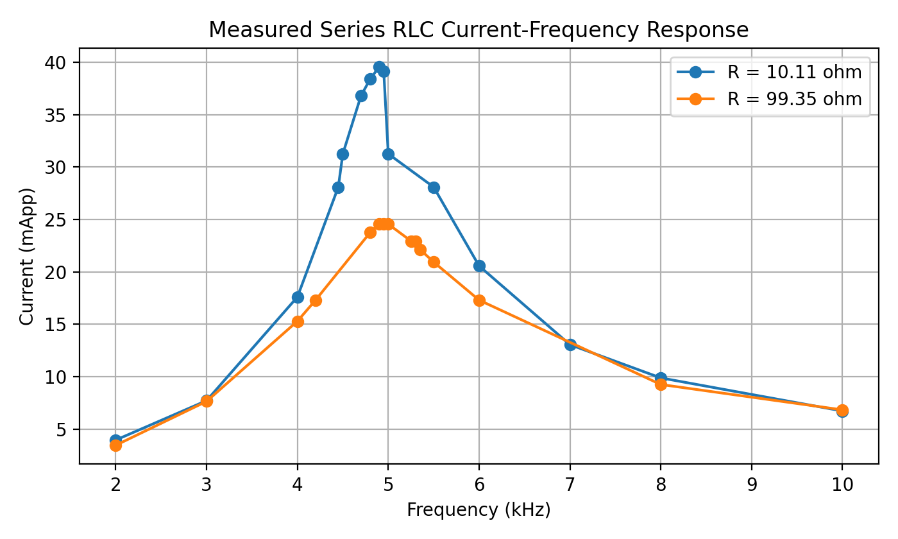

    <em>Figure 6: Measured current-frequency curves for the two series RLC cases.</em>

### 5.8 Verification of Capacitor Voltage Magnification

For the $R=10.11\text{ }\Omega$ case,

$$
\frac{V_{C0}}{V_S}=\frac{24.4}{5.20}=4.69
$$

which is very close to

$$
Q_0=4.67
$$

For the $R=99.35\text{ }\Omega$ case,

$$
\frac{V_{C0}}{V_S}=\frac{14.4}{5.20}=2.77
$$

which is very close to

$$
Q_0=2.75
$$

Therefore, the experiment verifies that the capacitor voltage magnification at resonance is approximately equal to the series circuit quality factor.

### 5.9 Multisim Simulation: Parallel RLC Circuit

The parallel RLC simulation used the op-amp current-source structure. The output was measured as the differential voltage across the parallel RLC network:

$$
V_o=V(3)-V(2)
$$

    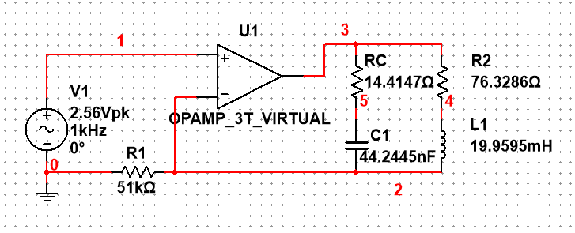

    <em>Figure 12: Multisim schematic of the op-amp current source driving the parallel RLC circuit.</em>

    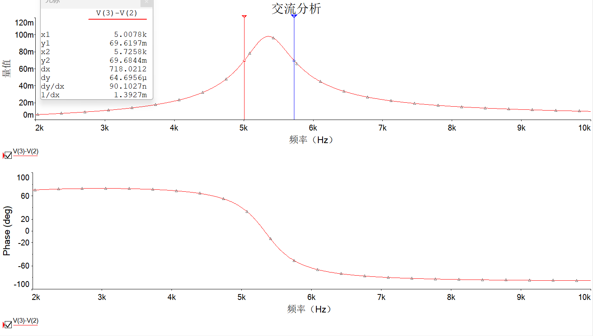

    <em>Figure 13: Simulated magnitude and phase response of $V_o=V(3)-V(2)$ for the parallel RLC circuit.</em>

| Quantity | Simulation Value |
| :--- | :--- |
| Resonance frequency $f_0$ | $5.3527\text{ kHz}$ |
| Maximum output voltage $V_{o,\max}$ | $98.122\text{ mV}$ |
| Cutoff voltage $V_{o,\text{cutoff}}$ | $69.383\text{ mV}$ |
| Lower cutoff frequency $f_1$ | $5.0078\text{ kHz}$ |
| Upper cutoff frequency $f_2$ | $5.7258\text{ kHz}$ |
| Bandwidth $B$ | $0.7180\text{ kHz}$ |
| Quality factor $Q$ | $7.46$ |

### 5.10 Practical Measurement: Parallel RLC Circuit

The practical parallel RLC circuit was driven using the function generator and $51\text{ k}\Omega$ series resistor. The approximate source current was

$$
i_0\approx\frac{5.12}{51000+52.15}=0.100\text{ mA}_{pp}
$$

| Frequency ($f$) | $V_S$ | $V_o$ across Parallel RLC | Notes |
| :--- | :--- | :--- | :--- |
| 2.00 kHz | 5.12 Vpp | 40 mVpp |  |
| 3.00 kHz | 5.12 Vpp | 64 mVpp |  |
| 4.00 kHz | 5.12 Vpp | 112 mVpp |  |
| 4.50 kHz | 5.12 Vpp | 156 mVpp |  |
| 4.80 kHz | 5.12 Vpp | 204 mVpp |  |
| 5.00 kHz | 5.12 Vpp | 256 mVpp |  |
| 5.20 kHz | 5.12 Vpp | 340 mVpp |  |
| 5.27 kHz | 5.12 Vpp | 380 mVpp | **f1** |
| 5.30 kHz | 5.12 Vpp | 396 mVpp |  |
| 5.40 kHz | 5.12 Vpp | 460 mVpp |  |
| 5.50 kHz | 5.12 Vpp | 516 mVpp |  |
| 5.55 kHz | 5.12 Vpp | 532 mVpp |  |
| 5.60 kHz | 5.12 Vpp | **540 mVpp** |  |
| 5.65 kHz | 5.12 Vpp | **540 mVpp** | **f0** |
| 5.70 kHz | 5.12 Vpp | 532 mVpp |  |
| 5.80 kHz | 5.12 Vpp | 492 mVpp |  |
| 6.00 kHz | 5.12 Vpp | 404 mVpp |  |
| 6.04 kHz | 5.12 Vpp | 384 mVpp | **f2** |
| 6.50 kHz | 5.12 Vpp | 240 mVpp |  |
| 7.00 kHz | 5.12 Vpp | 168 mVpp |  |
| 8.00 kHz | 5.12 Vpp | 112 mVpp |  |
| 10.00 kHz | 5.12 Vpp | 72 mVpp |  |

**Table 3: Summary of Parallel RLC Resonance**

| Quantity | Measured Value |
| :--- | :--- |
| Maximum output voltage $V_{o,\max}$ | $540\text{ mV}_{pp}$ |
| Cutoff voltage $V_{o,\text{cutoff}}$ | $381.8\text{ mV}_{pp}$ |
| Resonance frequency $f_0$ | $5.65\text{ kHz}$ |
| Lower cutoff frequency $f_1$ | $5.27\text{ kHz}$ |
| Upper cutoff frequency $f_2$ | $6.04\text{ kHz}$ |
| Bandwidth $B$ | $0.77\text{ kHz}$ |
| Quality factor $Q$ | $7.34$ |

### 5.11 Measured Parallel RLC Resonance Curve

The measured parallel resonance curve is shown below. The output voltage increases as the frequency approaches resonance, reaches a maximum near $5.65\text{ kHz}$, and then decreases after resonance.

    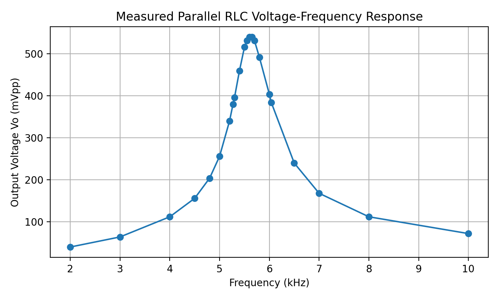

    <em>Figure 7: Measured voltage-frequency curve for the parallel RLC circuit.</em>

### 5.12 Theory, Simulation, and Measurement Comparison

| Circuit | Theory $f_0$ | Simulation $f_0$ | Measured $f_0$ | Theory $B$ | Simulation $B$ | Measured $B$ | Theory $Q$ | Simulation $Q$ | Measured $Q$ |
| :--- | :--- | :--- | :--- | :--- | :--- | :--- | :--- | :--- | :--- |
| Series RLC, $R=10.11\text{ }\Omega$ | $5.36\text{ kHz}$ | $5.3626\text{ kHz}$ | $4.90\text{ kHz}$ | $1.22\text{ kHz}$ | $1.2248\text{ kHz}$ | $1.05\text{ kHz}$ | $4.39$ | $4.38$ | $4.67$ |
| Series RLC, $R=99.35\text{ }\Omega$ | $5.36\text{ kHz}$ | $5.3610\text{ kHz}$ | $4.95\text{ kHz}$ | $1.93\text{ kHz}$ | $1.9367\text{ kHz}$ | $1.80\text{ kHz}$ | $2.77$ | $2.77$ | $2.75$ |
| Parallel RLC | $5.36\text{ kHz}$ | $5.3527\text{ kHz}$ | $5.65\text{ kHz}$ | $0.64\text{ kHz}$ | $0.7180\text{ kHz}$ | $0.77\text{ kHz}$ | $8.39$ | $7.46$ | $7.34$ |

### 5.13 Percentage Error Summary

| Circuit | Quantity | Theory Value | Simulation Value | Measured Value | Measured Error vs Theory |
| :--- | :--- | :--- | :--- | :--- | :--- |
| Series RLC, $R=10.11\text{ }\Omega$ | $f_0$ | $5.36\text{ kHz}$ | $5.3626\text{ kHz}$ | $4.90\text{ kHz}$ | $8.51\%$ |
| Series RLC, $R=99.35\text{ }\Omega$ | $f_0$ | $5.36\text{ kHz}$ | $5.3610\text{ kHz}$ | $4.95\text{ kHz}$ | $7.57\%$ |
| Parallel RLC | $f_0$ | $5.36\text{ kHz}$ | $5.3527\text{ kHz}$ | $5.65\text{ kHz}$ | $5.50\%$ |
| Series RLC, $R=10.11\text{ }\Omega$ | $Q$ | $4.39$ | $4.38$ | $4.67$ | $6.38\%$ |
| Series RLC, $R=99.35\text{ }\Omega$ | $Q$ | $2.77$ | $2.77$ | $2.75$ | $0.82\%$ |
| Parallel RLC | $Q$ | $8.39$ | $7.46$ | $7.34$ | $12.51\%$ |

## 6. Comprehensive Error and Phenomenon Analysis

### 6.1 Resonance Frequency Difference

The adjusted theoretical resonance frequency obtained from the measured $L$ and $C$ values is approximately $5.36\text{ kHz}$. The simulation results are very close to this value: the series simulations gave about $5.36\text{ kHz}$, and the parallel simulation gave about $5.35\text{ kHz}$. This confirms that the Multisim model is consistent with the measured component values.

The practical measured resonance frequencies were lower in the two series cases and higher in the parallel case. This difference is mainly caused by practical non-ideal effects, including breadboard parasitic capacitance, oscilloscope probe loading, contact resistance, extra wiring, and the frequency-dependent behavior of the real inductor and capacitor.

### 6.2 Effect of Resistance on Quality Factor

The $R=10.11\text{ }\Omega$ series circuit had a measured quality factor of $4.67$, while the $R=99.35\text{ }\Omega$ series circuit had a measured quality factor of $2.75$. This agrees with the theory that increasing the series resistance increases the bandwidth and decreases the quality factor.

### 6.3 Verification of $V_{C0}/V_S\approx Q_0$

For the $R=10.11\text{ }\Omega$ case,

$$
\frac{V_{C0}}{V_S}=\frac{24.4}{5.20}=4.69
$$

which is very close to the measured $Q_0=4.67$.

For the $R=99.35\text{ }\Omega$ case,

$$
\frac{V_{C0}}{V_S}=\frac{14.4}{5.20}=2.77
$$

which is very close to the measured $Q_0=2.75$.

Therefore, the experimental data supports the expected relationship between capacitor voltage magnification and quality factor.

### 6.4 Relationship among $Q_0$, $Q_L$, and $Q_C$

The measured individual component quality factors were

$$
Q_L=8.38693
$$

and

$$
Q_C=48.80
$$

However, the overall circuit quality factor is lower because it includes all circuit losses: the external resistor, source resistance, inductor winding resistance, capacitor ESR, breadboard contacts, and wiring loss. Thus, $Q_0$ represents the practical circuit quality factor rather than the quality factor of a single component.

### 6.5 Parallel Circuit Simulation and Measurement Difference

The parallel-circuit simulation used an ideal op-amp current source, while the practical circuit used a $51\text{ k}\Omega$ series resistor as an approximate current source. These two driving methods are similar but not identical. This explains why the simulation peak voltage and the practical peak voltage do not have the same magnitude. However, the frequency response shape and the calculated quality factors are reasonably close.

### 6.6 Possible Recording Uncertainty

In the $R=10.11\text{ }\Omega$ series measurement, the $5.00\text{ kHz}$ data point dropped more sharply than its neighboring points. This may be due to a reading or recording uncertainty. If time is available, that point should be remeasured.

## 7. Answers to Lab Questions

**1) How is the resonance frequency determined in the series RLC circuit?**  
The resonance frequency is determined by sweeping the frequency and observing the resistor voltage $V_R$. Since $I=V_R/R$, the maximum resistor voltage corresponds to the maximum current. Therefore, the frequency where $V_R$ is maximum is the resonance frequency.

**2) How are the cutoff frequencies determined?**  
The cutoff frequencies are found from the half-power points. For the series circuit,

$$
I=\frac{I_{\max}}{\sqrt{2}}
$$

Since $I=V_R/R$, the same condition can be applied to $V_R$. For the parallel circuit,

$$
V_o=\frac{V_{o,\max}}{\sqrt{2}}
$$

The lower and upper frequencies satisfying this condition are $f_1$ and $f_2$.

**3) What is the relationship among $Q_0$, $Q_L$, and $Q_C$?**  
$Q_L$ and $Q_C$ describe the inductor and capacitor separately. $Q_0$ describes the complete resonance circuit. Since the practical circuit includes many loss sources, $Q_0$ is usually lower than the ideal component quality factors.

**4) Does $V_{C0}/V_S$ equal $Q_0$?**  
For a series RLC circuit, the capacitor voltage at resonance is magnified by approximately the circuit quality factor. The measured results verify this relationship: $V_{C0}/V_S=4.69$ and $Q_0=4.67$ for the $10.11\text{ }\Omega$ case, while $V_{C0}/V_S=2.77$ and $Q_0=2.75$ for the $99.35\text{ }\Omega$ case.

**5) Why does the parallel RLC circuit show a voltage peak at resonance?**  
In a parallel RLC circuit, the inductive and capacitive branch currents cancel near resonance. Therefore, the equivalent impedance becomes maximum. When the circuit is driven by a current source, $V_o=i_0Z$, so the output voltage reaches a maximum at resonance.

## 8. Conclusion

This experiment successfully demonstrated the resonance characteristics of second-order RLC circuits. In the series RLC circuit, the current reached a maximum near resonance. The measured resonance frequencies were $4.90\text{ kHz}$ for the $10.11\text{ }\Omega$ case and $4.95\text{ kHz}$ for the $99.35\text{ }\Omega$ case. The measured quality factors were $4.67$ and $2.75$, respectively. These results show that a larger series resistance produces a wider bandwidth and a lower quality factor.

The capacitor voltage magnification relationship was also verified. The measured ratios $V_{C0}/V_S$ were $4.69$ and $2.77$, which closely matched the measured quality factors.

For the parallel RLC circuit, the measured output voltage reached a maximum of $540\text{ mV}_{pp}$ near $5.65\text{ kHz}$, and the measured quality factor was $7.34$. The simulation using an op-amp current source produced a resonance frequency of approximately $5.35\text{ kHz}$ and a quality factor of about $7.46$. Overall, the theory, simulation, and practical measurements show consistent second-order resonance behavior. The remaining differences are mainly caused by practical non-idealities and measurement uncertainties.
