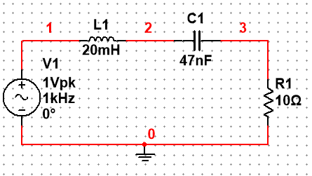
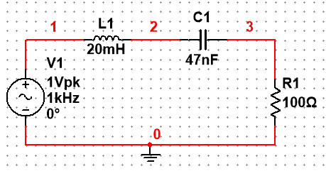
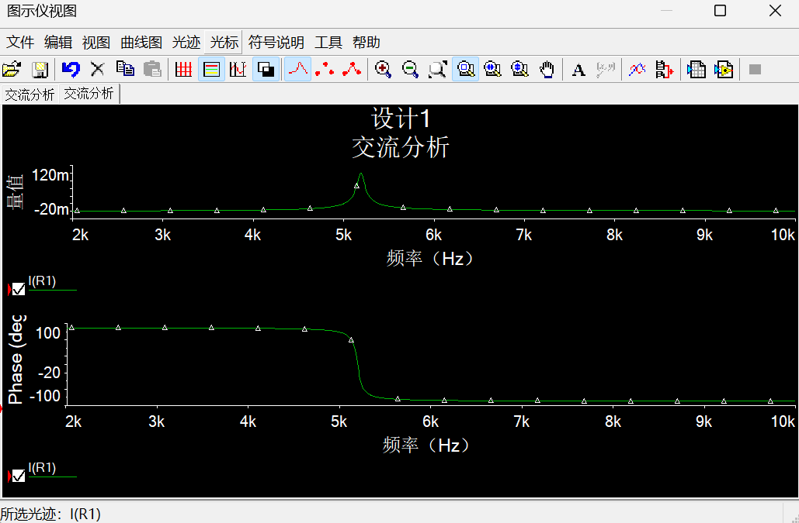
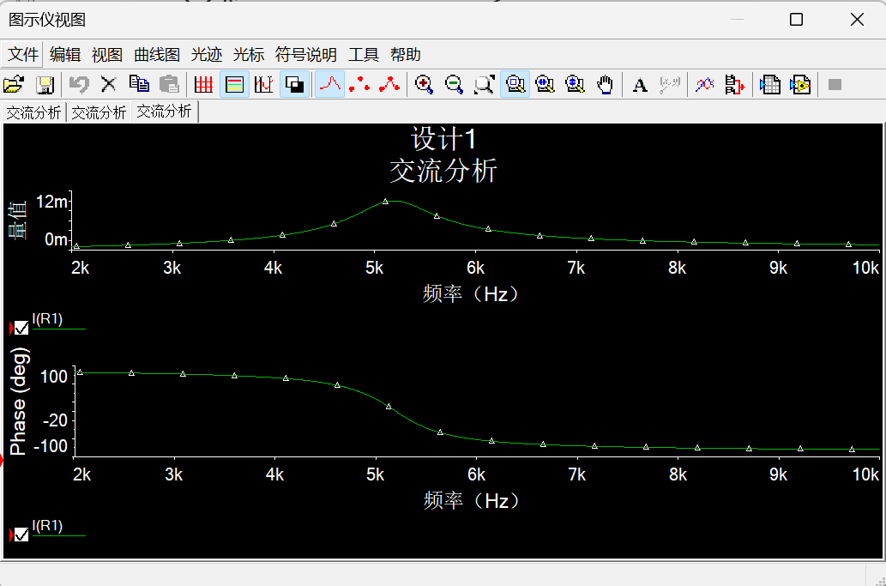
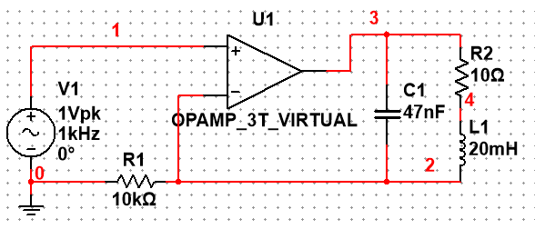
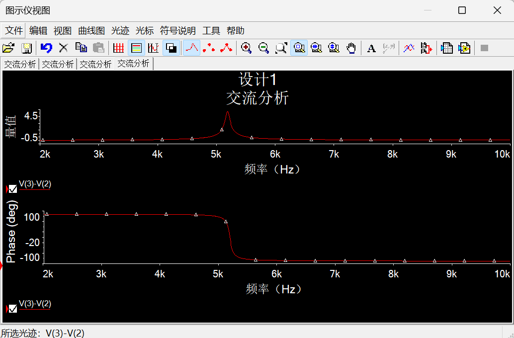

# **Pre-lab Report**

**Course Name:** [High-Voltage Alternating Current]  
**Laboratory Exercise No:** 5  
**Experiment Title:** 2nd-order RLC Frequency Response  
**Name:** Li Pengqi  
**Student ID:** 24721015  

## **1. Introduction**

This prelab prepares the theoretical analysis and simulation plan for measuring the frequency response of second-order RLC resonant circuits. The main objectives are:

1. Determine the resonant frequency, cutoff frequencies, bandwidth, and quality factor of a series RLC circuit.
2. Predict the resistor voltage and current-frequency response for \(R=10\ \Omega\) and \(R=100\ \Omega\).
3. Prepare a Multisim AC sweep simulation from 2 kHz to 10 kHz.
4. Design a practical measurement method for the parallel RLC resonance circuit.
5. Prepare data tables for laboratory measurement and comparison with theory and simulation.

## **2. Given Components**

The lab handout gives the series resonance circuit in Fig. 1(a). The component values used for the prelab calculation are:

| Component | Nominal value |
|---|---:|
| Inductor \(L\) | \(20\ \text{mH}\) |
| Capacitor \(C\) | \(47\ \text{nF}\) |
| Resistor \(R\) | \(10\ \Omega,\ 100\ \Omega\) |
| Input voltage \(V_s\) | \(1\ \text{V}_{pp}\) in the lab section |
| Frequency sweep | 2 kHz to 10 kHz |

Note: the lab procedure also mentions measuring an inductor rated near \(22\ \text{mH}\). The final report should use the actual measured \(L\), \(C\), and \(R\) values from the LCR meter to recalculate the theoretical results.

## **3. Simulation Figure Summary**

The following figures are included in this prelab.

| Figure label | Insert position | Required image content | Source |
|---|---|---|---|
| Fig. P1 | Section 6.1, after the series circuit description | Multisim schematic of the series RLC circuit with \(R=10\ \Omega\) | Multisim screenshot |
| Fig. P2 | Section 6.1, after Fig. P1 | Multisim schematic of the series RLC circuit with \(R=100\ \Omega\) | Multisim screenshot |
| Fig. P3 | Section 6.3, after the simulation measurement table | AC sweep result for \(R=10\ \Omega\), showing the required I-f curve | Multisim screenshot/export |
| Fig. P4 | Section 6.3, after Fig. P3 | AC sweep result for \(R=100\ \Omega\), showing the required I-f curve | Multisim screenshot/export |
| Fig. P5 | Section 7.1, after the current source circuit description | Designed parallel RLC measurement circuit using the Fig. 2 op-amp current source | Multisim screenshot |
| Fig. P6 | Section 7.2, after the parallel measurement procedure | Simulated V-f curve for the parallel RLC circuit | Multisim screenshot/export |

## **4. Series RLC Theory Analysis**

For the series RLC circuit, the total impedance is

\[
Z(j\omega)=R+j\omega L+\frac{1}{j\omega C}
=R+j\left(\omega L-\frac{1}{\omega C}\right)
\]

The circuit current is

\[
I(j\omega)=\frac{V_s}{Z(j\omega)}
\]

The resistor voltage is

\[
V_R(j\omega)=I(j\omega)R
\]

Therefore, the magnitude ratio of resistor voltage to source voltage is

\[
\left|\frac{V_R}{V_s}\right|
=
\frac{R}{\sqrt{R^2+\left(\omega L-\frac{1}{\omega C}\right)^2}}
\]

The current magnitude is

\[
|I|=\frac{|V_s|}{\sqrt{R^2+\left(\omega L-\frac{1}{\omega C}\right)^2}}
\]

At resonance,

\[
\omega_0 L=\frac{1}{\omega_0 C}
\]

so

\[
\omega_0=\frac{1}{\sqrt{LC}}
\]

and

\[
f_0=\frac{1}{2\pi\sqrt{LC}}
\]

At resonance, the reactive parts cancel and the impedance is minimum:

\[
Z(j\omega_0)=R
\]

Thus,

\[
I_0=\frac{V_s}{R}
\]

and

\[
V_{R0}=I_0R=V_s
\]

If the input is \(V_s=1\ \text{V}_{pp}\), then the ideal resistor voltage at resonance is

\[
V_{R0}=1\ \text{V}_{pp}
\]

for both \(R=10\ \Omega\) and \(R=100\ \Omega\).

In Multisim AC analysis, the plotted current scale depends on the AC magnitude assigned to the source. The response shape, resonant frequency, bandwidth, and quality factor are independent of this amplitude choice.

The quality factor of a series RLC circuit is

\[
Q=\frac{\omega_0L}{R}
=\frac{1}{\omega_0CR}
=\frac{1}{R}\sqrt{\frac{L}{C}}
\]

The bandwidth is

\[
B=f_2-f_1=\frac{R}{2\pi L}
\]

and

\[
Q=\frac{f_0}{B}
\]

The cutoff frequencies occur when the current or resistor voltage falls to \(1/\sqrt{2}\) of the resonant value:

\[
\left| \omega L-\frac{1}{\omega C} \right|=R
\]

Solving this gives

\[
f_1=\frac{1}{2\pi}\cdot
\frac{-R/L+\sqrt{(R/L)^2+4/(LC)}}{2}
\]

\[
f_2=\frac{1}{2\pi}\cdot
\frac{R/L+\sqrt{(R/L)^2+4/(LC)}}{2}
\]

## **5. Theoretical Calculation**

Using

\[
L=20\ \text{mH}=0.020\ \text{H}
\]

\[
C=47\ \text{nF}=47\times10^{-9}\ \text{F}
\]

the resonant frequency is

\[
f_0=\frac{1}{2\pi\sqrt{(0.020)(47\times10^{-9})}}
=5191.06\ \text{Hz}
\]

So,

\[
f_0\approx5.19\ \text{kHz}
\]

Also,

\[
\sqrt{\frac{L}{C}}
=\sqrt{\frac{0.020}{47\times10^{-9}}}
=652.33\ \Omega
\]

### **5.1 Results for \(R=10\ \Omega\)**

\[
Q=\frac{652.33}{10}=65.23
\]

\[
B=\frac{R}{2\pi L}
=\frac{10}{2\pi(0.020)}
=79.58\ \text{Hz}
\]

\[
f_1=5151.43\ \text{Hz}
\]

\[
f_2=5231.00\ \text{Hz}
\]

At resonance:

\[
I_0=\frac{V_s}{10}
\]

For \(V_s=1\ \text{V}_{pp}\):

\[
I_0=0.1\ \text{A}_{pp}
\]

\[
V_{R0}=1\ \text{V}_{pp}
\]

The capacitor voltage magnification at resonance is approximately

\[
\frac{V_{C0}}{V_s}=Q=65.23
\]

so the ideal capacitor voltage is approximately

\[
V_{C0}=65.23\ \text{V}_{pp}
\]

### **5.2 Results for \(R=100\ \Omega\)**

\[
Q=\frac{652.33}{100}=6.52
\]

\[
B=\frac{R}{2\pi L}
=\frac{100}{2\pi(0.020)}
=795.77\ \text{Hz}
\]

\[
f_1=4808.40\ \text{Hz}
\]

\[
f_2=5604.18\ \text{Hz}
\]

At resonance:

\[
I_0=\frac{V_s}{100}
\]

For \(V_s=1\ \text{V}_{pp}\):

\[
I_0=0.01\ \text{A}_{pp}
\]

\[
V_{R0}=1\ \text{V}_{pp}
\]

The capacitor voltage magnification at resonance is approximately

\[
\frac{V_{C0}}{V_s}=Q=6.52
\]

so the ideal capacitor voltage is approximately

\[
V_{C0}=6.52\ \text{V}_{pp}
\]

### **5.3 Theoretical Summary Table**

| Case | \(R\) | \(f_0\) | \(f_1\) | \(f_2\) | Bandwidth \(B\) | \(Q\) | Ideal \(V_{R0}\) for \(V_s=1\ \text{V}_{pp}\) |
|---|---:|---:|---:|---:|---:|---:|---:|
| Series RLC | \(10\ \Omega\) | 5191.06 Hz | 5151.43 Hz | 5231.00 Hz | 79.58 Hz | 65.23 | \(1\ \text{V}_{pp}\) |
| Series RLC | \(100\ \Omega\) | 5191.06 Hz | 4808.40 Hz | 5604.18 Hz | 795.77 Hz | 6.52 | \(1\ \text{V}_{pp}\) |

The \(10\ \Omega\) circuit has a much larger quality factor and a much narrower bandwidth. The \(100\ \Omega\) circuit has a lower peak current, lower quality factor, and wider bandwidth.

## **6. Multisim Simulation Plan**

### **6.1 Series RLC Circuit**

Build the series circuit in Multisim using:

- AC voltage source \(V_s\)
- Resistor \(R=10\ \Omega\), then repeat for \(R=100\ \Omega\)
- Inductor \(L=20\ \text{mH}\)
- Capacitor \(C=47\ \text{nF}\)
- Ground reference

The lab handout asks for the resonance curve as an I-f curve. Therefore, the preferred simulation output is the branch current through the series resistor:

\[
I(R1)
\]

Since all elements are in series, \(I(R1)\) is the circuit current. If the current direction appears negative in Multisim, plot the magnitude of \(I(R1)\) or use \(-I(R1)\). Measuring \(V_R\) is also useful for checking, because

\[
I=\frac{V_R}{R}
\]

and the lower side of \(R1\) is grounded, so \(V_R=V(3)\). However, the required simulation curve in Fig. P3 and Fig. P4 is the I-f curve.

**Figure P1.** Multisim schematic of the series RLC circuit with \(R=10\ \Omega\).

**Figure P2.** Multisim schematic of the series RLC circuit with \(R=100\ \Omega\).

### **6.2 AC Sweep Settings**

Suggested AC sweep settings:

| Setting | Value |
|---|---:|
| Start frequency | 2 kHz |
| Stop frequency | 10 kHz |
| Sweep type | Linear or logarithmic |
| Number of points | At least 1000 points |
| Output variable | \(I(R1)\) and phase |

For the \(R=10\ \Omega\) case, the resonant peak is very narrow, so a finer sweep around 5.19 kHz should also be used. Suggested fine sweep:

| Setting | Value |
|---|---:|
| Start frequency | 5.0 kHz |
| Stop frequency | 5.4 kHz |
| Number of points | At least 1000 points |

### **6.3 Simulation Measurements to Record**

For both \(R=10\ \Omega\) and \(R=100\ \Omega\), use the cursor to record:

| Quantity | Meaning |
|---|---|
| \(f_0\) | Frequency at maximum current or maximum \(V_R\) |
| \(f_1\) | Lower cutoff frequency where \(I=I_0/\sqrt{2}\) |
| \(f_2\) | Upper cutoff frequency where \(I=I_0/\sqrt{2}\) |
| \(B\) | \(f_2-f_1\) |
| \(Q\) | \(f_0/B\) |

**Figure P3.** AC sweep result for \(R=10\ \Omega\), showing the required I-f curve. The output variable is \(I(R1)\).

**Figure P4.** AC sweep result for \(R=100\ \Omega\), showing the required I-f curve. The output variable is \(I(R1)\).

### **6.4 Expected Simulation Results**

The simulation should show:

- \(R=10\ \Omega\): a sharp and narrow resonance peak near 5.19 kHz.
- \(R=100\ \Omega\): a wider and lower current peak near 5.19 kHz.
- The resonant frequency should be approximately the same for both resistor values in the ideal circuit.
- The bandwidth should increase as resistance increases.
- The quality factor should decrease as resistance increases.

## **7. Parallel Resonance Circuit Design**

The handout asks for a method to measure the resonance frequency and resonance curve of the parallel RLC circuit in Fig. 1(b), where \(r\) is the equivalent DC resistance of the inductor.

For a parallel resonant circuit, the impedance reaches a maximum at resonance. If the circuit is driven by an approximately constant current source, the output voltage reaches a maximum at resonance:

\[
V=IZ
\]

Therefore, the resonance curve can be measured as a voltage-frequency curve, \(V-f\).

### **7.1 Op-amp Current Source Approximation**

The handout suggests the circuit in Fig. 2 as a reference for producing a current source. In the designed Multisim circuit, the load resistor \(R_L\) in Fig. 2 is replaced by the parallel resonance network. The virtual op-amp forces the inverting input voltage to follow the non-inverting input:

\[
V_- \approx V_+ = V_s
\]

The resistor \(R_i\) from the inverting input to ground therefore sets the load current:

\[
i_0 \approx \frac{V_s}{R_i}
\]

In the simulation,

\[
R_i=10\ \text{k}\Omega
\]

and the load connected between the op-amp output node and the inverting input node is:

\[
C \parallel (r+L)
\]

where \(r\) is represented by \(R2=10\ \Omega\), \(L=20\ \text{mH}\), and \(C=47\ \text{nF}\). The output voltage of the parallel resonant network is measured across this load:

\[
V_o = V(3)-V(2)
\]

**Figure P5.** Designed parallel RLC measurement circuit using the Fig. 2 op-amp current source. The original \(R_L\) position is replaced by \(C \parallel (r+L)\).

### **7.2 Measurement Procedure**

1. Build the parallel RLC circuit on the breadboard.
2. Use the op-amp current source shown in Fig. P5 to drive the parallel network.
3. Set \(R_i=10\ \text{k}\Omega\), so \(i_0\approx V_s/R_i\).
4. Keep the source voltage \(V_s\) constant while changing frequency.
5. Sweep frequency from 2 kHz to 10 kHz.
6. Measure the output voltage \(V_o=V(3)-V(2)\) across the parallel RLC network.
7. The frequency where \(V_o\) is maximum is the parallel resonant frequency.
8. Record the two cutoff frequencies where \(V_o=V_{o,max}/\sqrt{2}\), if the response is clear enough.
9. Calculate bandwidth:

\[
B=f_2-f_1
\]

10. Calculate quality factor:

\[
Q=\frac{f_0}{B}
\]

**Figure P6.** Simulated parallel RLC V-f curve. The plotted output variable is \(V(3)-V(2)\), which is the voltage across the parallel resonant load.

### **7.3 Expected Parallel Resonance Behavior**

At low frequency, the inductor branch has low reactance, so the output voltage is relatively small. At high frequency, the capacitor branch has low reactance, so the output voltage is also relatively small. Near resonance, the inductive and capacitive susceptances cancel, the total parallel impedance becomes maximum, and the output voltage reaches its maximum value.

For an ideal parallel LC circuit:

\[
f_0=\frac{1}{2\pi\sqrt{LC}}
\]

In the real circuit, the inductor resistance \(r\), function generator resistance, component tolerances, and breadboard parasitics will shift the measured resonant frequency and reduce the peak amplitude.

## **8. LCR Meter Preparation**

Before building the circuit, measure the real component values with the LCR 6300 meter:

| Component | Parameter to measure | Measured value |
|---|---|---:|
| \(R=10\ \Omega\) | Resistance | __________ |
| \(R=100\ \Omega\) | Resistance | __________ |
| Capacitor \(47\ \text{nF}\) | \(C_S\), \(R_S\), \(Q_C\) | __________ |
| Inductor | \(L_S\), \(R_S\), \(Q_L\) | __________ |

The LCR meter should be warmed up for about 30 minutes before measurement. The final report should compare theoretical results using nominal values and recalculated results using measured component values.

## **9. Lab Data Tables Prepared Before Lab**

### **9.1 Series RLC, \(R=10\ \Omega\)**

| Frequency \(f\) | \(V_s\) | \(V_R\) | Current \(I=V_R/R\) | Phase observation | Notes |
|---:|---:|---:|---:|---|---|
| 2.0 kHz | | | | | |
| 3.0 kHz | | | | | |
| 4.0 kHz | | | | | |
| 5.0 kHz | | | | | |
| Near \(f_0\) | | | | | |
| 5.4 kHz | | | | | |
| 6.0 kHz | | | | | |
| 8.0 kHz | | | | | |
| 10.0 kHz | | | | | |

### **9.2 Series RLC, \(R=100\ \Omega\)**

| Frequency \(f\) | \(V_s\) | \(V_R\) | Current \(I=V_R/R\) | Phase observation | Notes |
|---:|---:|---:|---:|---|---|
| 2.0 kHz | | | | | |
| 3.0 kHz | | | | | |
| 4.0 kHz | | | | | |
| 5.0 kHz | | | | | |
| Near \(f_0\) | | | | | |
| 5.5 kHz | | | | | |
| 6.0 kHz | | | | | |
| 8.0 kHz | | | | | |
| 10.0 kHz | | | | | |

### **9.3 Parallel RLC Circuit**

| Frequency \(f\) | \(V_s\) | \(V_o\) across parallel RLC | Phase observation | Notes |
|---:|---:|---:|---|---|
| 2.0 kHz | | | | |
| 3.0 kHz | | | | |
| 4.0 kHz | | | | |
| 5.0 kHz | | | | |
| Near \(f_0\) | | | | |
| 6.0 kHz | | | | |
| 8.0 kHz | | | | |
| 10.0 kHz | | | | |

## **10. Error Analysis Prepared for Final Report**

Possible sources of error include:

1. The real inductor has internal resistance, so the circuit is not an ideal series RLC circuit.
2. The nominal values of \(L\), \(C\), and \(R\) may differ from the measured values.
3. The function generator has internal resistance, usually about \(50\ \Omega\), which may affect the effective series resistance.
4. Breadboard wiring adds parasitic resistance, capacitance, and inductance.
5. The source voltage must be readjusted after each frequency change; otherwise, the resonance curve will be distorted.
6. Oscilloscope probe loading and multimeter frequency response may affect the measured voltage.
7. The resonance peak for \(R=10\ \Omega\) is very narrow, so insufficient frequency resolution can cause measurement error.

## **11. Prelab Conclusion**

The theoretical resonant frequency of the series RLC circuit with \(L=20\ \text{mH}\) and \(C=47\ \text{nF}\) is approximately \(5.19\ \text{kHz}\). For \(R=10\ \Omega\), the circuit has a high quality factor of about 65.23 and a narrow bandwidth of about 79.58 Hz. For \(R=100\ \Omega\), the quality factor decreases to about 6.52 and the bandwidth increases to about 795.77 Hz. At resonance, the ideal resistor voltage equals the source voltage for both resistor values. The parallel resonance circuit should be measured using an approximate current source so that the resonance appears as a maximum in the voltage-frequency curve.

