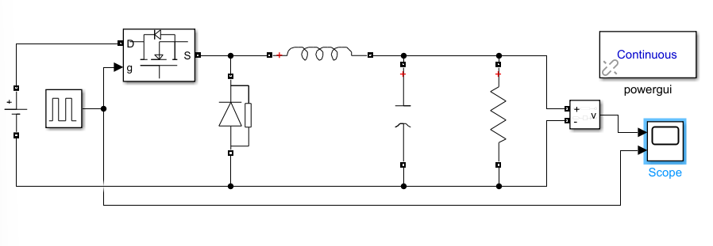
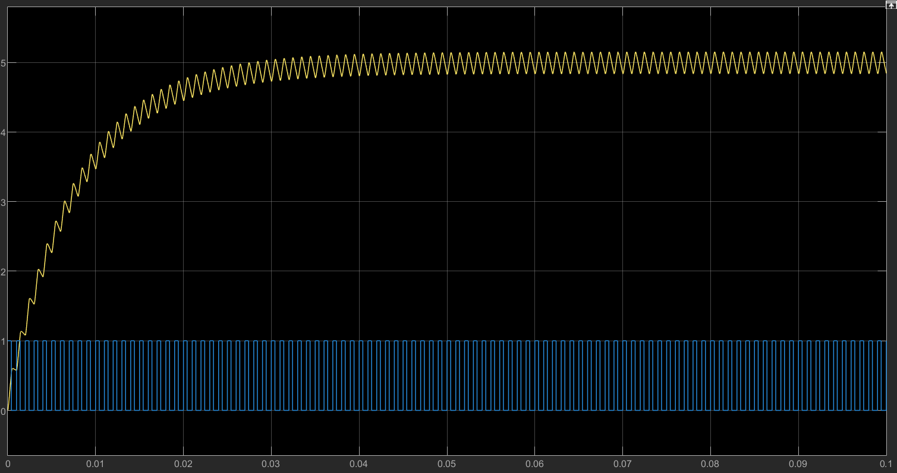
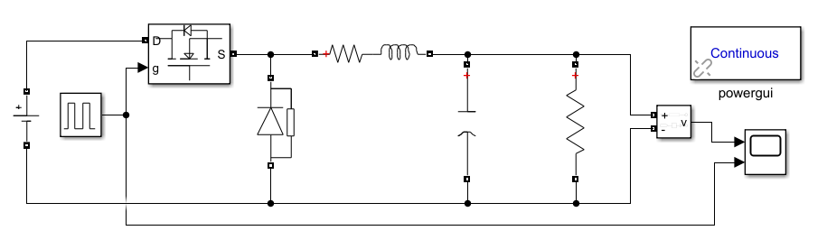
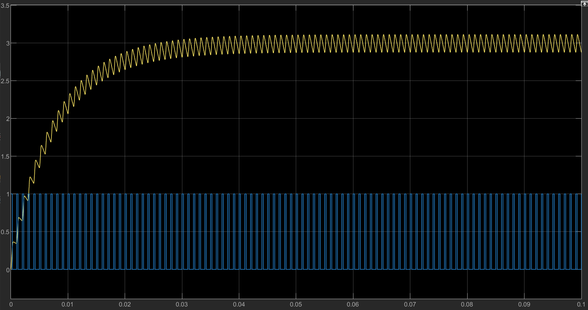
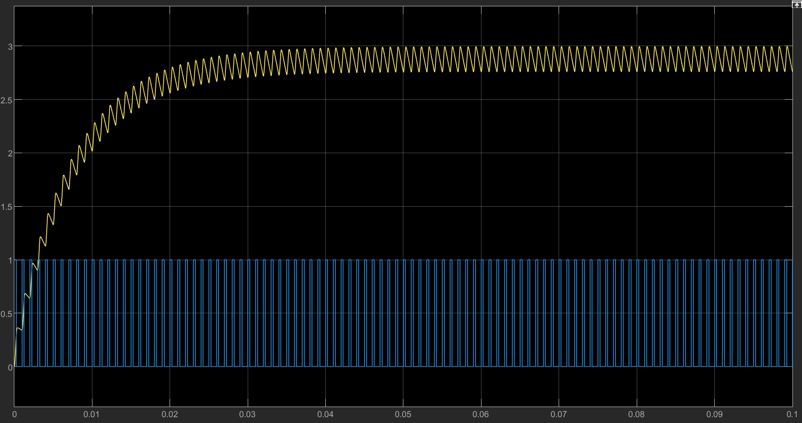

# Exercise 1: Simulation of a Buck Converter Using MATLAB/Simulink

**Name:** LPQ  
**Course/Lab:** Power Electronics / Computer Simulation  
**Experiment:** Exercise 1 — Buck Converter Simulation  
**Software:** MATLAB/Simulink, Simscape Electrical Specialized Power Systems

---

## 1. Objective

The objective of this experiment is to model and simulate a Buck converter using MATLAB/Simulink. The converter is designed to step down a 12 V DC input voltage to approximately 5 V DC output voltage. The effects of PWM duty cycle, LC filtering, and inductor copper loss are investigated by comparing different simulation cases.

In this experiment, four cases are simulated:

1. Buck converter with 41.7% duty cycle and ideal inductor.
2. Buck converter with 41.7% duty cycle and inductor copper loss.
3. Buck converter with 25% duty cycle and ideal inductor.
4. Buck converter with 25% duty cycle and inductor copper loss.

---

## 2. Background Theory

A Buck converter is a DC-DC step-down converter. It converts a higher DC voltage into a lower DC voltage by using a switching device, a diode, an inductor, a capacitor, and a load resistor.

The main components of the Buck converter are:

- DC voltage source
- MOSFET switch
- Freewheeling diode
- Inductor
- Smoothing capacitor
- Load resistor
- PWM signal generator

The MOSFET is controlled by a PWM signal. When the MOSFET is turned on, the input source supplies energy to the inductor, capacitor, and load. When the MOSFET is turned off, the inductor current continues to flow through the freewheeling diode. The inductor and capacitor reduce the switching ripple and produce a smoother DC output voltage.

For an ideal Buck converter operating in continuous conduction mode, the output voltage is given by:

$$
V_{out}=D V_{in}
$$

where:

$$
D=\frac{T_{on}}{T}
$$

is the PWM duty cycle.

For the required output voltage of approximately 5 V from a 12 V input source:

$$
D=\frac{V_{out}}{V_{in}}=\frac{5}{12}=0.4167
$$

Therefore, the required duty cycle is approximately:

$$
D=41.7\%
$$

The load resistance used in the simulation is:

$$
R=2.5\Omega
$$

When the output voltage is approximately 5 V, the output current is:

$$
I_{out}=\frac{V_{out}}{R}=\frac{5}{2.5}=2A
$$

The output power is:

$$
P_{out}=V_{out}I_{out}=5\times2=10W
$$

---

## 3. Simulink Model Setup

The Buck converter was constructed in MATLAB/Simulink using Simscape Electrical Specialized Power Systems blocks.

The main simulation parameters are shown below.

| Component | Value |
|---|---:|
| Input voltage | 12 V |
| MOSFET gate signal | PWM |
| Inductor | 20 mH |
| Capacitor | 20 μF |
| Load resistor | 2.5 Ω |
| Duty cycle, Case 1 and Case 2 | 41.7% |
| Duty cycle, Case 3 and Case 4 | 25% |
| Inductor copper loss resistance | 0.1 Ω |
| Simulation time | 0.1 s |
| powergui mode | Continuous |

The PWM signal was generated using a Pulse Generator block. The amplitude of the PWM signal was set to 1, and the duty cycle was changed according to each simulation case.

The output voltage was measured using a Voltage Measurement block. The output voltage and PWM signal were displayed on a Scope.

---

## 4. Simulation Cases and Results

### 4.1 Case 1: Buck Converter with 41.7% Duty Cycle

In the first simulation, the duty cycle was set to 41.7%. The inductor was treated as an ideal 20 mH inductor without copper loss.

The theoretical output voltage is:

$$
V_{out}=D V_{in}
$$

$$
V_{out}=0.417\times12=5.004V
$$

Therefore, the expected output voltage is approximately 5 V.

**Figure 1. Simulink model of the Buck converter with 41.7% duty cycle.**

**Figure 2. Output voltage and PWM waveform with 41.7% duty cycle.**

From the simulation result, the output voltage rises from 0 V and gradually reaches a steady-state value close to 5 V. A small ripple can be observed in the steady-state output voltage due to the switching operation of the MOSFET. The PWM signal switches between 0 and 1, showing that the MOSFET is being controlled correctly.

The result agrees with the theoretical relationship:

$$
V_{out}=D V_{in}
$$

---

### 4.2 Case 2: Buck Converter with 41.7% Duty Cycle and Inductor Copper Loss

In the second simulation, the duty cycle was kept at 41.7%, but a 0.1 Ω series resistance was added to the 20 mH inductor to represent inductor copper loss.

The inductor model was changed from an ideal inductor to a series RL branch:

$$
L=20mH
$$

$$
R_L=0.1\Omega
$$

The copper loss in the inductor can be calculated by:

$$
P_{cu}=I_L^2R_L
$$

Assuming the output current is approximately 2 A:

$$
P_{cu}=2^2\times0.1=0.4W
$$

Therefore, part of the input energy is dissipated as heat in the inductor winding resistance.

**Figure 3. Simulink model of the Buck converter with inductor copper loss at 41.7% duty cycle.**

**Figure 4. Output voltage and PWM waveform with inductor copper loss at 41.7% duty cycle.**

The simulation shows that after adding the 0.1 Ω series resistance to the inductor, the output voltage is slightly lower than the ideal case. This is because the inductor winding resistance produces voltage drop and copper loss.

Compared with Case 1, the output voltage decreases slightly, which is consistent with the expected effect of practical inductor resistance.

---

### 4.3 Case 3: Buck Converter with 25% Duty Cycle

In the third simulation, the PWM duty cycle was changed from 41.7% to 25%. The inductor was again treated as an ideal 20 mH inductor.

The theoretical output voltage is:

$$
V_{out}=D V_{in}
$$

$$
V_{out}=0.25\times12=3V
$$

Therefore, the expected output voltage is approximately 3 V.

**Figure 5. Output voltage and PWM waveform with 25% duty cycle.**

The simulation result shows that the output voltage rises from 0 V and reaches a steady-state value close to 3 V. This confirms that reducing the duty cycle reduces the average output voltage of the Buck converter.

Compared with Case 1, the duty cycle was reduced from 41.7% to 25%, so the output voltage decreased from approximately 5 V to approximately 3 V. This agrees with the Buck converter equation:

$$
V_{out}=D V_{in}
$$

---

### 4.4 Case 4: Buck Converter with 25% Duty Cycle and Inductor Copper Loss

In the fourth simulation, the duty cycle was kept at 25%, and the inductor copper loss was included by adding a 0.1 Ω series resistance to the 20 mH inductor.

The ideal output voltage for 25% duty cycle is:

$$
V_{out}=0.25\times12=3V
$$

However, due to the series resistance of the inductor, the practical output voltage is expected to be slightly lower than 3 V.

**Figure 6. Output voltage and PWM waveform with 25% duty cycle and inductor copper loss.**

The simulation result shows that the output voltage reaches approximately 3 V, but it is slightly lower than the ideal case. This is caused by the copper loss in the inductor. The output voltage also contains ripple because of the switching action and the LC filter.

---

## 5. Summary of Results

| Case | Duty Cycle | Inductor Model | Theoretical Output Voltage | Simulated Output Voltage |
|---|---:|---|---:|---:|
| Case 1 | 41.7% | 20 mH ideal inductor | 5.0 V | Approximately 5.0 V |
| Case 2 | 41.7% | 20 mH + 0.1 Ω | Slightly below 5.0 V | Slightly below 5.0 V |
| Case 3 | 25% | 20 mH ideal inductor | 3.0 V | Approximately 3.0 V |
| Case 4 | 25% | 20 mH + 0.1 Ω | Slightly below 3.0 V | Slightly below 3.0 V |

The results show that the output voltage is mainly controlled by the PWM duty cycle. A higher duty cycle produces a higher output voltage, while a lower duty cycle produces a lower output voltage.

The results also show that inductor copper loss reduces the output voltage slightly because part of the power is dissipated in the inductor resistance.

---

## 6. Discussion

The simulation results verify the basic operating principle of a Buck converter. When the duty cycle was set to 41.7%, the output voltage reached approximately 5 V. When the duty cycle was reduced to 25%, the output voltage decreased to approximately 3 V.

This confirms the ideal Buck converter equation:

$$
V_{out}=D V_{in}
$$

The output voltage does not become perfectly constant. Instead, a small ripple is observed in the steady-state waveform. This ripple is caused by the switching operation of the MOSFET. The inductor and capacitor reduce this ripple by storing and releasing energy during each switching period.

When inductor copper loss was added, the output voltage became slightly lower. This is because the series resistance of the inductor causes both voltage drop and power loss. The copper loss is given by:

$$
P_{cu}=I_L^2R_L
$$

Therefore, practical components cause the real converter output to deviate slightly from the ideal theoretical value.

The transient response can also be observed from the waveform. At the beginning of the simulation, the output voltage starts from 0 V and increases gradually. This is because the capacitor needs time to charge and the inductor current needs time to build up. After the transient period, the output reaches a steady-state value with switching ripple.

---

## 7. Conclusion

In this experiment, a Buck converter was successfully modeled and simulated using MATLAB/Simulink. The converter stepped down a 12 V DC input voltage to approximately 5 V when the PWM duty cycle was set to 41.7%.

The simulation results agreed with the theoretical relationship:

$$
V_{out}=D V_{in}
$$

When the duty cycle was reduced to 25%, the output voltage decreased to approximately 3 V. This shows that the duty cycle directly controls the average output voltage of the Buck converter.

The effect of inductor copper loss was also studied. When a 0.1 Ω series resistance was added to the inductor, the output voltage became slightly lower than the ideal case. This is because power is dissipated in the inductor winding resistance.

Overall, the simulation successfully demonstrated the operation of a Buck converter, the effect of duty cycle on output voltage, the role of LC filtering, and the influence of practical inductor copper loss.

---

## 8. References

1. Exercise 1 Lab Handout, Buck Converter Simulation Using MATLAB/Simulink.
