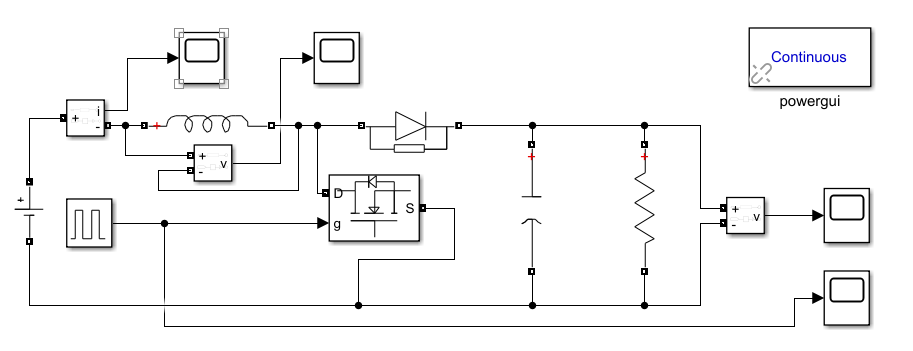
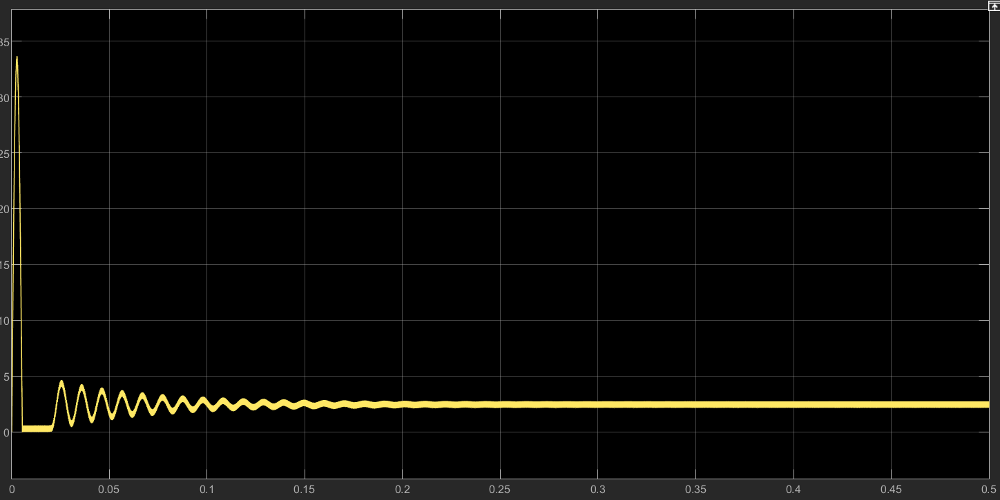
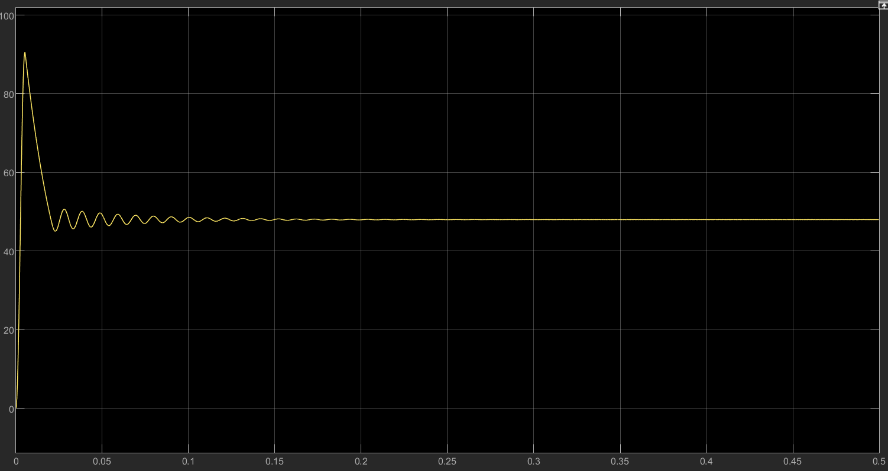
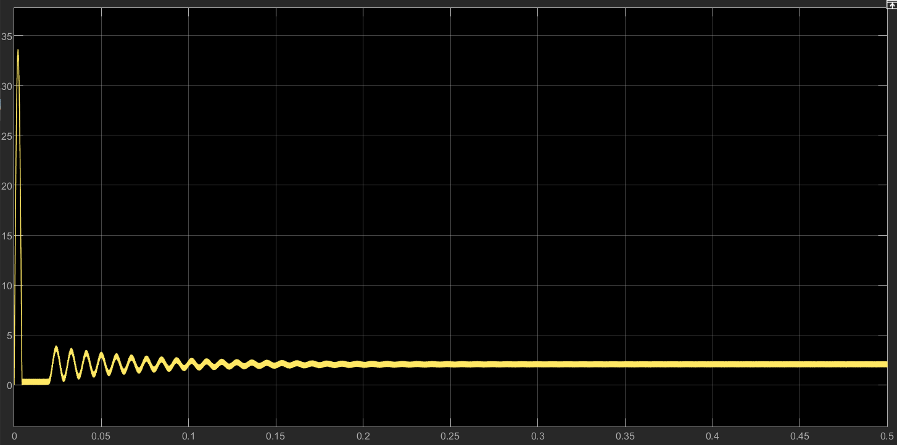
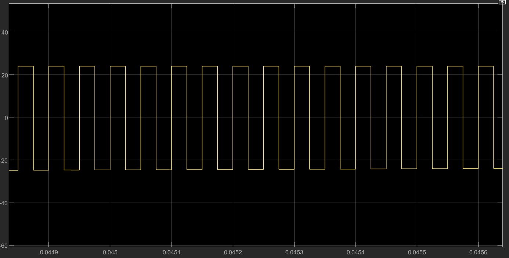
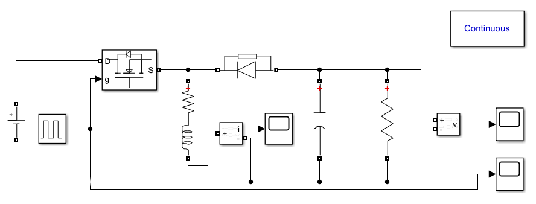
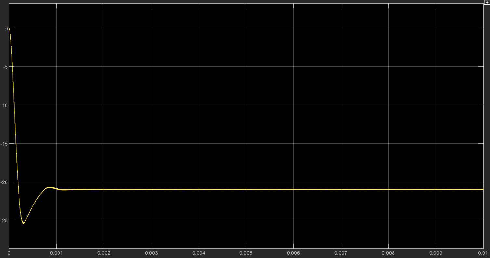
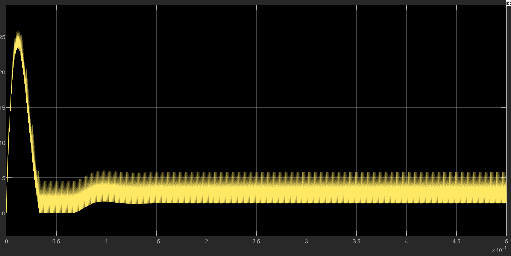
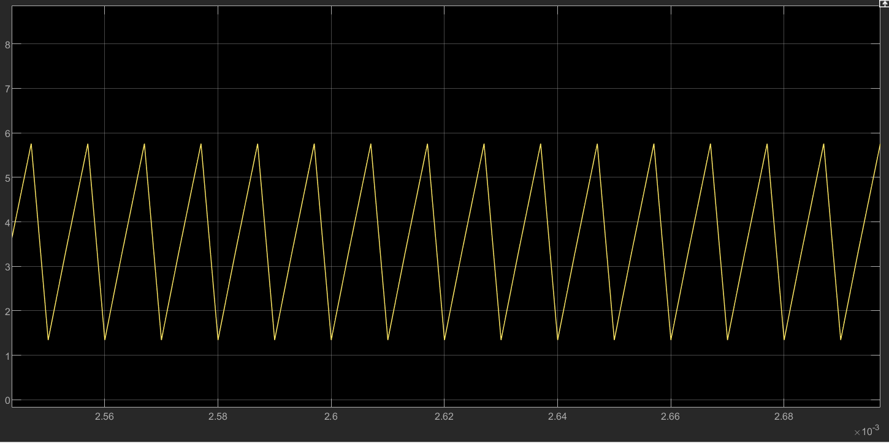

# Exercise 2: Boost Converter and Buck–Boost Converter Simulation Report

**Student:** LPQ  
**Software:** MATLAB/Simulink, Simscape Electrical Specialized Power Systems  
**Experiment:** Exercise 2 — Boost Converter and Buck–Boost Converter Transient Response

---

## 1. Objective

The objective of this experiment is to simulate and analyze two DC/DC power converter circuits in MATLAB/Simulink:

1. A **Boost converter** operating from a 24 V source with 20 kHz PWM and 50% duty cycle, and then from a 20 V source while maintaining the same output voltage by adjusting the duty cycle.
2. A **Buck–Boost converter** during start-up transient response, with focus on the inductor current and capacitor voltage waveforms.

This report also includes the calculation of a suitable Buck–Boost duty cycle to ensure continuous conduction mode (CCM), and the calculation of the minimum PWM switching frequency required to ensure CCM for a separate converter design specification.

---

## 2. Boost Converter

### 2.1 Background Theory

A Boost converter is a DC/DC step-up converter. In continuous conduction mode, the ideal conversion ratio is:

$$
\frac{V_{out}}{V_{in}}=\frac{1}{1-D}
$$

where \(D\) is the duty cycle of the PWM control signal.

The Boost converter uses the following operating principle:

- When the MOSFET is ON, the inductor stores energy from the input source.
- When the MOSFET is OFF, the inductor releases energy through the diode to the capacitor and load.
- The output voltage is higher than the input voltage.

---

### 2.2 Simulink Model

The Boost converter was modeled using a DC voltage source, inductor, MOSFET, diode, output capacitor, load resistor, measurement blocks, scopes, and a continuous `powergui` block.

**Figure 1. Simulink model of the Boost converter.**

---

### 2.3 Case A: 20 V Input, Output Maintained at Approximately 48 V

The handout requires the source to be changed to 20 V while maintaining the same output voltage as the 24 V case. The required duty cycle is calculated from:

$$
V_{out}=\frac{V_{in}}{1-D}
$$

Solving for \(D\):

$$
D=1-\frac{V_{in}}{V_{out}}
$$

For \(V_{in}=20V\) and \(V_{out}=48V\):

$$
D=1-\frac{20}{48}=0.5833
$$

Therefore, the PWM duty cycle was set to:

$$
D=58.3\%
$$

The PWM frequency remains 20 kHz, so the PWM period is:

$$
T_s=\frac{1}{20,000}=50\mu s
$$

The Pulse Generator settings were:

| Parameter | Value |
|---|---:|
| Amplitude | 1 |
| Period | 50e-6 s |
| Pulse Width | 58.3% |
| Phase Delay | 0 |
| Sample Time | 0 |

**Figure 2. Boost converter inductor current with 20 V input and 58.3% duty cycle.**

**Figure 3. Boost converter output voltage with 20 V input and 58.3% duty cycle.**

The output voltage shows a start-up overshoot and then settles close to 48 V. The steady-state value agrees with the theoretical requirement that the load voltage should remain close to the original 48 V value.

The steady-state inductor voltage should switch between:

$$
V_{L,on}=V_{in}=20V
$$

and

$$
V_{L,off}=V_{in}-V_{out}=20-48=-28V
$$

The volt-second balance is:

$$
20\times0.583+(-28)\times(1-0.583)\approx0
$$

**Figure 4. Steady-state inductor voltage zoom with 20 V input.**

The waveform verifies that the inductor voltage switches approximately between +20 V and -28 V in steady state.

---

### 2.4 Case B: 24 V Input, 20 kHz PWM, 50% Duty Cycle

For the original Boost converter case:

$$
V_{in}=24V
$$

$$
D=0.5
$$

The theoretical output voltage is:

$$
V_{out}=\frac{24}{1-0.5}=48V
$$

The Pulse Generator settings were:

| Parameter | Value |
|---|---:|
| Amplitude | 1 |
| Period | 50e-6 s |
| Pulse Width | 50% |
| Phase Delay | 0 |
| Sample Time | 0 |

**Figure 5. Boost converter output voltage with 24 V input and 50% duty cycle.**

**Figure 6. Boost converter inductor current with 24 V input and 50% duty cycle.**

The output voltage has a large start-up overshoot due to open-loop operation, but it settles close to 48 V after the transient period. The inductor current also has a large start-up peak before settling to steady-state operation.

In steady state, the inductor voltage should switch between:

$$
V_{L,on}=24V
$$

and

$$
V_{L,off}=24-48=-24V
$$

Since \(D=0.5\), the volt-second balance is:

$$
24\times0.5+(-24)\times0.5=0
$$

**Figure 7. Steady-state inductor voltage zoom with 24 V input.**

The waveform verifies that the inductor voltage switches approximately between +24 V and -24 V, confirming the volt-second balance condition.

---

## 3. Buck–Boost Converter Start-up Transient Response

### 3.1 Handout Parameters

The Buck–Boost converter was simulated using the parameters from the handout:

| Parameter | Value |
|---|---:|
| Input voltage \(V_g\) | 10 V |
| Load resistance \(R\) | 20 Ω |
| Capacitor \(C_1\) | 50 μF |
| Inductor \(L_1\) | 15 μH |
| Inductor winding resistance \(R_L\) | 0.1 Ω |
| MOSFET on-resistance | 50 mΩ = 0.05 Ω |
| Diode on-resistance | 5 mΩ = 0.005 Ω |
| Diode voltage drop | 0.7 V |
| PWM amplitude | 10 V |
| PWM period \(T_s\) | 10 μs |
| PWM frequency \(f_s\) | 100 kHz |

The Simulink model is shown below.

**Figure 8. Simulink model of the Buck–Boost converter.**

---

## 4. Selecting a Suitable Duty Cycle to Avoid DCM and Ensure CCM

### 4.1 Why the 50% Duty Cycle Is Not Suitable for CCM

The handout specifies the PWM amplitude and period, but it does not explicitly specify a duty cycle for the Buck–Boost transient simulation. To avoid discontinuous conduction mode (DCM), the duty cycle must be selected carefully.

For an inverting Buck–Boost converter, the critical inductance for CCM is:

$$
L_{crit}=\frac{R T_s(1-D)^2}{2}
$$

Using the handout values:

$$
R=20\Omega
$$

$$
T_s=10\mu s
$$

$$
L=15\mu H
$$

If \(D=50\%\):

$$
L_{crit}=\frac{20\times10\times10^{-6}\times(1-0.5)^2}{2}
$$

$$
L_{crit}=25\mu H
$$

Since:

$$
15\mu H < 25\mu H
$$

50% duty cycle would cause the converter to operate in DCM or near the boundary. Therefore, 50% is not an appropriate choice if the goal is to guarantee CCM.

---

### 4.2 Condition for CCM with the Given Inductor

To ensure CCM:

$$
L > L_{crit}
$$

Substituting the expression for \(L_{crit}\):

$$
L > \frac{R T_s(1-D)^2}{2}
$$

Rearranging:

$$
(1-D)^2 < \frac{2L}{R T_s}
$$

Substitute the given values:

$$
(1-D)^2 < \frac{2\times15\times10^{-6}}{20\times10\times10^{-6}}
$$

$$
(1-D)^2 < 0.15
$$

$$
1-D < \sqrt{0.15}=0.3873
$$

Therefore:

$$
D > 1-0.3873
$$

$$
D > 0.6127
$$

So the duty cycle must be greater than approximately:

$$
61.3\%
$$

to ensure CCM with the given 15 μH inductor.

---

### 4.3 Selected Duty Cycle

A duty cycle of 70% was selected because it is above the minimum value required for CCM and still keeps the output voltage within a reasonable range.

$$
D=70\%=0.7
$$

The critical inductance at this duty cycle is:

$$
L_{crit}=\frac{20\times10\times10^{-6}\times(1-0.7)^2}{2}
$$

$$
L_{crit}=9\mu H
$$

Since:

$$
15\mu H > 9\mu H
$$

the converter operates in CCM.

The ideal Buck–Boost output voltage is:

$$
V_o=-\frac{D}{1-D}V_g
$$

$$
V_o=-\frac{0.7}{0.3}\times10
$$

$$
V_o=-23.3V
$$

Considering the diode voltage drop and conduction losses, the simulated output capacitor voltage is expected to be slightly smaller in magnitude, around -21 V to -22 V.

The theoretical inductor current ripple is:

$$
\Delta i_L=\frac{V_gDT_s}{L}
$$

$$
\Delta i_L=\frac{10\times0.7\times10\times10^{-6}}{15\times10^{-6}}
$$

$$
\Delta i_L\approx4.67A
$$

An approximate average inductor current is:

$$
I_{L,avg}\approx\frac{D V_g}{R(1-D)^2}
$$

$$
I_{L,avg}\approx\frac{0.7\times10}{20\times0.3^2}
$$

$$
I_{L,avg}\approx3.89A
$$

Therefore:

$$
I_{L,min}\approx3.89-\frac{4.67}{2}=1.56A
$$

$$
I_{L,max}\approx3.89+\frac{4.67}{2}=6.22A
$$

This confirms that the inductor current should remain above zero during steady-state operation.

---

## 5. Buck–Boost Simulation Results at 70% Duty Cycle

### 5.1 Capacitor Voltage

**Figure 9. Buck–Boost capacitor voltage at 70% duty cycle.**

The capacitor voltage starts from 0 V, has a start-up overshoot, and then settles near -21 V. This agrees with the expected negative output voltage of the inverting Buck–Boost converter. The simulated voltage magnitude is lower than the ideal value because the diode voltage drop, MOSFET on-resistance, diode resistance, and inductor winding resistance are included.

---

### 5.2 Inductor Current During Start-up

**Figure 10. Buck–Boost inductor current during start-up transient at 70% duty cycle.**

The inductor current has a high transient peak during start-up. This shows that the converter components experience higher current stress during the start-up transient than in steady-state operation.

---

### 5.3 Steady-state Inductor Current and CCM Verification

**Figure 11. Steady-state inductor current at 70% duty cycle.**

The steady-state inductor current remains above 0 A during the entire switching cycle. Therefore, the converter operates in continuous conduction mode.

From the waveform:

$$
i_{L,min}\approx1.4A
$$

$$
i_{L,max}\approx5.8A
$$

The ripple is approximately:

$$
\Delta i_L\approx5.8-1.4=4.4A
$$

This agrees well with the theoretical estimate of approximately 4.67 A.

---

## 6. Reducing Start-up Transient Stress

The simulation shows that converter components are exposed to significantly higher current stress during start-up than during steady-state operation. Several design methods can reduce this stress:

1. **Soft-start control**: Increase the duty cycle gradually from a small value to the final operating value instead of applying the full duty cycle immediately.
2. **Current limiting**: Reduce or interrupt the gate signal when the inductor current exceeds a safe threshold.
3. **Output capacitor pre-charging**: Pre-charge the output capacitor so that the converter does not initially see a fully discharged capacitor.
4. **Increase inductance**: A larger inductor reduces the current slope because \(di_L/dt=V_L/L\).
5. **Add damping or inrush limiting**: Damping networks or temporary series resistance can reduce transient oscillation and inrush current.

Among these methods, soft-start control is usually the most practical and effective method.

---

## 7. Minimum PWM Switching Frequency for CCM Operation

The final question asks for the minimum PWM switching frequency that ensures CCM operation for a Buck/Boost converter with:

| Parameter | Value |
|---|---:|
| Inductance | 100 μH |
| Output voltage | 144 VDC |
| Input voltage range | 120 VDC to 162 VDC |
| Output current range | 5 A to 10 A |

For an ideal Buck–Boost converter:

$$
\frac{V_o}{V_{in}}=\frac{D}{1-D}
$$

Therefore:

$$
D=\frac{V_o}{V_o+V_{in}}
$$

The inductor current ripple is:

$$
\Delta I_L=\frac{V_{in}D}{Lf_s}
$$

The CCM boundary occurs when:

$$
I_{L,avg}=\frac{\Delta I_L}{2}
$$

For a Buck–Boost converter:

$$
I_{L,avg}=\frac{I_o}{1-D}
$$

Thus:

$$
\frac{I_o}{1-D}=\frac{V_{in}D}{2Lf_s}
$$

Solving for \(f_s\):

$$
f_s=\frac{V_{in}D(1-D)}{2LI_o}
$$

To guarantee CCM, the worst-case condition is the lowest output current and the highest required boundary frequency. The lowest output current is:

$$
I_o=5A
$$

At \(V_{in}=162V\):

$$
D=\frac{144}{144+162}=0.4706
$$

Substitute:

$$
f_s=\frac{162\times0.4706\times(1-0.4706)}{2\times100\times10^{-6}\times5}
$$

$$
f_s\approx40360Hz
$$

Therefore, the minimum PWM switching frequency is:

$$
f_{s,min}\approx40.4kHz
$$

A practical switching frequency should include margin, so a suitable choice is:

$$
f_s=50kHz
$$

---

## 8. Conclusion

The Boost converter simulation verified the theoretical voltage conversion relationship. With a 24 V input and 50% duty cycle, the output voltage settled close to 48 V. When the input voltage was reduced to 20 V, the duty cycle was increased to 58.3%, and the output voltage was again maintained close to 48 V. The inductor voltage waveforms verified the steady-state volt-second balance.

For the Buck–Boost converter, the original handout parameters were retained. Since the handout did not explicitly specify the duty cycle, the duty cycle was selected by calculating the CCM condition. The analysis showed that the duty cycle must be greater than 61.3% to avoid DCM with the given 15 μH inductor. Therefore, a 70% duty cycle was selected. The simulation confirmed that the steady-state inductor current remains above zero, verifying CCM operation.

The Buck–Boost transient simulation also showed that the inductor current has a much higher peak during start-up than during steady-state operation. This confirms that converter components are exposed to higher current stress during start-up. Soft-start control, current limiting, capacitor pre-charging, increased inductance, and damping can be used to reduce these stresses.

Finally, the minimum PWM switching frequency required to ensure CCM for the specified 100 μH Buck/Boost design was calculated to be approximately 40.4 kHz. A practical design value of 50 kHz is recommended.

---

## 9. References

1. Exercise 2 Lab Handout, Boost Converter and Buck–Boost Converter Simulation.
