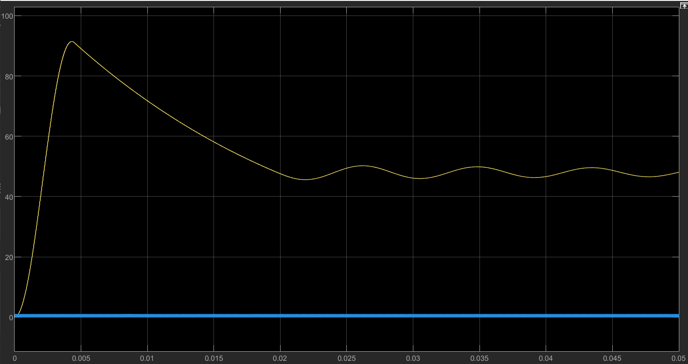
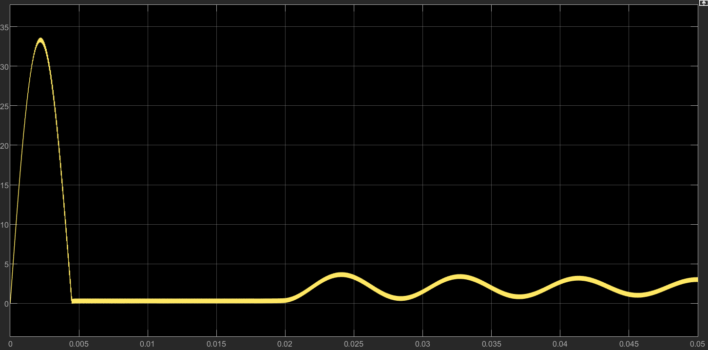
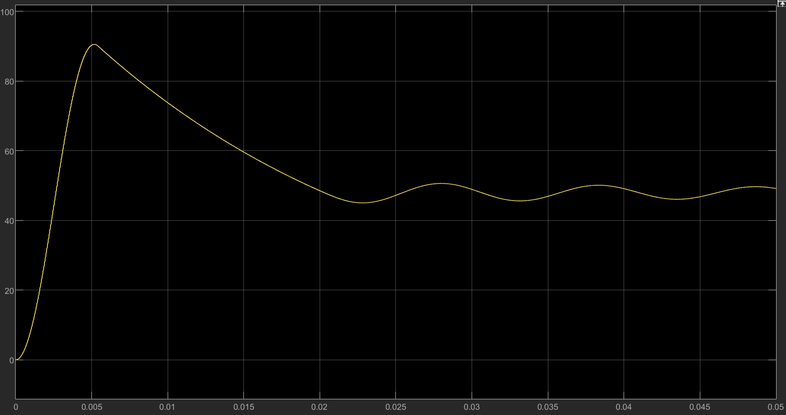
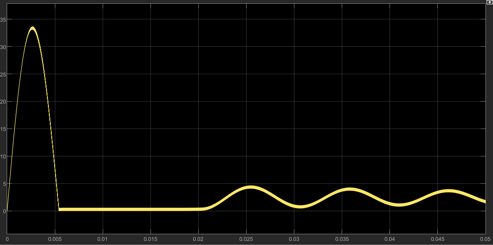
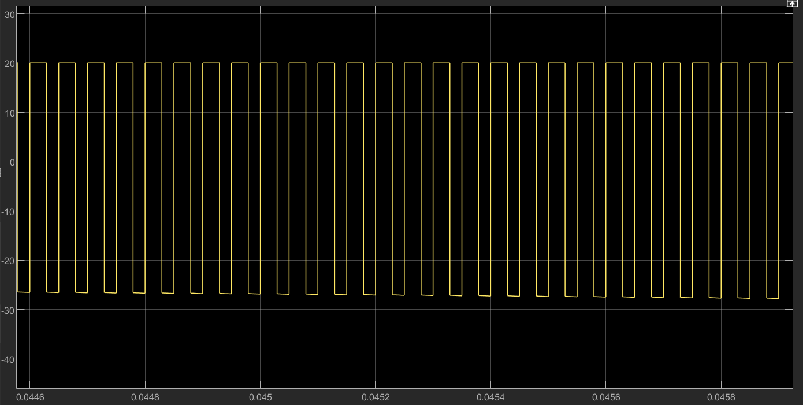
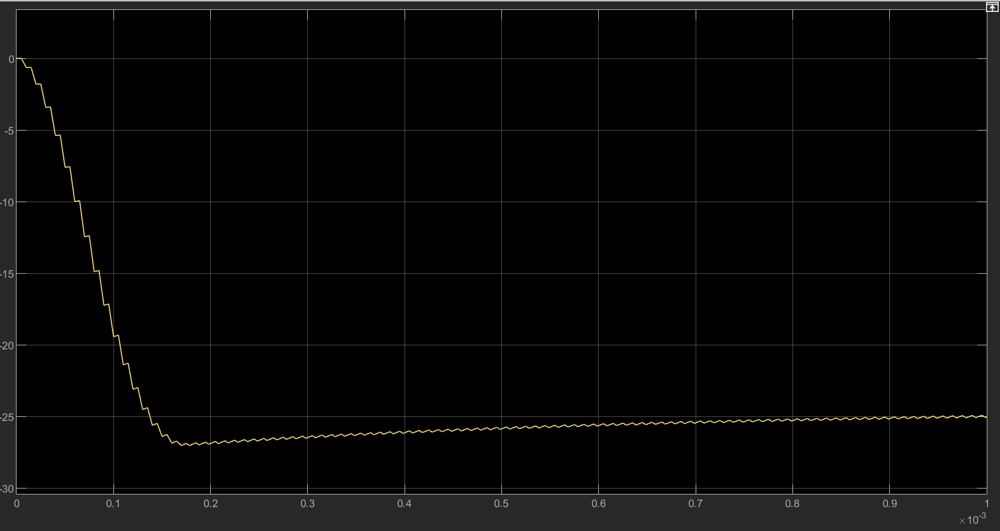
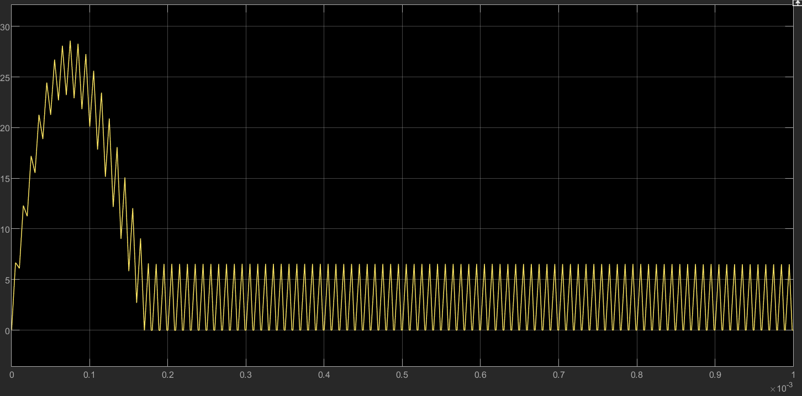
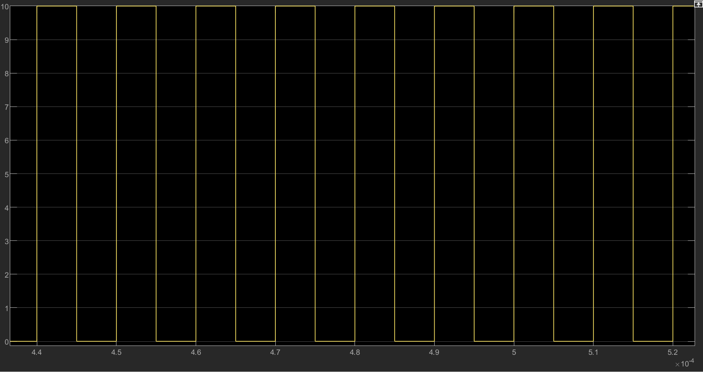

# Exercise 2: Boost Converter and Buck–Boost Converter Transient Response

## 1. Objective

The objective of this experiment is to simulate and analyze two DC-DC converter circuits using MATLAB/Simulink.

The first part investigates a Boost converter. The converter is supplied by a DC input voltage and controlled by a PWM signal. The output voltage is compared with the theoretical Boost converter voltage conversion ratio. The inductor voltage and current waveforms are also observed in order to verify the volt-second balance in steady state.

The second part investigates the start-up transient response of a Buck–Boost converter. The inductor current and capacitor voltage are observed during start-up. The purpose is to study the high transient current stress that occurs before the converter reaches steady-state operation.

The final part calculates the minimum PWM switching frequency required to ensure continuous conduction mode operation for a Buck/Boost converter.

---

## 2. Background Theory

### 2.1 Boost Converter

A Boost converter is a DC-DC converter that steps up the input voltage to a higher output voltage.

For an ideal Boost converter operating in continuous conduction mode, the voltage transfer function is:

$$
V_{out}=\frac{V_{in}}{1-D}
$$

where:

$$
D
$$

is the PWM duty cycle.

When the MOSFET is turned on, the inductor stores energy from the input source. During this interval, the diode is reverse biased and the load is supplied by the output capacitor.

When the MOSFET is turned off, the inductor releases energy through the diode to the output capacitor and load. Therefore, the output voltage becomes higher than the input voltage.

In steady-state operation, the average voltage across the inductor over one switching period must be zero. This is known as the inductor volt-second balance:

$$
V_{L,on}DT+V_{L,off}(1-D)T=0
$$

where \(T\) is the switching period.

---

### 2.2 Buck–Boost Converter

A Buck–Boost converter can produce an output voltage whose magnitude may be higher or lower than the input voltage. In the inverting Buck–Boost topology, the output voltage polarity is opposite to the input voltage polarity.

During start-up, the output capacitor is initially uncharged. As a result, the inductor current may rise to a value much higher than its steady-state value. This causes high transient current stress on the converter components such as the MOSFET, diode, and inductor.

The start-up transient response is therefore important in converter design.

---

## 3. Boost Converter Simulation

### 3.1 Simulation Parameters

The Boost converter was simulated with the following parameters:

| Parameter | Value |
|---|---:|
| Input voltage, Case 1 | 24 V |
| Input voltage, Case 2 | 20 V |
| PWM frequency | 20 kHz |
| PWM period | 50 μs |
| Duty cycle, Case 1 | 50% |
| Duty cycle, Case 2 | 58.3% |
| Inductor | 1 mH |
| Capacitor | 470 μF |
| Load resistor | 48 Ω |
| powergui mode | Continuous |

The PWM frequency is:

$$
f_s=20kHz
$$

Therefore, the PWM period is:

$$
T=\frac{1}{f_s}=\frac{1}{20000}=50\mu s
$$

---

### 3.2 Boost Converter Simulink Model

The Boost converter was constructed using a DC voltage source, inductor, MOSFET, diode, output capacitor, load resistor, voltage measurement blocks, current measurement block, PWM generator, scopes, and powergui.

The basic structure of the Boost converter is:

$$
V_{in} \rightarrow L \rightarrow \text{switching node} \rightarrow D \rightarrow V_{out}
$$

The MOSFET is connected between the switching node and ground. The output capacitor and load resistor are connected in parallel at the output.

---

## 4. Boost Converter Case 1: \(V_{in}=24V\), \(D=50\%\)

### 4.1 Theoretical Calculation

For the first Boost converter case:

$$
V_{in}=24V
$$

$$
D=50\%=0.5
$$

Using the Boost converter equation:

$$
V_{out}=\frac{V_{in}}{1-D}
$$

$$
V_{out}=\frac{24}{1-0.5}
$$

$$
V_{out}=48V
$$

Therefore, the theoretical output voltage is:

$$
V_{out}=48V
$$

---

### 4.2 Output Voltage Waveform

The simulation result shows that the output voltage rises from 0 V during start-up. A large overshoot occurs at the beginning, with the voltage reaching approximately 90 V. After the transient period, the output voltage decreases and finally settles close to 48 V.

The start-up overshoot occurs because the Boost converter is operated in open-loop mode. There is no feedback controller or soft-start circuit to limit the output voltage during the start-up period.

In steady state, the output voltage is close to the theoretical value of 48 V. Therefore, the simulation result agrees with the theoretical Boost converter voltage conversion ratio.

---

### 4.3 Inductor Current Waveform

The inductor current increases rapidly during start-up and reaches a large transient peak. After the transient period, the current becomes a periodic ripple waveform.

The high start-up current occurs because the output capacitor is initially uncharged and the inductor transfers energy to charge the capacitor. This current stress is much higher than the steady-state ripple current.

---

### 4.4 Inductor Voltage Waveform and Volt-Second Balance

In steady state, the inductor voltage switches between approximately:

$$
+24V
$$

and:

$$
-24V
$$

When the MOSFET is on:

$$
V_{L,on}=V_{in}=24V
$$

When the MOSFET is off:

$$
V_{L,off}=V_{in}-V_{out}=24-48=-24V
$$

Since the duty cycle is 50%:

$$
D=0.5
$$

The volt-second balance is:

$$
V_{L,on}D+V_{L,off}(1-D)=0
$$

$$
24(0.5)+(-24)(0.5)=0
$$

$$
12-12=0
$$

Therefore, the volt-second balance condition is satisfied in steady state.

---

## 5. Boost Converter Case 2: \(V_{in}=20V\), \(V_{out}\approx48V\)

### 5.1 Duty Cycle Calculation

In the second case, the input voltage is changed to:

$$
V_{in}=20V
$$

The required output voltage remains approximately:

$$
V_{out}=48V
$$

Using the Boost converter equation:

$$
V_{out}=\frac{V_{in}}{1-D}
$$

Rearranging for \(D\):

$$
1-D=\frac{V_{in}}{V_{out}}
$$

$$
D=1-\frac{V_{in}}{V_{out}}
$$

$$
D=1-\frac{20}{48}
$$

$$
D=0.5833
$$

Therefore, the PWM duty cycle should be:

$$
D=58.3\%
$$

The Pulse Generator was adjusted to:

$$
\text{Pulse Width}=58.3\%
$$

---

### 5.2 Output Voltage Waveform

The simulation result shows that the output voltage still settles close to 48 V after the start-up transient. This confirms that the duty cycle adjustment compensates for the lower input voltage.

There is still a start-up overshoot because the converter is operated in open-loop mode. However, the steady-state output voltage agrees with the theoretical value.

---

### 5.3 Inductor Current Waveform

The inductor current also shows a large transient peak during start-up. After the start-up period, the current becomes a periodic ripple waveform.

Compared with the 24 V case, a higher duty cycle is required to maintain the same output voltage because the input voltage is lower.

---

### 5.4 Inductor Voltage Waveform and Volt-Second Balance

In steady state, the inductor voltage switches between approximately:

$$
+20V
$$

and:

$$
-28V
$$

When the MOSFET is on:

$$
V_{L,on}=V_{in}=20V
$$

When the MOSFET is off:

$$
V_{L,off}=V_{in}-V_{out}=20-48=-28V
$$

Using the duty cycle:

$$
D=0.583
$$

$$
1-D=0.417
$$

The volt-second balance is:

$$
20(0.583)+(-28)(0.417)\approx0
$$

$$
11.66-11.68\approx0
$$

Therefore, the inductor volt-second balance is also satisfied for the 20 V input case.

---

## 6. Buck–Boost Converter Start-Up Transient Simulation

### 6.1 Simulation Parameters

The Buck–Boost converter was simulated using the following parameters:

| Parameter | Value |
|---|---:|
| Input voltage \(V_g\) | 10 V |
| Load resistor \(R\) | 20 Ω |
| Capacitor \(C_1\) | 50 μF |
| Inductor \(L_1\) | 15 μH |
| Inductor winding resistance \(R_L\) | 0.1 Ω |
| MOSFET on-resistance \(R_{on}\) | 50 mΩ |
| Diode on-resistance | 5 mΩ |
| Diode forward voltage drop | 0.7 V |
| PWM amplitude | 10 V |
| PWM period | 10 μs |
| PWM frequency | 100 kHz |
| powergui mode | Continuous |

The PWM frequency is:

$$
f_s=\frac{1}{T}
$$

$$
f_s=\frac{1}{10\mu s}
$$

$$
f_s=100kHz
$$

---

### 6.2 Buck–Boost Converter Simulink Model

The Buck–Boost converter was constructed according to the circuit diagram. The MOSFET is controlled by a pulsed voltage signal. The inductor winding resistance is included in series with the inductor to represent copper loss.

---

### 6.3 Capacitor Voltage During Start-Up

The capacitor voltage starts from 0 V and decreases to a negative value. This occurs because the Buck–Boost converter is an inverting topology.

The capacitor voltage reaches approximately:

$$
-27V
$$

during the transient period and then gradually settles close to:

$$
-25V
$$

The negative sign is due to the polarity of the output voltage. If the voltage measurement polarity were reversed, the same physical voltage would be shown as a positive value.

---

### 6.4 Inductor Current During Start-Up

The inductor current waveform shows a large transient peak during start-up. The current rises to approximately:

$$
28A
$$

before decreasing to its steady-state ripple waveform.

After the transient period, the inductor current becomes a periodic triangular waveform. Its steady-state value is much lower than the start-up peak.

This confirms that converter components are exposed to significantly higher current stress during start-up than during steady-state operation.

---

### 6.5 PWM Control Signal

The PWM signal switches between 0 V and 10 V. The period is:

$$
10\mu s
$$

which corresponds to a frequency of:

$$
100kHz
$$

This agrees with the required PWM signal settings.

---

## 7. Methods to Reduce Start-Up Transient Stress

The simulation shows that the inductor current has a large peak during start-up. This high current can stress the MOSFET, diode, inductor, and capacitor.

Several methods can be used to reduce start-up transient stress:

### 7.1 Soft-Start Control

The most effective method is to use soft-start control. Instead of applying the final duty cycle immediately, the duty cycle is gradually increased from a small value to the target value.

For example:

$$
D=0\% \rightarrow 10\% \rightarrow 20\% \rightarrow \cdots \rightarrow D_{target}
$$

This reduces the rate of energy transfer and limits the peak inductor current.

### 7.2 Current Limiting

A current limit can be added to the control system. If the inductor current exceeds a preset limit, the controller reduces the duty cycle or temporarily turns off the MOSFET.

### 7.3 Output Capacitor Pre-Charging

Pre-charging the output capacitor before normal converter operation reduces the initial charging current. This can reduce the start-up current peak.

### 7.4 Increasing Inductance

The inductor current slope is given by:

$$
\frac{di_L}{dt}=\frac{V_L}{L}
$$

Increasing the inductance reduces the current rising rate, which helps reduce peak current during start-up.

### 7.5 Adding Damping or Inrush Current Limiting

A damping network or inrush current limiting resistor can also reduce start-up stress. However, this may reduce efficiency if the limiting component remains in the circuit during normal operation.

---

## 8. Minimum PWM Switching Frequency for CCM Operation

The final question asks for the minimum PWM switching frequency that ensures continuous conduction mode operation.

Given:

$$
L=100\mu H
$$

$$
V_{out}=144V
$$

$$
V_{in}=120V \text{ to } 162V
$$

$$
I_{out}=5A \text{ to } 10A
$$

For an ideal Buck–Boost converter:

$$
\frac{V_{out}}{V_{in}}=\frac{D}{1-D}
$$

Solving for duty cycle:

$$
D=\frac{V_{out}}{V_{out}+V_{in}}
$$

The worst case for CCM occurs at minimum output current and maximum input voltage. Therefore:

$$
V_{in}=162V
$$

$$
I_{out}=5A
$$

The duty cycle is:

$$
D=\frac{144}{144+162}
$$

$$
D=\frac{144}{306}
$$

$$
D=0.471
$$

The boundary condition for continuous conduction mode is:

$$
I_{L,avg}>\frac{\Delta I_L}{2}
$$

For the Buck–Boost converter:

$$
\Delta I_L=\frac{V_{in}D}{Lf_s}
$$

and:

$$
I_{L,avg}=\frac{I_{out}}{1-D}
$$

At the CCM boundary:

$$
\frac{I_{out}}{1-D}=\frac{1}{2}\frac{V_{in}D}{Lf_s}
$$

Solving for \(f_s\):

$$
f_s=\frac{V_{in}D(1-D)}{2LI_{out}}
$$

Substituting values:

$$
f_s=\frac{162\times0.471\times(1-0.471)}{2\times100\times10^{-6}\times5}
$$

$$
f_s=\frac{162\times0.471\times0.529}{0.001}
$$

$$
f_s\approx40360Hz
$$

Therefore, the minimum switching frequency is approximately:

$$
f_{s,min}\approx40.4kHz
$$

In practical design, a switching frequency higher than this value should be selected. Therefore, a suitable choice is:

$$
f_s=50kHz
$$

---

## 9. Discussion

The Boost converter simulation verified the theoretical relationship between input voltage, duty cycle, and output voltage.

For the first case, with:

$$
V_{in}=24V
$$

$$
D=50\%
$$

the theoretical output voltage was:

$$
48V
$$

The simulation output voltage settled close to 48 V after the transient period.

For the second case, the input voltage was reduced to 20 V. To keep the output voltage close to 48 V, the duty cycle was increased to 58.3%. The simulation result confirmed that the output voltage could still be maintained close to 48 V.

The inductor voltage waveforms also verified volt-second balance. For the 24 V input case, the inductor voltage switched between +24 V and -24 V. For the 20 V input case, the inductor voltage switched between approximately +20 V and -28 V. In both cases, the positive and negative volt-second areas were approximately equal.

The Buck–Boost converter simulation showed that a large inductor current peak occurs during start-up. The capacitor voltage also experienced a transient before reaching steady state. This confirms that converter components may experience much larger stresses during start-up than during normal operation.

Soft-start control and current limiting are effective ways to reduce these start-up stresses.

---

## 10. Conclusion

In this experiment, a Boost converter and a Buck–Boost converter were successfully simulated using MATLAB/Simulink.

For the Boost converter, the theoretical voltage conversion relationship:

$$
V_{out}=\frac{V_{in}}{1-D}
$$

was verified. With a 24 V input and 50% duty cycle, the output voltage settled close to 48 V. When the input voltage was reduced to 20 V, the duty cycle was adjusted to 58.3%, and the output voltage again settled close to 48 V.

The inductor voltage waveforms verified the volt-second balance condition in steady-state operation.

For the Buck–Boost converter, the start-up transient response was observed. The capacitor voltage became negative because of the inverting output characteristic. The inductor current showed a large transient peak of approximately 28 A before reaching steady state. This demonstrated that converter components are exposed to high current stress during start-up.

Finally, the minimum PWM switching frequency required to ensure continuous conduction mode operation was calculated to be approximately:

$$
40.4kHz
$$

A practical switching frequency of 50 kHz is recommended to provide a safety margin.

---

## 11. References

1. Exercise 2 Lab Handout, Boost Converter and Buck–Boost Converter Simulation.
