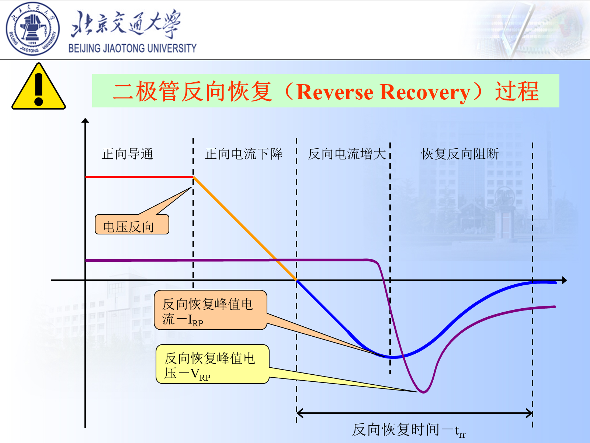
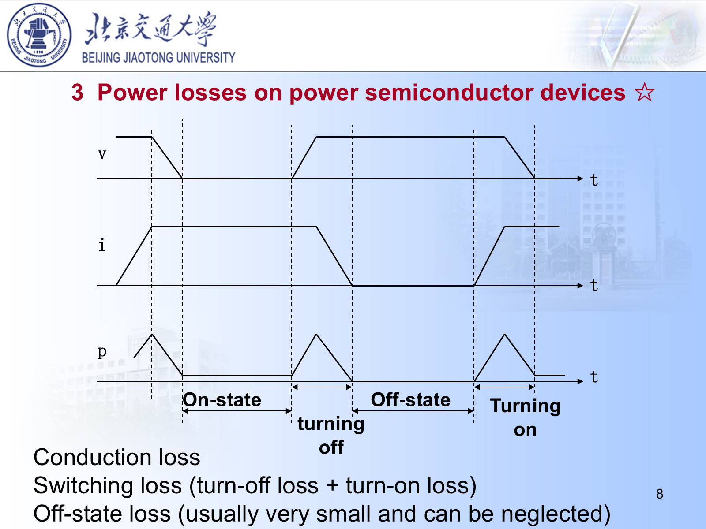
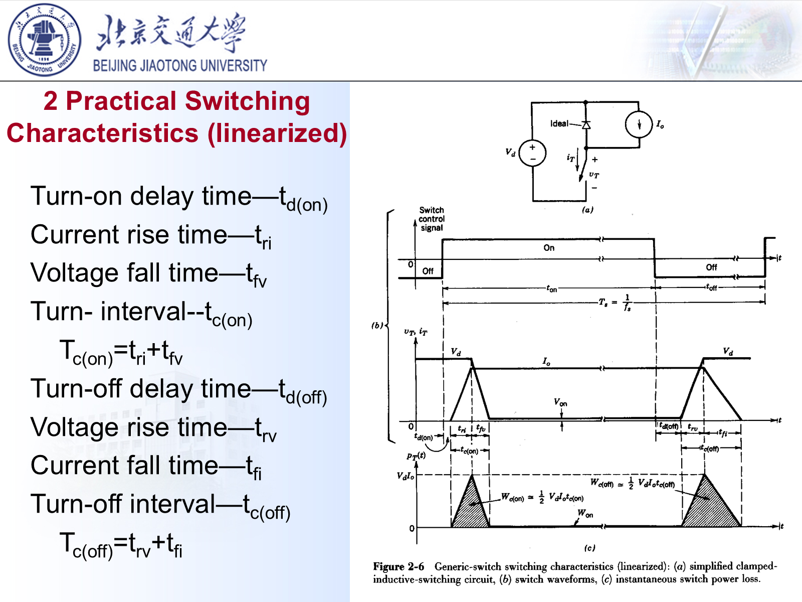
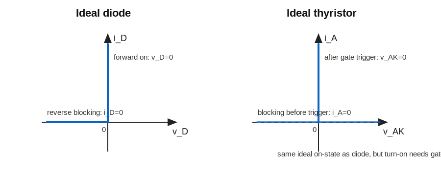
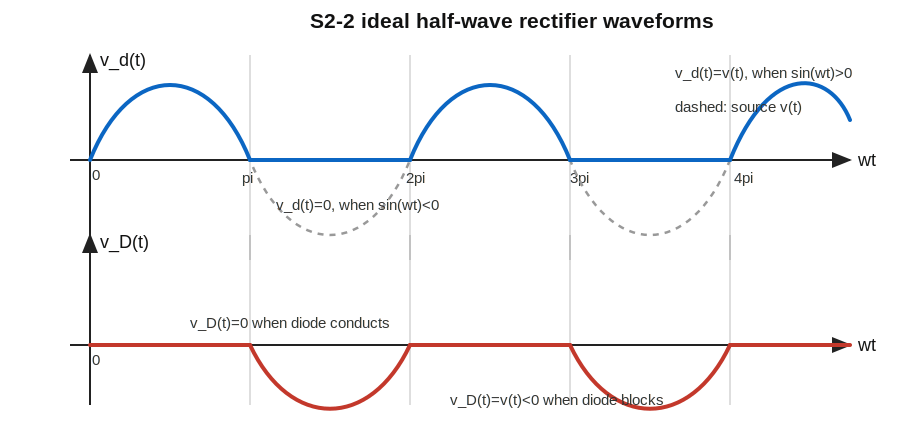

# 2 电力半导体器件概述笔记

## 一、这一讲的主线

电力电子器件是主电路的“开关”。  
这一讲重点是认识几类常用器件：

- Power diode；
- Thyristor；
- MOSFET；
- IGBT。

判断器件时不要只背名字，要抓住三个问题：

1. 能不能被控制开通；
2. 能不能被控制关断；
3. 适合高频还是大功率。

---

## 二、理想功率开关希望具备什么

理想受控开关应满足：

- 导通压降低；
- 关断漏电流小；
- 开关速度快；
- 驱动功率小；
- 电压电流耐量高；
- 开关损耗低；
- 可靠性高。

现实器件只能在这些指标之间折中。

分析所有功率器件损耗时，都从瞬时功率开始：

$$
p(t)=v(t)i(t)
$$

一个周期内的平均损耗为：

$$
P=\frac1{T_s}\int_0^{T_s}p(t)\,dt
$$

因此只要知道器件两端电压 $v(t)$ 和流过电流 $i(t)$ 的波形，就能把损耗分成导通损耗、开关损耗和断态损耗。

---

## 三、功率二极管

### 1. 基本特性

功率二极管是不可控器件：

- 正向偏置时导通；
- 反向偏置时阻断；
- 不能靠控制端人为开关。

### 2. 导通损耗

近似可写成：

$$
P_{\mathrm{cond}}\approx V_F I_F
$$

其中 $V_F$ 是正向压降。

更完整一点，二极管导通时可用“固定压降 + 小电阻”近似：

$$
v_D \approx V_F+r_D i_D
$$

所以瞬时导通损耗为：

$$
p_D(t)=v_Di_D\approx V_Fi_D+r_Di_D^2
$$

如果只保留固定压降项，且二极管在一个周期内导通占空比为 $D$、导通电流近似恒定为 $I_F$：

$$
P_{\mathrm{cond}}
=\frac1{T_s}\int_{\mathrm{on}}V_FI_F\,dt
=V_FI_FD
$$

若题目没有给占空比，默认讨论某一段导通状态时，就写成 $P_{\mathrm{cond}}\approx V_FI_F$。

### 3. 反向恢复

二极管从导通转入反向阻断时，  
内部少数载流子不能瞬间消失，会出现反向恢复电流。

常见参数：

| 参数 | 含义 |
| :--- | :--- |
| $t_{rr}$ | 反向恢复时间 |
| $I_{rr}$ | 反向恢复峰值电流 |
| $Q_{rr}$ | 反向恢复电荷 |

图中过程可以按电流方向理解：

1. 原来二极管正向导通，$i_D>0$；
2. 外电路让电流下降，$i_D$ 先从正值降到 0；
3. 由于 PN 结内仍有少数载流子，二极管还没有恢复阻断能力，所以电流继续反向增长；
4. 反向电流达到峰值 $I_{rr}$ 后，少子逐渐被抽走；
5. 少子基本清除后，二极管恢复反向阻断，反向电流降回接近 0。

近似：

$$
Q_{rr}\approx\frac12 I_{rr}t_{rr}
$$

这个式子来自面积近似。反向恢复电荷定义为反向电流面积：

$$
Q_{rr}=\int_0^{t_{rr}}|i_R(t)|\,dt
$$

若把反向恢复电流波形近似为三角形，底边为 $t_{rr}$，高度为 $I_{rr}$，则：

$$
Q_{rr}\approx\frac12\times t_{rr}\times I_{rr}
$$

如果把恢复时间拆成电流上升段和下降段，也可写成：

$$
t_{rr}=t_a+t_b
$$

其中 $t_a$ 是反向电流从 0 增大到峰值的时间，$t_b$ 是从峰值恢复到接近 0 的时间。

### 4. 反向恢复为什么危险

反向恢复电流突然被切断时，  
杂散电感会产生过电压：

$$
v_L=L_\sigma\frac{di}{dt}
$$

这就是后面需要 snubber 的重要原因。

还会带来额外损耗。若二极管反向恢复时承受的反向电压近似为 $V_R$，每次恢复损耗能量可粗略估计为：

$$
E_{rr}\approx V_RQ_{rr}
$$

开关频率为 $f_s$ 时，平均恢复损耗为：

$$
P_{rr}\approx f_sV_RQ_{rr}
$$

所以高频电路中更需要快恢复二极管或肖特基二极管。本质原因不是“名字更高级”，而是它们的 $t_{rr}$、$Q_{rr}$ 更小。

---

## 四、晶闸管 Thyristor / SCR

### 1. 结构与端子

SCR 是四层三端器件：

- 阳极 A；
- 阴极 K；
- 门极 G。

### 2. 开通条件

SCR 导通需要：

1. 阳极对阴极正向偏置；
2. 门极给触发电流；
3. 阳极电流上升到足够大。

### 3. 关断特点

普通 SCR 一旦导通，门极失去控制。  
它不能像 MOSFET 那样靠门极直接关断。

关断通常需要：

- 主电流降到维持电流以下；
- 或通过外部换流电路强迫关断。

原因是 SCR 内部有正反馈。门极只负责“点火”，一旦阳极电流足够大，器件内部载流子维持导通，门极就不能再把主电流拉断。

### 4. 锁存电流与维持电流

| 参数 | 含义 |
| :--- | :--- |
| 锁存电流 $I_L$ | 触发后能保持导通所需的最小阳极电流 |
| 维持电流 $I_H$ | 已导通后继续保持导通所需的最小电流 |

通常：

$$
I_L>I_H
$$

$I_L$ 比 $I_H$ 大，是因为刚触发时器件内部导通还没有完全建立，需要较大的阳极电流把导通状态“锁住”；已经稳定导通后，内部载流子浓度足够，维持导通所需电流就可以更小。

### 5. SCR 的优缺点

优点：

- 电压电流等级高；
- 导通损耗低；
- 适合大功率低频场合。

缺点：

- 关断不可控；
- 开关速度慢；
- 对 $di/dt$、$dv/dt$ 敏感。

---

## 五、MOSFET

### 1. 基本特点

MOSFET 是电压驱动器件：

- 栅极电流很小；
- 开关速度快；
- 适合高频和中低压应用。

### 2. 导通损耗

MOSFET 导通时可近似为电阻：

$$
P_{\mathrm{cond}}=I_D^2R_{DS(on)}
$$

这说明在大电流下，导通电阻非常关键。

推导从欧姆定律开始：

$$
v_{DS}=i_DR_{DS(on)}
$$

代入瞬时功率：

$$
p(t)=v_{DS}i_D=i_D^2R_{DS(on)}
$$

如果导通电流近似为恒定 $I_D$，导通占空比为 $D$：

$$
P_{\mathrm{cond}}
=\frac1{T_s}\int_{\mathrm{on}}I_D^2R_{DS(on)}\,dt
=I_D^2R_{DS(on)}D
$$

如果电流不是恒定值，则应使用均方值：

$$
P_{\mathrm{cond}}=I_{D,\mathrm{rms}}^2R_{DS(on)}
$$

这里的 $I_{D,\mathrm{rms}}$ 要按整个周期计算；若只按导通区间计算，则还要乘导通占空比。

### 3. 栅极驱动

虽然静态栅极电流很小，  
但开关瞬间要给栅极电容充放电。

驱动能力不足会导致：

- 开通慢；
- 关断慢；
- 开关损耗增加；
- EMI 变差。

可以把栅极看成需要充放电的电容。若总栅极电荷为 $Q_g$，驱动电流近似为 $I_g$，则开关时间大致满足：

$$
t_{\mathrm{sw}}\approx\frac{Q_g}{I_g}
$$

驱动电流越小，充放电越慢，$v_{DS}$ 与 $i_D$ 重叠时间越长，开关损耗越大。

驱动器本身每秒给栅极搬运电荷，栅极驱动功耗常估算为：

$$
P_g\approx Q_gV_{GS}f_s
$$

### 4. 体二极管

功率 MOSFET 通常带有体二极管。  
在桥式电路和同步整流中，它会影响续流、反向恢复和损耗。

---

## 六、IGBT

### 1. 基本特点

IGBT 可理解为：

$$
\text{MOS 栅极驱动}+\text{双极型导电能力}
$$

它兼具：

- 电压驱动；
- 较低导通压降；
- 较高电压电流等级。

### 2. 导通损耗

IGBT 导通时常用：

$$
P_{\mathrm{cond}}\approx V_{CE(sat)}I_C
$$

如果考虑占空比，写成：

$$
P_{\mathrm{cond}}\approx V_{CE(sat)}I_CD
$$

更精细的模型也可写成：

$$
v_{CE}\approx V_{CE0}+r_{CE}i_C
$$

于是：

$$
p(t)=v_{CE}i_C\approx V_{CE0}i_C+r_{CE}i_C^2
$$

平均后得到：

$$
P_{\mathrm{cond}}\approx V_{CE0}I_{C,\mathrm{avg}}+r_{CE}I_{C,\mathrm{rms}}^2
$$

课件和练习里若直接给 $V_{CE(sat)}$，通常按固定压降模型计算。

### 3. 关断拖尾

IGBT 是少数载流子器件，  
关断时可能存在 tail current。

这会带来：

- 关断损耗增加；
- 高频能力弱于 MOSFET。

拖尾电流存在时，器件两端电压已经升高，但电流还没有立刻降为 0。此时：

$$
p_{\mathrm{off}}(t)=v_{CE}(t)i_C(t)
$$

仍然不小。若粗略把拖尾阶段看成三角形电流，母线电压近似为 $V_{dc}$，拖尾峰值为 $I_{\mathrm{tail}}$、持续时间为 $t_{\mathrm{tail}}$：

$$
E_{\mathrm{tail}}\approx\frac12V_{dc}I_{\mathrm{tail}}t_{\mathrm{tail}}
$$

所以 IGBT 虽然适合较大功率，但频率通常不能像 MOSFET 那样做得很高。

### 4. 适用场景

IGBT 常用于：

- 中高压；
- 大功率；
- 开关频率不特别高的场合。

---

## 七、器件对比

| 器件 | 可控开通 | 可控关断 | 高频能力 | 功率等级 |
| :--- | :--- | :--- | :--- | :--- |
| Diode | 否 | 否 | 取决于恢复特性 | 中高 |
| SCR | 是 | 否 | 低 | 很高 |
| MOSFET | 是 | 是 | 高 | 中低压强 |
| IGBT | 是 | 是 | 中 | 中高压强 |

---

## 八、开关损耗

开关过程中，器件电压和电流会同时存在：

$$
p(t)=v(t)i(t)
$$

开关能量：

$$
E_{\mathrm{sw}}=\int p(t)dt
$$

平均开关损耗：

$$
P_{\mathrm{sw}}=f_s(E_{\mathrm{on}}+E_{\mathrm{off}})
$$

因此频率越高，开关损耗越重要。

图中三条曲线的含义是：

- $v$：器件两端电压；
- $i$：流过器件的电流；
- $p$：瞬时损耗功率。

理想导通时 $v=0$，所以 $p=vi=0$；理想关断时 $i=0$，所以 $p=vi=0$。  
现实器件在开通、关断瞬间，电压和电流会重叠，所以 $p(t)$ 会出现尖峰。

平均损耗可以写成：

$$
P_{\mathrm{total}}
=P_{\mathrm{cond}}+P_{\mathrm{sw}}+P_{\mathrm{off}}
$$

断态漏电流很小，所以常近似为：

$$
P_{\mathrm{total}}\approx P_{\mathrm{cond}}+P_{\mathrm{sw}}
$$

### 1. 线性化开关过程

课件把实际开关过程线性化：

| 符号 | 含义 |
| :--- | :--- |
| $t_{d(on)}$ | 开通延迟时间 |
| $t_{ri}$ | 电流上升时间 |
| $t_{fv}$ | 电压下降时间 |
| $t_{d(off)}$ | 关断延迟时间 |
| $t_{rv}$ | 电压上升时间 |
| $t_{fi}$ | 电流下降时间 |

真正产生主要开关损耗的是电压和电流重叠的时间。  
因此：

$$
t_{c(on)}=t_{ri}+t_{fv}
$$

$$
t_{c(off)}=t_{rv}+t_{fi}
$$

若开通过程近似为线性变化：

电流从 0 上升到 $I$：

$$
i(t)=\frac{I}{t_{ri}}t
$$

电压近似仍为 $V$，则这一段能量：

$$
E_{ri}=\int_0^{t_{ri}}V\frac{I}{t_{ri}}t\,dt
=\frac12VIt_{ri}
$$

电压从 $V$ 下降到 0：

$$
v(t)=V\left(1-\frac{t}{t_{fv}}\right)
$$

电流近似为 $I$，则：

$$
E_{fv}=\int_0^{t_{fv}}I V\left(1-\frac{t}{t_{fv}}\right)\,dt
=\frac12VIt_{fv}
$$

所以开通能量：

$$
E_{\mathrm{on}}
=E_{ri}+E_{fv}
=\frac12VI(t_{ri}+t_{fv})
=\frac12VI t_{c(on)}
$$

同理，关断时：

$$
E_{\mathrm{off}}
=\frac12VI(t_{rv}+t_{fi})
=\frac12VI t_{c(off)}
$$

代入平均功率：

$$
P_{\mathrm{sw}}
=f_s(E_{\mathrm{on}}+E_{\mathrm{off}})
=\frac12VI f_s\left[t_{c(on)}+t_{c(off)}\right]
$$

---

## 九、无源器件也不是“理想配角”

PPT 中把功率器件、磁性元件、电容元件放在一起讲，是因为电力电子电路的可靠性不只由开关管决定。

### 1. 电容的非理想参数

实际电容除了电容量 $C$，还要考虑：

- ESR：等效串联电阻，会产生纹波损耗和发热；
- ESL：等效串联电感，会影响高频尖峰；
- 寿命：电解电容对温度非常敏感。

课件强调的经验规律：

> 铝电解电容温度每升高约 $10^\circ\mathrm{C}$，寿命大约减半。

常见电容选择：

| 类型 | 典型特点 | 常见用途 |
| :--- | :--- | :--- |
| 铝电解电容 | 容量大，ESR 较明显 | 低频储能、母线滤波 |
| 金属化聚丙烯电容 | 损耗小，脉冲能力好 | 缓冲、换流、薄膜滤波 |
| 陶瓷电容 | ESL 很低，高频性能好 | 去耦、高频滤波 |

### 2. 电感和变压器的非理想参数

理想电感满足：

$$
v=L\frac{di}{dt}
$$

但实际磁性元件要考虑：

- 铜损；
- 铁损；
- 饱和；
- 漏感；
- 分布电容；
- 温升。

电感常常需要气隙来储能；理想变压器则主要用于瞬时传能，不希望显著储能。  
后面 Flyback 与 Forward 的差别，本质上就和“储能磁件”与“传能变压器”有关。

---

## 十、器件选择思路

1. 先看电压等级；
2. 再看电流等级；
3. 再看开关频率；
4. 再比较导通损耗与开关损耗；
5. 最后考虑驱动难度、散热、保护、成本。

---

## 十一、课件例题：开关损耗与导通损耗

课件例题给出：

$$
V_o=100\ \mathrm{V},\qquad I_o=100\ \mathrm{A}
$$

开关导通压降：

$$
V_{\mathrm{sat}}=2\ \mathrm{V}
$$

控制波形：

$$
t_{\mathrm{on}}=40\ \mu s,\qquad t_{\mathrm{off}}=60\ \mu s
$$

开通、关断延迟忽略，电压电流重叠时间按课件波形：

$$
t_{c(on)}=(0.4+0.5)\ \mu s=0.9\ \mu s
$$

这里的 $0.4\ \mu s$、$0.5\ \mu s$ 分别对应开通过程中的 $t_{ri}$ 和 $t_{fv}$。  
延迟时间 $t_{d(on)}$、$t_{d(off)}$ 被题目忽略，是因为延迟阶段理想近似下还没有明显的 $v$、$i$ 重叠，不作为主要损耗时间。

关断过程同理：

$$
t_{c(off)}=t_{rv}+t_{fi}
$$

题中按课件波形取：

$$
t_{c(off)}=(0.4+0.6)\ \mu s=1.0\ \mu s
$$

### 第一步：求开关频率

周期：

$$
T_s=t_{\mathrm{on}}+t_{\mathrm{off}}
=40\ \mu s+60\ \mu s
=100\ \mu s
$$

所以：

$$
f_s=\frac1{T_s}
=\frac1{100\ \mu s}
=10\ \mathrm{kHz}
$$

### 第二步：求开关损耗

若把开关过程中的电压电流重叠近似成三角形，则单次能量近似为：

$$
E=\frac12VI t
$$

这个 $\frac12$ 来自三角形面积，也就是来自积分：

$$
E=\int p(t)\,dt=\int v(t)i(t)\,dt
$$

在线性化近似下，$p(t)$ 的等效面积可看成底边为重叠时间 $t_c$、高度约为 $VI$ 的三角形：

$$
E\approx\frac12\cdot t_c\cdot VI
$$

开通损耗：

$$
P_{\mathrm{on}}
=\frac12 V_o I_o t_{c(on)} f_s
$$

代入：

$$
P_{\mathrm{on}}
=\frac12\times100\times100\times0.9\times10^{-6}\times10\times10^3
=45\ \mathrm{W}
$$

关断损耗：

$$
P_{\mathrm{off}}
=\frac12 V_o I_o t_{c(off)} f_s
$$

$$
P_{\mathrm{off}}
=\frac12\times100\times100\times1.0\times10^{-6}\times10\times10^3
=50\ \mathrm{W}
$$

因此：

$$
P_{\mathrm{sw}}=P_{\mathrm{on}}+P_{\mathrm{off}}
=45+50=95\ \mathrm{W}
$$

也可以一步写成：

$$
P_{\mathrm{sw}}
=\frac12 V_o I_o f_s\left[t_{c(on)}+t_{c(off)}\right]
$$

代入：

$$
P_{\mathrm{sw}}
=\frac12\times100\times100\times10\times10^3
\times(0.9+1.0)\times10^{-6}
=95\ \mathrm{W}
$$

### 第三步：求导通损耗

有效导通时间要扣掉开关重叠过程：

$$
t_{\mathrm{cond}}=(40-0.5-0.4)\ \mu s=39.1\ \mu s
$$

导通占比：

$$
D_{\mathrm{cond}}=\frac{39.1}{100}=0.391
$$

导通损耗：

$$
P_{\mathrm{cond}}
=D_{\mathrm{cond}}V_{\mathrm{sat}}I_o
=0.391\times2\times100
=78.2\ \mathrm{W}
$$

这里用的是“固定导通压降模型”：

$$
p_{\mathrm{cond}}=V_{\mathrm{sat}}I_o
$$

但器件不是整个周期都处于稳定导通状态，所以要乘以稳定导通占空比 $D_{\mathrm{cond}}$。  
课件把电压下降时间 $t_{fv}$ 和电流上升时间 $t_{ri}$ 归到开关过程里，因此稳定导通时间取：

$$
t_{\mathrm{cond}}=t_{\mathrm{on}}-t_{fv}-t_{ri}
$$

也就是：

$$
t_{\mathrm{cond}}=40-0.5-0.4=39.1\ \mu s
$$

总器件损耗约为：

$$
P_{\mathrm{total}}\approx95+78.2=173.2\ \mathrm{W}
$$

这个例题的启发是：开关频率越高，$P_{\mathrm{sw}}$ 越容易成为主要损耗；导通压降越大，$P_{\mathrm{cond}}$ 越明显。

---

## 十二、课后练习 S2-1 与 S2-2

### S2-1：画理想二极管和理想晶闸管特性

题目要求画 ideal characteristics，即忽略导通压降、漏电流和开关过程。

#### 1. 理想二极管

理想二极管只有两个状态：

- 正向导通：$v_D=0,\ i_D>0$；
- 反向截止：$i_D=0,\ v_D<0$。

可写成分段关系：

$$
\begin{cases}
v_D=0,\quad i_D\ge 0 & \text{forward on} \\
i_D=0,\quad v_D\le 0 & \text{reverse off}
\end{cases}
$$

注意：理想二极管没有正向压降，所以导通支路画在电流轴上；反向没有漏电流，所以截止支路画在电压轴上。

#### 2. 理想晶闸管

理想晶闸管和理想二极管相似，但多了门极触发条件。

未触发时：

$$
i_A=0
$$

正向触发后导通：

$$
v_{AK}=0,\quad i_A>0
$$

因此可理解为：

- 未加门极触发：即使 $v_{AK}>0$，也处于 forward blocking；
- 加门极触发且阳极正偏：进入导通支路；
- 导通后普通 SCR 不能靠门极关断，要靠阳极电流降到维持电流以下。

所以理想晶闸管的“理想”不是指不用触发，而是指导通后压降为 0、阻断时漏电流为 0。

### S2-2：理想二极管半波整流

已知：

$$
v(t)=\sqrt{2}\times230\sin\omega t
$$

$$
\omega=100\pi
$$

所以输入电压峰值为：

$$
V_m=\sqrt{2}\times230\approx325.3\ \mathrm{V}
$$

由于：

$$
\omega=2\pi f
$$

可得：

$$
f=\frac{\omega}{2\pi}
=\frac{100\pi}{2\pi}
=50\ \mathrm{Hz}
$$

周期：

$$
T=\frac1f=0.02\ \mathrm{s}=20\ \mathrm{ms}
$$

#### (I) 负载电压 $v_d(t)$

理想二极管正向导通时，二极管压降为 0，负载直接接到输入电源上：

$$
v_d(t)=v(t)
$$

理想二极管反向截止时，电路开路，负载电流为 0：

$$
i_R=0
$$

因为：

$$
v_d(t)=i_RR
$$

所以截止时：

$$
v_d(t)=0
$$

因此输出电压为半波整流波形：

$$
v_d(t)=
\begin{cases}
V_m\sin\omega t, & 0<\omega t<\pi \\
0, & \pi<\omega t<2\pi
\end{cases}
$$

并且每 $2\pi$ 重复一次。

#### (II) 二极管电压 $v_D(t)$

题图中二极管电压标成左正右负，即：

$$
v_D(t)=v_{\text{left}}-v_{\text{right}}
$$

正半周时，二极管导通，理想二极管压降为：

$$
v_D(t)=0
$$

负半周时，二极管截止，负载中没有电流，电阻上没有电压，所以二极管右端电位等于下端参考点：

$$
v_{\text{right}}=0
$$

二极管左端接输入源上端：

$$
v_{\text{left}}=v(t)
$$

所以负半周：

$$
v_D(t)=v(t)=V_m\sin\omega t
$$

由于此时 $\sin\omega t<0$，所以二极管电压是负的。分段写为：

$$
v_D(t)=
\begin{cases}
0, & 0<\omega t<\pi \\
V_m\sin\omega t, & \pi<\omega t<2\pi
\end{cases}
$$

也每 $2\pi$ 重复一次。

#### (III) 输出平均值 $V_d$

平均值定义为一个周期内的面积除以周期：

$$
V_d=\frac1T\int_0^T v_d(t)\,dt
$$

令：

$$
\theta=\omega t
$$

则一个周期对应 $0\sim2\pi$。输出只在正半周有值，所以：

$$
V_d=\frac1{2\pi}\int_0^{2\pi}v_d(\theta)\,d\theta
=\frac1{2\pi}\int_0^\pi V_m\sin\theta\,d\theta
$$

积分：

$$
\int_0^\pi \sin\theta\,d\theta
=\left[-\cos\theta\right]_0^\pi
=-\cos\pi+\cos0
=2
$$

所以：

$$
V_d=\frac{V_m}{2\pi}\times2
=\frac{V_m}{\pi}
$$

代入 $V_m=\sqrt2\times230$：

$$
V_d=\frac{\sqrt2\times230}{\pi}
\approx103.5\ \mathrm{V}
$$

---

## 课件与练习补充：器件分类答题模板

练习题常要求“列出常用电力电子器件并简述特点”。可以按可控性来答：

| 器件 | 控制类型 | 高频/功率特点 | 一句话特点 |
| :--- | :--- | :--- | :--- |
| Power diode | 不可控 | 取决于反向恢复 | 结构简单，靠外电路自然导通/关断 |
| SCR / Thyristor | 半控 | 低频大功率 | 门极触发开通，普通 SCR 不能门极关断 |
| GTO | 全控 | 大功率、频率较低 | 可门极关断，但关断驱动电流大 |
| BJT / GTR | 全控 | 曾用于较大功率 | 电流驱动，驱动功率和二次击穿问题明显 |
| MOSFET | 全控 | 高频、中低压强 | 电压驱动，$R_{DS(on)}$ 决定导通损耗 |
| IGBT | 全控 | 中高压大功率 | 电压驱动，导通压降低，但有关断拖尾 |

功率二极管常分三类：

1. 普通整流二极管：低频整流，恢复慢；
2. 快恢复二极管：适合较高频开关；
3. 肖特基二极管：正向压降低、恢复快，但耐压通常较低。

几个容易被问到的判断：

- Thyristor/SCR：触发需要门极电流，通常归为电流控制或半控器件；
- IGBT、MOSFET：栅极绝缘，归为电压驱动器件；
- MOSFET 容易并联均流：$R_{DS(on)}$ 具有正温度系数，某支路电流变大后温度升高，电阻增大，电流会被压回去。

## 损耗题复习模板

看到开关波形题，先把损耗拆成两块：

$$
P_{\mathrm{total}}=P_{\mathrm{sw}}+P_{\mathrm{cond}}
$$

若题图把开通、关断重叠近似为三角形：

$$
P_{\mathrm{sw}}
=\frac12 V I(t_{c,on}+t_{c,off})f_s
$$

导通损耗按器件类型选公式：

MOSFET：

$$
P_{\mathrm{cond}}=I^2R_{DS(on)}D_{\mathrm{cond}}
$$

IGBT/BJT 近似压降型：

$$
P_{\mathrm{cond}}=V_{CE(sat)}I_CD_{\mathrm{cond}}
$$

练习题里若给出 $V_{CE(sat)}$，通常暗示器件是 IGBT；若给出 $R_{on}$ 或 $R_{DS(on)}$，通常按 MOSFET 电阻型导通损耗处理。

## 十三、考前速记

1. MOSFET 导通损耗：

$$
P=I^2R_{DS(on)}
$$

2. IGBT 导通损耗：

$$
P\approx V_{CE(sat)}I_C
$$

3. 开关损耗：

$$
P_{\mathrm{sw}}=f_s(E_{\mathrm{on}}+E_{\mathrm{off}})
$$

4. SCR 可控开通、不可控关断。
5. MOSFET 高频强，IGBT 中高压大功率强。
6. 二极管反向恢复会引起过电压和额外损耗。
