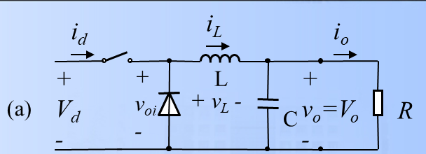
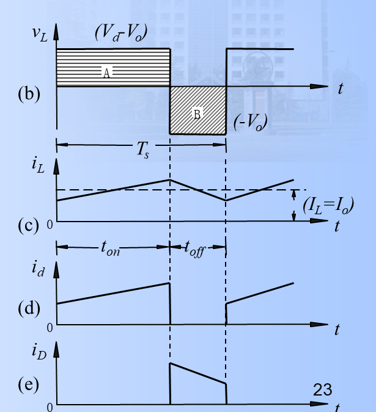
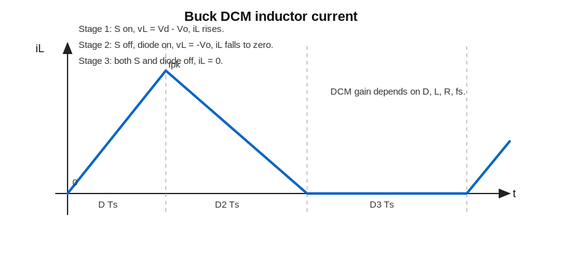

# 4 Buck 变换器笔记

## 一、这一讲的主线

Buck 变换器是降压型 DC-DC 变换器：

$$
V_o<V_d
$$

它由：

- 开关；
- 二极管；
- 电感；
- 电容；
- 负载

构成。

核心公式是：

$$
V_o=DV_d
$$

但这个公式成立的典型前提是：理想器件、稳态、连续导通模式。

Buck 的核心物理图像：

- 开关导通时，输入侧把能量送入电感、电容和负载；
- 开关关断时，电感电流不能突变，靠二极管续流；
- 电感负责“让电流连续”，电容负责“让输出电压平滑”。

分析 Buck 时先盯住两个状态的电感电压 $v_L$。  
因为：

$$
v_L=L\frac{di_L}{dt}
$$

所以 $v_L>0$ 时 $i_L$ 上升，$v_L<0$ 时 $i_L$ 下降。

---

## 二、两种开关状态

### 1. 开关导通

开关 $S$ 导通时：

- 输入电源给电感和负载供能；
- 二极管反偏；
- 电感电流上升。

电感电压：

$$
v_L=V_d-V_o
$$

持续时间：

$$
DT_s
$$

电感电流上升量：

$$
\Delta i_{L,\mathrm{on}}
=\frac{(V_d-V_o)DT_s}{L}
$$

### 2. 开关关断

开关关断时：

- 电感电流不能突变；
- 二极管导通续流；
- 电感给负载供能；
- 电感电流下降。

电感电压：

$$
v_L=-V_o
$$

持续时间：

$$
(1-D)T_s
$$

电感电流下降量：

$$
\Delta i_{L,\mathrm{off}}
=\frac{V_o(1-D)T_s}{L}
$$

两段电流变化量在稳态下大小相等：

$$
\Delta i_{L,\mathrm{on}}=\Delta i_{L,\mathrm{off}}
$$

这句话和“电感伏秒平衡”是同一件事。  
如果一个周期结束后电感电流没有回到起点，下一周期就会继续偏移，不可能是稳态。

---

## 三、用伏秒平衡推导电压增益

稳态时电感伏秒平衡：

$$
(V_d-V_o)DT_s+(-V_o)(1-D)T_s=0
$$

展开：

$$
DV_d-DV_o-V_o+DV_o=0
$$

所以：

$$
DV_d=V_o
$$

得到：

$$
\frac{V_o}{V_d}=D
$$

也可以从电流纹波相等推一遍：

$$
\frac{(V_d-V_o)DT_s}{L}
=\frac{V_o(1-D)T_s}{L}
$$

消去 $T_s$ 和 $L$：

$$
(V_d-V_o)D=V_o(1-D)
$$

展开：

$$
DV_d-DV_o=V_o-DV_o
$$

所以：

$$
V_o=DV_d
$$

这个推导能帮助判断符号：导通段电感“充能”的面积，必须等于关断段电感“放能”的面积。

---

## 四、电感电流纹波

由导通阶段：

$$
\Delta i_L=\frac{(V_d-V_o)DT_s}{L}
$$

代入：

$$
V_o=DV_d
$$

可得：

$$
\Delta i_L
=\frac{V_d(1-D)DT_s}{L}
$$

也可写成：

$$
\Delta i_L
=\frac{V_dD(1-D)}{Lf_s}
$$

这里的 $\Delta i_L$ 指峰峰值：

$$
\Delta i_L=I_{L,\max}-I_{L,\min}
$$

如果平均电感电流为 $I_L$，在三角波近似下：

$$
I_{L,\max}=I_L+\frac{\Delta i_L}{2}
$$

$$
I_{L,\min}=I_L-\frac{\Delta i_L}{2}
$$

理想 Buck 的输出平均电流近似等于电感平均电流：

$$
I_L\approx I_o=\frac{V_o}{R}
$$

### 纹波怎么理解

- $L$ 越大，纹波越小；
- $f_s$ 越高，纹波越小；
- $D(1-D)$ 在 $D=0.5$ 附近最大。

但要注意两种“最坏情况”不同：

- 若 $V_d$ 固定，只看 $D(1-D)$，纹波在 $D=0.5$ 最大；
- 若 $V_o$ 固定、$V_d$ 变化，则 $D=V_o/V_d$，常用形式为：

$$
\Delta i_L=\frac{V_o(1-D)}{Lf_s}
$$

此时 $V_d$ 越大，$D$ 越小，$(1-D)$ 越大，纹波越大。

---

## 五、输出电压纹波

若忽略电容 ESR，输出纹波主要来自电容充放电。  
Buck 中常用近似：

$$
\Delta V_o\approx\frac{\Delta i_L}{8Cf_s}
$$

这个式子来自电容电荷平衡。

电容电流为：

$$
i_C=i_L-I_o
$$

在 CCM 中，$i_L$ 围绕平均值 $I_o$ 上下三角波动。  
当 $i_L>I_o$ 时，电容充电；当 $i_L<I_o$ 时，电容放电。

一个充电区间的面积近似为三角形：

$$
\Delta Q
=\frac12\cdot\frac{T_s}{2}\cdot\frac{\Delta i_L}{2}
=\frac{\Delta i_LT_s}{8}
$$

电容电压变化满足：

$$
\Delta Q=C\Delta V_o
$$

所以：

$$
\Delta V_o
=\frac{\Delta Q}{C}
=\frac{\Delta i_LT_s}{8C}
=\frac{\Delta i_L}{8Cf_s}
$$

若考虑电容 ESR，还会有一项近似：

$$
\Delta V_{\mathrm{ESR}}\approx \Delta i_L\cdot ESR
$$

实际输出纹波通常是电容充放电纹波和 ESR 纹波共同作用。

因此：

- 电容越大，纹波越小；
- 开关频率越高，纹波越小；
- 电感电流纹波越小，输出纹波也越小。

电容稳态还满足电荷平衡：

$$
\int_0^{T_s}i_C(t)\,dt=0
$$

也就是一个周期内电容吸收的电荷和放出的电荷相等。  
这和电感的伏秒平衡是一对常用工具：

- 电感：稳态用伏秒平衡；
- 电容：稳态用电荷平衡。

---

## 六、连续导通模式 CCM

### 1. 条件

CCM 中电感电流不降为零：

$$
I_L>\frac{\Delta i_L}{2}
$$

边界情况是：

$$
I_{L,\min}=0
$$

所以：

$$
I_L=\frac{\Delta i_L}{2}
$$

由于 Buck 中 $I_L\approx I_o$，边界输出电流为：

$$
I_{oB}=\frac{\Delta i_L}{2}
$$

代入：

$$
\Delta i_L=\frac{V_o(1-D)}{Lf_s}
$$

得到：

$$
I_{oB}=\frac{V_o(1-D)}{2Lf_s}
$$

### 2. 边界电感

Buck 的边界电感可写为：

$$
L_b=\frac{(1-D)R}{2f_s}
$$

推导过程：

$$
I_o=\frac{V_o}{R}
$$

边界时：

$$
\frac{V_o}{R}
=\frac{V_o(1-D)}{2Lf_s}
$$

消去 $V_o$：

$$
\frac1R=\frac{1-D}{2Lf_s}
$$

整理得到：

$$
L_b=\frac{(1-D)R}{2f_s}
$$

若：

$$
L>L_b
$$

更容易保持 CCM。

---

## 七、断续导通模式 DCM

### 1. 特点

DCM 下一个周期有三段：

1. 开关导通，电感电流上升；
2. 开关关断，二极管导通，电感电流下降；
3. 电感电流为零，二极管也关断。

### 2. 为什么 DCM 更复杂

CCM 下：

$$
\frac{V_o}{V_d}=D
$$

只由占空比决定。

DCM 下，输出不仅与 $D$ 有关，还与：

- 负载 $R$；
- 电感 $L$；
- 频率 $f_s$

有关。

### 3. DCM 电压增益推导

设三个时间段分别为：

$$
DT_s,\qquad D_2T_s,\qquad D_3T_s
$$

并且：

$$
D+D_2+D_3=1
$$

第一段开关导通：

$$
v_L=V_d-V_o
$$

电感电流从 0 上升到峰值：

$$
I_{pk}=\frac{(V_d-V_o)DT_s}{L}
$$

第二段开关关断、二极管导通：

$$
v_L=-V_o
$$

电感电流从 $I_{pk}$ 降到 0：

$$
I_{pk}=\frac{V_oD_2T_s}{L}
$$

两式相等：

$$
(V_d-V_o)D=V_oD_2
$$

所以：

$$
D_2=\frac{V_d-V_o}{V_o}D
=\frac{1-M}{M}D
$$

其中：

$$
M=\frac{V_o}{V_d}
$$

输出电流等于电感电流平均值。DCM 的电感电流是一个三角形：

$$
I_o=\frac12 I_{pk}(D+D_2)
$$

这里的平均值是对整个周期取平均，因为 $D_3T_s$ 内电感电流为 0。

代入：

$$
I_o=\frac{V_o}{R}
$$

和：

$$
I_{pk}=\frac{(V_d-V_o)DT_s}{L}
$$

可得到 DCM 下的增益不再只等于 $D$。常用无量纲参数：

$$
K=\frac{2L}{RT_s}=\frac{2Lf_s}{R}
$$

代入并整理可得：

$$
KM^2+D^2M-D^2=0
$$

取正根，则 Buck DCM 增益满足：

$$
M=\frac{2}{1+\sqrt{1+\frac{4K}{D^2}}}
$$

这个式子不用死背，重点记住结论：

> DCM 下 $V_o/V_d$ 与 $D$、$L$、$R$、$f_s$ 都有关。

负载越轻，$R$ 越大，越容易进入 DCM。

---

## 八、参数设计思路

### 1. 已知输出电压求占空比

$$
D=\frac{V_o}{V_d}
$$

### 2. 按电流纹波选电感

若允许电感纹波为 $\Delta i_L$：

$$
L=\frac{V_dD(1-D)}{\Delta i_L f_s}
$$

### 3. 按输出纹波选电容

若允许输出纹波为 $\Delta V_o$：

$$
C\approx\frac{\Delta i_L}{8f_s\Delta V_o}
$$

### 4. 器件电压电流应力

理想 Buck 中，开关关断时承受输入电压：

$$
V_{S,\max}\approx V_d
$$

二极管反偏时也大约承受输入电压：

$$
V_{D,\mathrm{reverse}}\approx V_d
$$

开关和二极管的电流等级通常按电感电流峰值留裕量：

$$
I_{L,\max}=I_o+\frac{\Delta i_L}{2}
$$

实际选型还要考虑开关尖峰、二极管反向恢复、MOSFET 导通电阻和散热。

---

## 九、例题模板

已知：

$$
V_d,\quad V_o,\quad f_s,\quad R,\quad \Delta i_L
$$

求 $D$、$L$。

### 第一步：求占空比

$$
D=\frac{V_o}{V_d}
$$

### 第二步：求平均输出电流

$$
I_o=\frac{V_o}{R}
$$

Buck 中：

$$
I_L\approx I_o
$$

### 第三步：选电感

$$
L=\frac{V_dD(1-D)}{\Delta i_L f_s}
$$

### 第四步：检查 CCM

确认：

$$
I_L>\frac{\Delta i_L}{2}
$$

如果不满足，就进入 DCM，不能再直接用简单 CCM 公式。

---

## 十、课件习题 7-1：保证 Buck 全范围 CCM

题意：Buck 变换器，理想器件，输出保持：

$$
V_o=5\ \mathrm{V}
$$

输入范围：

$$
V_d=10\sim40\ \mathrm{V}
$$

输出功率要求：

$$
P_o\ge5\ \mathrm{W}
$$

开关频率：

$$
f_s=50\ \mathrm{kHz}
$$

求在所有条件下保持连续导通所需的最小电感。

### 第一步：找最轻负载

最容易进入 DCM 的情况是负载最轻，也就是输出电流最小。

$$
I_{o,\min}=\frac{P_{o,\min}}{V_o}
=\frac{5}{5}
=1\ \mathrm{A}
$$

等效负载最大：

$$
R_{\max}=\frac{V_o}{I_{o,\min}}
=\frac{5}{1}
=5\ \Omega
$$

### 第二步：写 Buck 边界电感

Buck 的边界电感：

$$
L_b=\frac{(1-D)R}{2f_s}
$$

要全范围 CCM，就取最坏情况的最大 $L_b$。

### 第三步：判断最坏输入电压

Buck 中：

$$
D=\frac{V_o}{V_d}
$$

当 $V_d$ 最大时，$D$ 最小，$(1-D)$ 最大，边界电感也最大。

所以取：

$$
V_{d,\max}=40\ \mathrm{V}
$$

$$
D_{\min}=\frac{5}{40}=0.125
$$

### 第四步：代入计算

$$
L_{\min}
=\frac{(1-0.125)\times5}{2\times50\times10^3}
$$

$$
L_{\min}
=\frac{4.375}{100000}
=43.75\times10^{-6}\ \mathrm{H}
$$

所以：

$$
L_{\min}\approx43.8\ \mu\mathrm{H}
$$

实际设计会留裕量，因此可选略大于该值的标准电感。

---

## 十一、这一讲最容易错的点

1. Buck 的电感在输出侧，所以 $I_L\approx I_o$；
2. $V_o=DV_d$ 不是任何条件下都成立，它主要用于 CCM 理想情况；
3. 电感电流不能突变，电容电压不能突变；
4. 二极管的作用是开关关断时给电感续流；
5. 纹波公式要分清电感纹波和输出电压纹波。

---

## 课件对齐补充：边界电流与最坏情况

Buck 的边界公式可以有三种等价写法，做题时选最顺手的：

$$
L_b=\frac{(1-D)R}{2f_s}
$$

若题目给定 $L$，要判断负载电流是否足够大，可写边界输出电流：

$$
I_{oB}=\frac{V_o(1-D)}{2Lf_s}
$$

因为 Buck 中 $I_L\approx I_o$，所以实际

$$
I_o>I_{oB}\Rightarrow \mathrm{CCM}
$$

最坏情况要看题目保持谁不变：

- 若 $V_d$ 固定、$D$ 可变，$D(1-D)$ 在 $D=0.5$ 最大，电感纹波最大；
- 若 $V_o$ 固定、$V_d$ 在范围内变化，$D=V_o/V_d$，通常 $V_d$ 最大时 $D$ 最小，$(1-D)$ 最大，最容易进入 DCM。

## 复习例题：Buck 全输入范围保持 CCM

题意：$V_d=50\sim80\ \mathrm{V}$，$V_o=40\ \mathrm{V}$，$L=60\ \mu\mathrm{H}$，$f_s=40\ \mathrm{kHz}$，求全输入范围保持 CCM 的最小输出功率。

第一步，求占空比范围：

$$
D=\frac{V_o}{V_d}
$$

$$
D_{\max}=\frac{40}{50}=0.8,
\qquad
D_{\min}=\frac{40}{80}=0.5
$$

第二步，用边界输出电流判断最坏情况：

$$
I_{oB}=\frac{V_o(1-D)}{2Lf_s}
$$

当 $D=0.5$ 时，$(1-D)$ 最大：

$$
I_{oB}=\frac{40\times0.5}{2\times60\times10^{-6}\times40\times10^3}
\approx4.17\ \mathrm{A}
$$

第三步，转成输出功率：

$$
P_{o,\min}=V_oI_{oB}=40\times4.17\approx166.7\ \mathrm{W}
$$

结论：若要求整个输入范围都保持 CCM，应满足

$$
P_o>166.7\ \mathrm{W}
$$

若只取等号，是边界模式；实际设计应留裕量。

## 复习例题：Buck 纹波与波形标注

题意：$V_d=12.5\ \mathrm{V}$，$V_o=5\ \mathrm{V}$，$I_o=2\ \mathrm{A}$，$f_s=20\ \mathrm{kHz}$，$L=100\ \mu\mathrm{H}$，$C=470\ \mu\mathrm{F}$。

第一步，求占空比和周期：

$$
D=\frac{5}{12.5}=0.4,
\qquad
T_s=\frac1{20\ \mathrm{kHz}}=50\ \mu s
$$

第二步，电感电压两段值：

$$
v_{L,on}=V_d-V_o=7.5\ \mathrm{V}
$$

$$
v_{L,off}=-V_o=-5\ \mathrm{V}
$$

第三步，电感电流纹波：

$$
\Delta i_L=\frac{(V_d-V_o)DT_s}{L}
=\frac{7.5\times0.4\times50\times10^{-6}}{100\times10^{-6}}
=1.5\ \mathrm{A}
$$

平均电感电流约等于输出电流：

$$
I_L\approx I_o=2\ \mathrm{A}
$$

所以：

$$
I_{L,\max}=2+0.75=2.75\ \mathrm{A},
\qquad
I_{L,\min}=2-0.75=1.25\ \mathrm{A}
$$

最小值大于 0，确认 CCM。

第四步，输出电压纹波近似：

$$
\Delta V_o\approx\frac{\Delta i_L}{8Cf_s}
=\frac{1.5}{8\times470\times10^{-6}\times20\times10^3}
\approx0.020\ \mathrm{V}
$$

器件选择答题口径：开关可选 MOSFET；续流二极管在几十 kHz 下优先考虑快恢复或肖特基二极管；耐压至少按 $V_d$ 加尖峰裕量选择。

## 练习问答补充

若 Buck 在固定占空比下负载突然开路，输出电容缺少放电通道，输出电压会上升；理想极限下会趋近输入电压，所以实际电路必须有过压保护或最小负载。

若题目比较 $D=0.2$ 和 $D=0.8$ 的开关利用率，按课件练习口径取 $D=0.8$ 更高。直观理解是开关在一个周期中承担有效能量传输的时间更长。

## 十二、考前速记

1. Buck 增益：

$$
\frac{V_o}{V_d}=D
$$

2. 电感纹波：

$$
\Delta i_L=\frac{V_dD(1-D)}{Lf_s}
$$

3. 输出纹波：

$$
\Delta V_o\approx\frac{\Delta i_L}{8Cf_s}
$$

4. 边界电感：

$$
L_b=\frac{(1-D)R}{2f_s}
$$

5. 做题核心：写两个状态的 $v_L$，再用伏秒平衡。
