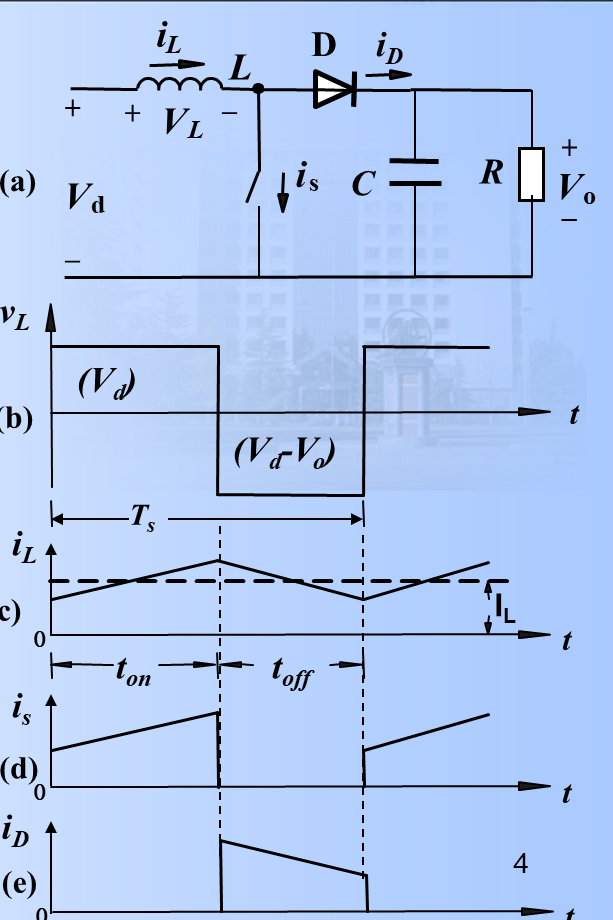
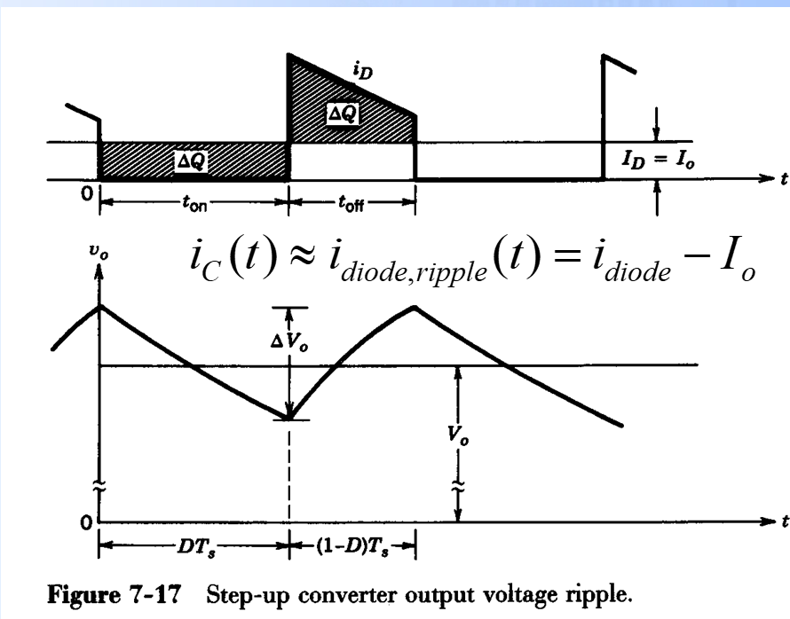
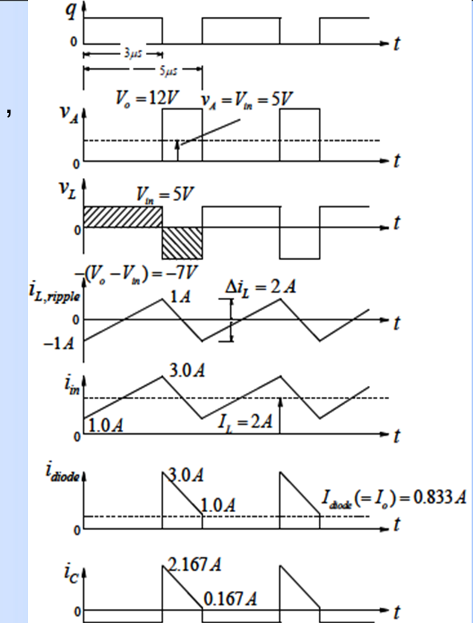

# 5 Boost 变换器笔记

## 一、这一讲的主线

Boost 变换器是升压型 DC-DC 变换器：

$$
V_o>V_d
$$

它的核心思想是：

> 开关导通时先把能量存入电感，开关关断时电源和电感一起向负载供能。

CCM 理想增益：

$$
\frac{V_o}{V_d}=\frac1{1-D}
$$

Boost 的物理图像和 Buck 正好相反：

- Buck 是“输入直接经开关送到输出侧”，电感在输出侧；
- Boost 是“先让输入给电感充能，再让电源和电感串联给输出侧供能”，电感在输入侧。

所以 Boost 中：

$$
I_L\approx I_{\mathrm{in}}
$$

而不是 $I_o$。

---

## 二、两种开关状态

### 1. 开关导通

开关 $S$ 导通时：

- 电感直接接在输入电源上；
- 二极管反偏；
- 负载主要由输出电容供电；
- 电感电流上升。

电感电压：

$$
v_L=V_d
$$

持续时间：

$$
DT_s
$$

电感电流上升量：

$$
\Delta i_{L,\mathrm{on}}
=\frac{V_dDT_s}{L}
$$

### 2. 开关关断

开关关断时：

- 电感电流不能突变；
- 电感电压反向；
- 输入源与电感串联，经二极管向负载供电；
- 电感电流下降。

电感电压：

$$
v_L=V_d-V_o
$$

由于 Boost 输出大于输入，所以该值为负。

持续时间：

$$
(1-D)T_s
$$

电感电流下降量的大小为：

$$
\Delta i_{L,\mathrm{off}}
=\frac{(V_o-V_d)(1-D)T_s}{L}
$$

稳态时，上升量和下降量相等：

$$
\Delta i_{L,\mathrm{on}}=\Delta i_{L,\mathrm{off}}
$$

这和电感伏秒平衡是同一个条件。

---

## 三、用伏秒平衡推导增益

稳态时：

$$
V_dDT_s+(V_d-V_o)(1-D)T_s=0
$$

约去 $T_s$：

$$
V_dD+V_d(1-D)-V_o(1-D)=0
$$

所以：

$$
V_d=V_o(1-D)
$$

得到：

$$
\frac{V_o}{V_d}=\frac1{1-D}
$$

也可以从电感电流纹波相等推导：

$$
\frac{V_dDT_s}{L}
=\frac{(V_o-V_d)(1-D)T_s}{L}
$$

消去 $T_s$ 和 $L$：

$$
V_dD=(V_o-V_d)(1-D)
$$

展开：

$$
V_dD=V_o(1-D)-V_d(1-D)
$$

右边的 $V_dD$ 与 $-V_d(1-D)$ 合起来等价于把 $V_d$ 移到左侧，最后得到：

$$
V_d=V_o(1-D)
$$

所以：

$$
V_o=\frac{V_d}{1-D}
$$

这个式子也能解释为什么 Boost 会升压：关断时电感电压极性反向，电感等效为一个与输入串联的电源，把能量推向输出端。

---

## 四、电感电流纹波

由导通阶段：

$$
\Delta i_L=\frac{V_dDT_s}{L}
$$

写成频率形式：

$$
\Delta i_L=\frac{V_dD}{Lf_s}
$$

这里的 $\Delta i_L$ 是峰峰值：

$$
\Delta i_L=I_{L,\max}-I_{L,\min}
$$

若平均电感电流为 $I_L$：

$$
I_{L,\max}=I_L+\frac{\Delta i_L}{2}
$$

$$
I_{L,\min}=I_L-\frac{\Delta i_L}{2}
$$

在理想 Boost 中，输入平均电流就是电感平均电流：

$$
I_L\approx I_d
$$

由功率守恒：

$$
V_dI_d=V_oI_o
$$

又因为：

$$
V_o=\frac{V_d}{1-D}
$$

所以：

$$
I_L\approx I_d=\frac{I_o}{1-D}
$$

---

## 五、输出电容纹波

开关导通时，二极管截止，负载由输出电容供电。  
因此电容在导通时间内放电：

$$
\Delta Q\approx I_oDT_s
$$

所以：

$$
\Delta V_o\approx\frac{I_oD}{Cf_s}
$$

又因为：

$$
I_o=\frac{V_o}{R}
$$

可写为：

$$
\frac{\Delta V_o}{V_o}\approx\frac{D}{RCf_s}
$$

推导过程：

导通时间内，二极管电流为 0：

$$
i_D=0
$$

电容电流：

$$
i_C=i_D-I_o=-I_o
$$

所以电容放出的电荷为：

$$
\Delta Q=I_oDT_s
$$

由：

$$
\Delta V_o=\frac{\Delta Q}{C}
$$

得到：

$$
\Delta V_o=\frac{I_oDT_s}{C}
=\frac{I_oD}{Cf_s}
$$

再代入：

$$
I_o=\frac{V_o}{R}
$$

可得：

$$
\frac{\Delta V_o}{V_o}
=\frac{D}{RCf_s}
$$

这说明 Boost 的输出纹波与负载有关：$R$ 越小，输出电流越大，电容放电越明显，纹波越大。

---

## 六、为什么 Boost 不能把 $D$ 调到 1

从理想公式：

$$
\frac{V_o}{V_d}=\frac1{1-D}
$$

看起来 $D\to1$ 时输出无限大。  
但实际不可能，因为：

- 电感电流会迅速增大；
- 开关和二极管有损耗；
- 电容有 ESR；
- 控制环和器件耐压有限；
- DCM/CCM 变化会影响增益。

所以实际 Boost 的占空比不能无限接近 1。

---

## 七、边界导通

Boost 中平均电感电流不是输出电流，而是输入电流。

功率近似守恒：

$$
V_dI_d\approx V_oI_o
$$

又有：

$$
V_o=\frac{V_d}{1-D}
$$

所以：

$$
I_L\approx I_d=\frac{I_o}{1-D}
$$

这也是 Boost 选电感、电流额定值时最容易错的地方：  
电感电流会比输出电流大，尤其当 $D$ 较大时，$1-D$ 很小，输入电流会明显增大。

边界电感常写为：

$$
L_b=\frac{D(1-D)^2R}{2f_s}
$$

推导思路：

边界时：

$$
I_{L,\min}=0
$$

所以：

$$
I_{L,B}=\frac{\Delta i_L}{2}
$$

而：

$$
\Delta i_L=\frac{V_dD}{Lf_s}
$$

因此边界电感平均电流：

$$
I_{L,B}=\frac{V_dD}{2Lf_s}
$$

边界输出电流由功率关系换算：

$$
I_{oB}=(1-D)I_{L,B}
$$

代入 $V_d=V_o(1-D)$：

$$
I_{oB}
=(1-D)\frac{V_o(1-D)D}{2Lf_s}
=\frac{V_oD(1-D)^2}{2Lf_s}
$$

又因为：

$$
I_o=\frac{V_o}{R}
$$

边界时令 $I_o=I_{oB}$，整理得：

$$
L_b=\frac{D(1-D)^2R}{2f_s}
$$

---

## 八、参数设计思路

### 1. 求占空比

由：

$$
V_o=\frac{V_d}{1-D}
$$

得到：

$$
D=1-\frac{V_d}{V_o}
$$

### 2. 按电感纹波选电感

$$
L=\frac{V_dD}{\Delta i_L f_s}
$$

### 3. 按输出纹波选电容

$$
C\approx\frac{I_oD}{\Delta V_o f_s}
$$

---

## 九、例题模板

已知：

$$
V_d,\quad V_o,\quad R,\quad f_s,\quad \Delta V_o
$$

### 第一步：求占空比

$$
D=1-\frac{V_d}{V_o}
$$

### 第二步：求输出电流

$$
I_o=\frac{V_o}{R}
$$

### 第三步：估算输入/电感平均电流

$$
I_L\approx\frac{I_o}{1-D}
$$

### 第四步：选 $L$ 与 $C$

$$
L=\frac{V_dD}{\Delta i_L f_s}
$$

$$
C=\frac{I_oD}{\Delta V_o f_s}
$$

### 第五步：检查器件应力

理想 Boost 中：

- 开关关断时承受约 $V_o$；
- 二极管反压约 $V_o$；
- 电感电流大于输出电流。

---

## 十、课件例题 7-B：Boost 参数和波形计算

题意：Boost 变换器工作于直流稳态，已知：

$$
V_{\mathrm{in}}=5\ \mathrm{V},\qquad V_o=12\ \mathrm{V}
$$

$$
P_o=10\ \mathrm{W},\qquad f_s=200\ \mathrm{kHz}
$$

电感电流纹波：

$$
\Delta i_L=2\ \mathrm{A}
$$

假设理想器件，求电感并描述主要波形。

### 第一步：求占空比

Boost 的 CCM 增益：

$$
\frac{V_o}{V_d}=\frac1{1-D}
$$

因此：

$$
D=1-\frac{V_d}{V_o}
$$

代入：

$$
D=1-\frac{5}{12}
=0.583
$$

### 第二步：求周期和导通时间

$$
T_s=\frac1{f_s}
=\frac1{200\times10^3}
=5\ \mu s
$$

$$
t_{\mathrm{on}}=DT_s
=0.583\times5
\approx2.917\ \mu s
$$

### 第三步：用纹波求电感

Boost 导通阶段：

$$
v_L=V_d=5\ \mathrm{V}
$$

电流上升量：

$$
\Delta i_L=\frac{V_dDT_s}{L}
$$

所以：

$$
L=\frac{V_dDT_s}{\Delta i_L}
$$

代入：

$$
L=\frac{5\times0.583\times5\times10^{-6}}{2}
\approx7.29\times10^{-6}\ \mathrm{H}
$$

即：

$$
L\approx7.3\ \mu\mathrm{H}
$$

### 第四步：求平均电流并判断 CCM

输出电流：

$$
I_o=\frac{P_o}{V_o}
=\frac{10}{12}
=0.833\ \mathrm{A}
$$

理想功率守恒：

$$
V_dI_d\approx V_oI_o=P_o
$$

所以输入平均电流，也就是电感平均电流：

$$
I_L\approx I_d=\frac{P_o}{V_d}
=\frac{10}{5}
=2\ \mathrm{A}
$$

电感电流上下限：

$$
I_{L,\max}=2+\frac{2}{2}=3\ \mathrm{A}
$$

$$
I_{L,\min}=2-\frac{2}{2}=1\ \mathrm{A}
$$

由于最小值仍大于零，所以确实为 CCM。

### 第五步：写电感电压波形

导通时：

$$
v_L=+5\ \mathrm{V}
$$

关断时：

$$
v_L=V_d-V_o=5-12=-7\ \mathrm{V}
$$

所以电感电流导通时线性上升，关断时线性下降。

### 第六步：写电容电流波形

导通时二极管截止，负载由电容供电：

$$
i_C=-I_o=-0.833\ \mathrm{A}
$$

关断时二极管导通，电容电流为：

$$
i_C=i_D-I_o
$$

关断开始附近：

$$
i_C\approx3-0.833=2.167\ \mathrm{A}
$$

关断结束附近：

$$
i_C\approx1-0.833=0.167\ \mathrm{A}
$$

这也解释了课件中电容电流从约 $2.167\ \mathrm{A}$ 降到约 $0.167\ \mathrm{A}$ 的波形。

图中各波形对应关系：

- $q$：开关控制信号，高电平表示开关导通；
- $v_A$：开关管两端电压，导通时约为 0，关断时约为 $V_o$；
- $v_L$：电感电压，导通为 $+V_{in}$，关断为 $-(V_o-V_{in})$；
- $i_{L,ripple}$：电感纹波电流，围绕 0 上下变化；
- $i_{in}$：输入电流，也就是电感电流；
- $i_{diode}$：二极管电流，只在开关关断时存在；
- $i_C$：电容电流，导通时为 $-I_o$，关断时由二极管电流减去负载电流。

---

## 十一、这一讲最容易错的点

1. Boost 中电感在输入侧，电感平均电流约等于输入电流，不等于输出电流；
2. 导通时负载靠电容供电；
3. 关断时输入和电感串联给负载供电，所以升压；
4. 占空比越大增益越高，但实际会受损耗和电流限制；
5. 输出电容纹波主要发生在开关导通阶段。

---

## 课件对齐补充：Boost 边界模式

Boost 的边界输出电流常写成：

$$
I_{oB}=\frac{V_oD(1-D)^2}{2Lf_s}
$$

也可写边界电感：

$$
L_b=\frac{D(1-D)^2R}{2f_s}
$$

判断方式：

$$
I_o>I_{oB}\Rightarrow \mathrm{CCM},
\qquad
I_o<I_{oB}\Rightarrow \mathrm{DCM}
$$

注意 Boost 中 $I_L\approx I_{in}$，不是 $I_o$。很多错误就是把输出电流直接当电感平均电流。

### DCM 增益从哪里来

Boost 在 DCM 下一个周期分三段：

1. 开关导通，电感电流从 0 上升；
2. 开关关断，二极管导通，电感电流下降到 0；
3. 电感电流为 0，二极管也截止，输出由电容供电。

设第二段持续时间为 $\Delta_1T_s$。  
第一段：

$$
I_{pk}=\frac{V_dDT_s}{L}
$$

第二段：

$$
I_{pk}=\frac{(V_o-V_d)\Delta_1T_s}{L}
$$

两式相等：

$$
V_dD=(V_o-V_d)\Delta_1
$$

所以：

$$
\frac{V_o}{V_d}=\frac{D+\Delta_1}{\Delta_1}
$$

这就是课件中 DCM 增益式：

$$
\frac{V_o}{V_d}=\frac{D+\Delta_1}{\Delta_1}
$$

它说明 DCM 下增益不只由 $D$ 决定，还和负载、电感、频率有关。

## 复习例题 7-1：要求 Boost 始终 DCM 时怎么选 $L$

题意：Boost 输出稳压 $V_o=48\ \mathrm{V}$，输入 $V_d=12\sim36\ \mathrm{V}$，最大输出功率 $120\ \mathrm{W}$，$f_s=50\ \mathrm{kHz}$，要求始终工作在 DCM，求可用的最大电感。

第一步，求最大输出电流：

$$
I_{o,\max}=\frac{120}{48}=2.5\ \mathrm{A}
$$

第二步，求占空比范围：

$$
D=1-\frac{V_d}{V_o}
$$

$$
V_d=12\ \mathrm{V}\Rightarrow D=0.75,
\qquad
V_d=36\ \mathrm{V}\Rightarrow D=0.25
$$

第三步，为保证最大功率时仍是 DCM，应让实际输出电流不超过边界电流。课件指出该范围内 $D=0.75$ 时 $I_{oB}$ 最小，所以取这个最坏点：

$$
L_{\max}=\frac{V_oD(1-D)^2}{2I_{o,\max}f_s}
$$

$$
L_{\max}=\frac{48\times0.75\times0.25^2}{2\times2.5\times50\times10^3}
=9\ \mu\mathrm{H}
$$

结论：若要进一步保证 DCM，应选小于 $9\ \mu\mathrm{H}$ 的电感。

## 复习例题：Boost 参数设计一题多问

题意：Boost，$V_d=18\ \mathrm{V}$，$V_o=30\ \mathrm{V}$，$f_s=20\ \mathrm{kHz}$，$P_o=180\ \mathrm{W}$。

第一步，占空比：

$$
D=1-\frac{18}{30}=0.4
$$

第二步，电容。若 $\Delta V_o/V_o<5\%$，则

$$
\Delta V_o<0.05\times30=1.5\ \mathrm{V}
$$

输出电流：

$$
I_o=\frac{180}{30}=6\ \mathrm{A}
$$

Boost 输出纹波近似：

$$
C\ge\frac{I_oD}{\Delta V_of_s}
=\frac{6\times0.4}{1.5\times20\times10^3}
=80\ \mu\mathrm{F}
$$

第三步，保证 $P_o\ge180\ \mathrm{W}$ 时 CCM 的最小电感。边界时取 $I_o=I_{oB}$：

$$
L_{\min}=\frac{V_oD(1-D)^2}{2I_of_s}
$$

$$
L_{\min}=\frac{30\times0.4\times0.6^2}{2\times6\times20\times10^3}
=18\ \mu\mathrm{H}
$$

严格 CCM 应选大于 $18\ \mu\mathrm{H}$；等于该值时是边界。

第四步，波形标注：

- 开关导通：$v_L=+18\ \mathrm{V}$，开关电压 $v_T\approx0$；
- 开关关断：$v_L=V_d-V_o=-12\ \mathrm{V}$，开关电压 $v_T\approx V_o=30\ \mathrm{V}$；
- $P_o=180\ \mathrm{W}$ 时输入/电感平均电流 $I_L\approx P_o/V_d=10\ \mathrm{A}$。

## 十二、考前速记

1. Boost 增益：

$$
\frac{V_o}{V_d}=\frac1{1-D}
$$

2. 占空比：

$$
D=1-\frac{V_d}{V_o}
$$

3. 电感纹波：

$$
\Delta i_L=\frac{V_dD}{Lf_s}
$$

4. 输出纹波：

$$
\frac{\Delta V_o}{V_o}\approx\frac{D}{RCf_s}
$$

5. 边界电感：

$$
L_b=\frac{D(1-D)^2R}{2f_s}
$$
