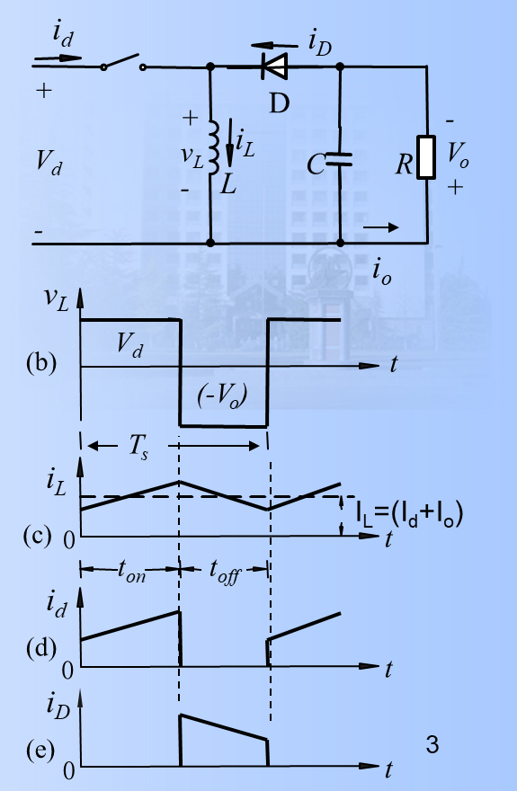
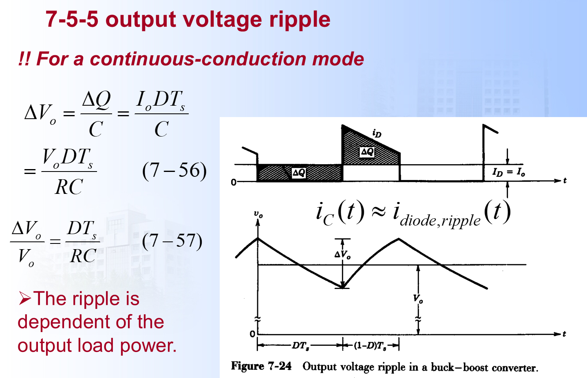
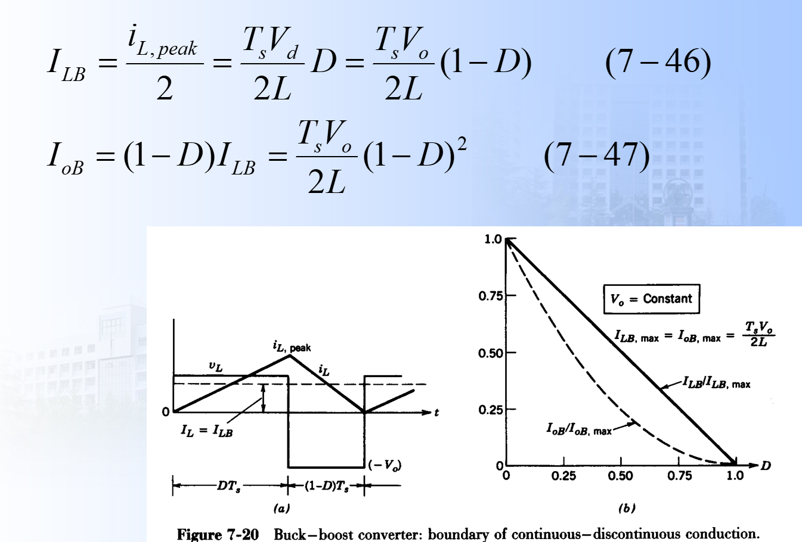
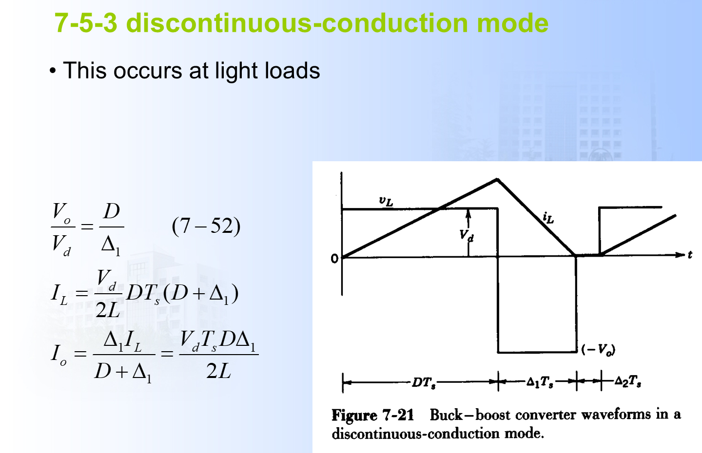
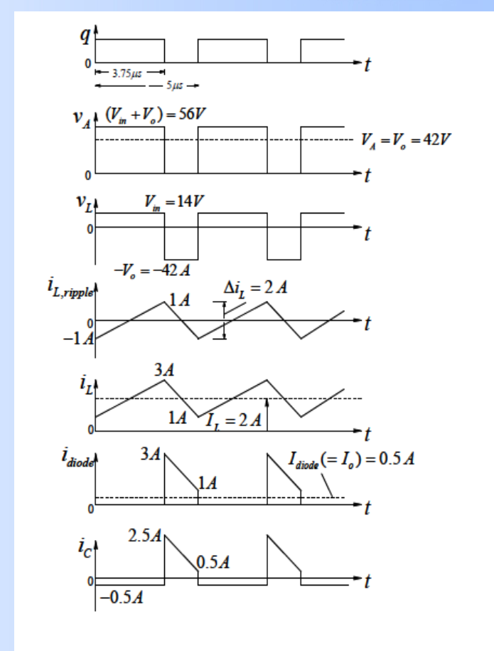

# 6 Buck-Boost 变换器笔记

## 一、这一讲的主线

基本 Buck-Boost 变换器既可以降压，也可以升压，  
但它的输出极性与输入相反。

理想 CCM 下，按课件中负载旁边标出的电压极性定义：

$$
\frac{V_o}{V_d}=\frac{D}{1-D}
$$

这里要特别注意：课件中的 $V_o$ 不是“上端对公共端”的带符号电压，而是按图中 $+$、$-$ 极性定义出来的正值。  
也就是说，负载上端相对公共端确实是负的，但课件把 $V_o$ 的正方向取成“下端为正、上端为负”。

如果另定义输出端上端对公共端的电压为 $v_{\text{out}}$，才有：

$$
v_{\text{out}}=-V_o
$$

因此：

$$
\frac{v_{\text{out}}}{V_d}=-\frac{D}{1-D}
$$

本讲后文默认沿用课件约定：$V_o>0$，不再给 $V_o$ 额外加绝对值。

---

## 二、为什么叫 Buck-Boost

当：

$$
D<0.5
$$

则：

$$
V_o<V_d
$$

表现为降压。

当：

$$
D>0.5
$$

则：

$$
V_o>V_d
$$

表现为升压。

当：

$$
D=0.5
$$

则：

$$
V_o=V_d
$$

---

## 三、两种开关状态

课件中的 CCM 拓扑和关键波形如下：

### 1. 开关导通

开关导通时：

- 输入电源给电感充电；
- 二极管反偏；
- 输出负载由电容供电；
- 电感电流上升。

此时输入侧和电感直接相连，输出侧被二极管隔开。  
所以瞬时关系可以理解为：

$$
i_d=i_L,\qquad i_D=0
$$

输出电容单独给负载供电：

$$
i_C=-I_o
$$

电感电压：

$$
v_L=V_d
$$

因此电感电流斜率为：

$$
\frac{di_L}{dt}=\frac{v_L}{L}=\frac{V_d}{L}
$$

持续时间：

$$
DT_s
$$

电感电流上升量：

$$
\Delta i_{L,\mathrm{on}}=\frac{V_dDT_s}{L}
$$

### 2. 开关关断

开关关断时：

- 电感电流不能突变；
- 电感极性反转；
- 二极管导通；
- 电感向电容和负载释放能量。

此时输入侧被切断：

$$
i_d=0
$$

但是电感电流仍然存在，电感通过二极管向输出侧放能：

$$
i_D=i_L
$$

这也是 Buck-Boost 输出反相的直观原因：导通时电感从输入侧储能，关断时电感以相反极性把能量送到输出电容，使输出端标注的正负号与输入相反。

按课件约定，$V_o$ 是输出电压的正值，但关断阶段电感电压方向与导通阶段相反，所以：

$$
v_L=-V_o
$$

电感电流斜率为：

$$
\frac{di_L}{dt}=\frac{v_L}{L}=-\frac{V_o}{L}
$$

电感电流下降。

持续时间：

$$
(1-D)T_s
$$

电感电流下降量为：

$$
\Delta i_{L,\mathrm{off}}
=\frac{V_o(1-D)T_s}{L}
$$

在 CCM 中，如果忽略纹波，只看一个周期的平均值：

$$
I_d=D I_L
$$

因为输入电流只在开关导通时等于电感电流。

而输出电流来自关断阶段的二极管电流：

$$
I_o=(1-D)I_L
$$

所以：

$$
I_L=\frac{I_o}{1-D}
$$

这两个平均电流关系也可以直接从：

$$
I=\frac{Q}{T}
$$

来理解。这里的 $Q$ 是一个周期内通过某个端口的电荷量，等价于电流波形面积。

对输入端来说，只有开关导通的 $DT_s$ 时间内有输入电流，而且这段时间：

$$
i_d=i_L
$$

若忽略纹波，把电感电流近似看成平均值 $I_L$，则一个周期内从输入端取走的电荷为：

$$
Q_d=I_L\cdot DT_s
$$

所以输入平均电流为：

$$
I_d=\frac{Q_d}{T_s}
=\frac{I_LDT_s}{T_s}
=DI_L
$$

对输出端来说，导通阶段二极管截止，电感不向输出送电；只有关断阶段 $(1-D)T_s$ 内二极管导通，电感电流流向输出：

$$
i_D=i_L
$$

一个周期内送到输出侧的电荷近似为：

$$
Q_o=I_L(1-D)T_s
$$

稳态时电容平均电流为 0，所以负载平均电流等于二极管电流的周期平均值：

$$
I_o=I_{D,\mathrm{avg}}
$$

因此：

$$
I_o=\frac{Q_o}{T_s}
=\frac{I_L(1-D)T_s}{T_s}
=(1-D)I_L
$$

这就是为什么 Buck-Boost 中电感平均电流不是输出电流，而是：

$$
I_L=\frac{I_o}{1-D}
$$

一句话记忆：$I_d=DI_L$ 来自“输入只在导通时间取电荷”；$I_o=(1-D)I_L$ 来自“输出只在关断时间从电感得到电荷”。

也可以由功率守恒看出：

$$
V_dI_d=V_oI_o
$$

又因为：

$$
\frac{V_o}{V_d}=\frac{D}{1-D}
$$

所以：

$$
I_d=\frac{D}{1-D}I_o
$$

于是：

$$
I_d+I_o
=\frac{D}{1-D}I_o+I_o
=\frac{I_o}{1-D}
=I_L
$$

这就是课件中写 $I_L=I_d+I_o$ 的原因。

---

## 四、用伏秒平衡推导增益

稳态时，电感不能一直升流或一直降流，所以一个周期内电感电压平均值为零：

$$
\overline{v_L}=0
$$

按课件约定写：

$$
V_dDT_s+(-V_o)(1-D)T_s=0
$$

约去 $T_s$：

$$
V_dD-V_o(1-D)=0
$$

得到：

$$
V_o=\frac{D}{1-D}V_d
$$

所以：

$$
\frac{V_o}{V_d}=\frac{D}{1-D}
$$

如果另定义“输出上端对公共端”的带符号电压 $v_{\text{out}}$，则：

$$
v_{\text{out}}=-V_o
$$

所以：

$$
\frac{v_{\text{out}}}{V_d}=-\frac{D}{1-D}
$$

负号表示输出端相对输入公共端反极性；课件里的 $V_o$ 本身仍取正值。

---

## 五、电感电流纹波

导通阶段：

$$
\Delta i_L=\frac{V_dDT_s}{L}
$$

写成频率形式：

$$
\Delta i_L=\frac{V_dD}{Lf_s}
$$

关断阶段也可以得到同一个纹波：

$$
\Delta i_L=\frac{V_o(1-D)T_s}{L}
=\frac{V_o(1-D)}{Lf_s}
$$

两式相等，本质上就是伏秒平衡：

$$
V_dD=V_o(1-D)
$$

若 $I_L$ 表示电感平均电流，则：

$$
I_{L,\max}=I_L+\frac{\Delta i_L}{2}
$$

$$
I_{L,\min}=I_L-\frac{\Delta i_L}{2}
$$

保持 CCM 的条件是：

$$
I_{L,\min}>0
$$

也就是：

$$
I_L>\frac{\Delta i_L}{2}
$$

---

## 六、输出电容纹波

课件中的输出电压纹波图如下：

开关导通时，负载由电容供电。  
因此与 Boost 类似：

$$
\Delta V_o\approx\frac{I_oD}{Cf_s}
$$

推导过程是：

$$
i_C=-I_o
\qquad (0<t<DT_s)
$$

因此导通阶段电容损失的电荷为：

$$
\Delta Q=I_oDT_s
$$

电压纹波近似等于：

$$
\Delta V_o=\frac{\Delta Q}{C}
=\frac{I_oDT_s}{C}
=\frac{I_oD}{Cf_s}
$$

或：

$$
\frac{\Delta V_o}{V_o}\approx\frac{D}{RCf_s}
$$

因为：

$$
I_o=\frac{V_o}{R}
$$

所以：

$$
\frac{\Delta V_o}{V_o}
=\frac{I_oD}{Cf_sV_o}
=\frac{D}{RCf_s}
$$

注意这里的 $\Delta V_o$ 通常取峰峰值近似，并且忽略电容 ESR。

---

## 七、边界导通条件

课件中的边界导通图如下：

Buck-Boost 中输出电流不是电感平均电流。  
更准确地说，$I_o$ 是负载电流的平均值：

$$
I_o=\frac{V_o}{R}
$$

导通阶段二极管截止，电感不向输出侧供能：

$$
i_D=0
$$

但负载电流并不会消失，它由输出电容提供：

$$
i_o\approx I_o
$$

关断阶段二极管导通，电感电流流向输出侧：

$$
i_D=i_L
$$

其中一部分供给负载，一部分给电容充电或由电容补偿。  
稳态时电容一个周期内平均电流为零：

$$
I_C=0
$$

所以负载平均电流等于二极管电流的周期平均值：

$$
I_o=I_D
$$

因此在 Buck-Boost 中：

$$
I_o\neq I_L
$$

而是：

$$
I_o=(1-D)I_L
\qquad \text{(CCM，忽略纹波时)}
$$

这句话非常重要：输出电流是负载得到的平均电流，不是某一瞬间的电感电流。

边界模式下：

$$
I_{L,\mathrm{avg}}=\frac{\Delta i_L}{2}
$$

因为边界时 $i_L$ 的最小值刚好降到 0，一个周期内电感电流是从 0 上升到峰值、再下降到 0 的三角波。  
它在整个周期内的平均值等于三角形面积除以周期：

$$
I_{LB}
=\frac{\frac12 T_s I_{L,\mathrm{pk}}}{T_s}
=\frac{I_{L,\mathrm{pk}}}{2}
$$

所以这里的 $I_{LB}$ 指的是“边界状态下的平均电感电流”：

$$
I_{LB}=\frac{I_{L,\mathrm{pk}}}{2}
$$

导通阶段峰值为：

$$
I_{L,\mathrm{pk}}
=\frac{V_dDT_s}{L}
$$

因此：

$$
I_{LB}
=\frac{I_{L,\mathrm{pk}}}{2}
=\frac{V_dDT_s}{2L}
=\frac{V_dD}{2Lf_s}
$$

关断阶段电感电流从峰值降到 0，临界状态下刚好用完整个关断时间：

$$
(1-D)T_s
$$

课件中 $V_o$ 是正值，关断阶段电感电压为：

$$
v_L=-V_o
$$

所以电流下降的斜率大小为：

$$
\left|\frac{di_L}{dt}\right|=\frac{V_o}{L}
$$

因此峰值也可以由下降过程写成：

$$
I_{L,\mathrm{pk}}
=\frac{V_o(1-D)T_s}{L}
$$

代入 $I_{LB}=I_{L,\mathrm{pk}}/2$：

$$
I_{LB}
=\frac{T_sV_o}{2L}(1-D)
$$

这就是课件式 (7-46)：

$$
I_{LB}
=\frac{I_{L,\mathrm{pk}}}{2}
=\frac{T_sV_d}{2L}D
=\frac{T_sV_o}{2L}(1-D)
$$

输出平均电流来自二极管电流的周期平均值。  
临界时二极管电流只在关断阶段存在，而且也是一个三角形：

$$
0\rightarrow I_{L,\mathrm{pk}}\rightarrow 0
$$

所以：

$$
I_{oB}
=\frac{\frac12(1-D)T_s I_{L,\mathrm{pk}}}{T_s}
$$

整理得：

$$
I_{oB}
=\frac12(1-D)I_{L,\mathrm{pk}}
$$

又因为：

$$
I_{LB}=\frac{I_{L,\mathrm{pk}}}{2}
$$

所以：

$$
I_{oB}=(1-D)I_{LB}
$$

把式 (7-46) 代入：

$$
I_{oB}
=(1-D)\frac{T_sV_o}{2L}(1-D)
$$

得到课件式 (7-47)：

$$
I_{oB}
=\frac{T_sV_o}{2L}(1-D)^2
=\frac{V_o(1-D)^2}{2Lf_s}
$$

如果负载是电阻，边界时：

$$
I_{oB}=\frac{V_o}{R_b}
$$

代入上式可得到边界电感：

$$
L_b=\frac{(1-D)^2R}{2f_s}
$$

这里 $R$ 是实际负载电阻；当 $L=L_b$ 或 $I_o=I_{oB}$ 时，电路刚好处在 CCM/DCM 边界。

判断方式：

$$
I_o>I_{oB}\Rightarrow \mathrm{CCM}
$$

$$
I_o<I_{oB}\Rightarrow \mathrm{DCM}
$$

---

## 八、DCM 下为什么更麻烦

课件中的 DCM 波形如下：

DCM 下一个周期分三段：

1. 开关导通，电感电流从零上升；
2. 开关关断，电感电流下降到零；
3. 电感电流为零，负载由电容供电。

此时电压增益不再只由 $D$ 决定，还与：

- $L$；
- $R$；
- $f_s$

有关。

设三段时间分别为：

$$
DT_s,\qquad \Delta_1T_s,\qquad \Delta_2T_s
$$

其中：

$$
D+\Delta_1+\Delta_2=1
$$

导通阶段：

$$
I_{L,\mathrm{pk}}
=\frac{V_dDT_s}{L}
$$

关断阶段电感电流从峰值下降到 0：

$$
I_{L,\mathrm{pk}}
=\frac{V_o\Delta_1T_s}{L}
$$

两式相等：

$$
\frac{V_dDT_s}{L}
=\frac{V_o\Delta_1T_s}{L}
$$

所以 DCM 电压增益为：

$$
\frac{V_o}{V_d}=\frac{D}{\Delta_1}
$$

输出电流等于关断阶段二极管电流三角波的平均值：

$$
I_o
=\frac12 I_{L,\mathrm{pk}}\Delta_1
$$

代入峰值：

$$
I_o
=\frac12\cdot\frac{V_dDT_s}{L}\cdot\Delta_1
=\frac{V_dDT_s\Delta_1}{2L}
$$

又因为：

$$
I_o=\frac{V_o}{R}
$$

可以看出 DCM 下 $V_o/V_d$ 不再只由 $D$ 决定，还会受到 $R,L,f_s$ 的影响。  
令：

$$
K=\frac{2Lf_s}{R}
$$

可整理出常见形式：

$$
\frac{V_o}{V_d}
=\frac{D}{\sqrt{K}}
=D\sqrt{\frac{R}{2Lf_s}}
$$

---

## 九、参数设计模板

已知：

$$
V_d,\quad V_o,\quad R,\quad f_s,\quad \Delta i_L
$$

### 第一步：按课件约定求占空比

由：

$$
\frac{V_o}{V_d}=\frac{D}{1-D}
$$

得：

$$
D=\frac{V_o}{V_d+V_o}
$$

### 第二步：求输出电流

$$
I_o=\frac{V_o}{R}
$$

### 第三步：估算电感平均电流

由于输出只在关断阶段由电感提供：

$$
I_L\approx\frac{I_o}{1-D}
$$

### 第四步：选电感

$$
L=\frac{V_dD}{\Delta i_L f_s}
$$

### 第五步：检查 CCM

$$
I_L>\frac{\Delta i_L}{2}
$$

如果不满足，就说明电感电流会在某段时间降到零，进入 DCM。

### 第六步：估算器件应力

Buck-Boost 的开关和二极管承受的电压都比较大。  
开关关断时，开关两端大致承受：

$$
V_T\approx V_d+V_o
$$

二极管反偏时，也大致承受：

$$
V_D\approx V_d+V_o
$$

电流应力方面，开关导通时流过电感电流，二极管关断时不导通：

$$
i_T=i_L,\qquad i_D=0
$$

开关关断、二极管导通时：

$$
i_T=0,\qquad i_D=i_L
$$

所以开关和二极管的峰值电流通常都按电感峰值估算：

$$
I_{\mathrm{pk}}\approx I_{L,\max}
$$

---

## 十、课件例题 7-2：先判断模式，再求占空比

题意：Buck-Boost 变换器，已知：

$$
f_s=20\ \mathrm{kHz},\qquad L=0.05\ \mathrm{mH}
$$

$$
V_d=15\ \mathrm{V},\qquad V_o=10\ \mathrm{V}
$$

输出功率：

$$
P_o=10\ \mathrm{W}
$$

求占空比 $D$。

### 第一步：求输出电流

$$
I_o=\frac{P_o}{V_o}
=\frac{10}{10}
=1\ \mathrm{A}
$$

周期：

$$
T_s=\frac1{f_s}
=\frac1{20\times10^3}
=50\ \mu s
$$

### 第二步：不要急着套 CCM 公式

如果先假设 CCM，则：

$$
\frac{V_o}{V_d}
=\frac{D}{1-D}
$$

$$
\frac{10}{15}
=\frac{D}{1-D}
$$

解得：

$$
D_{\mathrm{CCM}}=\frac{10}{15+10}=0.4
$$

但是这只是 CCM 下的占空比，必须检查是否真的连续导通。

### 第三步：计算边界输出电流

Buck-Boost 边界模式下，电感峰值为：

$$
I_{L,\mathrm{pk}}=\frac{V_dDT_s}{L}
$$

边界时关断区间持续约为 $(1-D)T_s$，输出电流是二极管电流三角波的平均值：

$$
I_{oB}
=\frac12 I_{L,\mathrm{pk}}(1-D)
$$

代入：

$$
I_{oB}
=\frac12\cdot\frac{V_dDT_s}{L}\cdot(1-D)
$$

用 $D=0.4$ 检查：

$$
I_{oB}
=\frac12\cdot
\frac{15\times0.4\times50\times10^{-6}}{0.05\times10^{-3}}
\cdot0.6
$$

先算电感峰值：

$$
I_{L,\mathrm{pk}}
=\frac{15\times0.4\times50\times10^{-6}}{50\times10^{-6}}
=6\ \mathrm{A}
$$

所以：

$$
I_{oB}
=\frac12\times6\times0.6
=1.8\ \mathrm{A}
$$

实际输出电流：

$$
I_o=1\ \mathrm{A}<I_{oB}=1.8\ \mathrm{A}
$$

因此电路实际工作在 DCM，不能用 $D=0.4$。

### 第四步：用 DCM 关系求 $D$

DCM 下，电感电流从零开始上升：

$$
I_{L,\mathrm{pk}}=\frac{V_dDT_s}{L}
$$

关断阶段电感电压为 $-V_o$，电流下降斜率大小为 $V_o/L$，所以电流下降时间占比：

$$
D_2=\frac{V_d}{V_o}D
$$

这里 $D_2$ 是“关断后电感电流下降到 0 的那一段”占整个周期的比例。  
也就是：

$$
t_2=D_2T_s
$$

输出电流等于二极管电流三角波折算到整个周期的平均值：

$$
I_o=\frac12 I_{L,\mathrm{pk}}D_2
$$

代入：

$$
I_o
=\frac12
\left(\frac{V_dDT_s}{L}\right)
\left(\frac{V_d}{V_o}D\right)
$$

整理：

$$
I_o
=\frac{V_d^2D^2T_s}{2LV_o}
$$

因此：

$$
D=\sqrt{\frac{2LV_oI_o}{V_d^2T_s}}
$$

代入：

$$
D=\sqrt{
\frac{2\times50\times10^{-6}\times10\times1}
{15^2\times50\times10^{-6}}
}
$$

$$
D=\sqrt{0.0889}
\approx0.298
$$

所以本题正确占空比约为：

$$
D\approx0.30
$$

这个例题最重要的不是数值，而是步骤：先用 CCM 公式试算，再用边界电流判断模式，最后按实际模式求解。

---

## 十一、与 Buck 和 Boost 的比较

| 电路 | 输出极性 | CCM 增益 |
| :--- | :--- | :--- |
| Buck | 同极性 | $D$ |
| Boost | 同极性 | $\frac1{1-D}$ |
| Buck-Boost | 反极性 | $\frac{D}{1-D}$ |

表中的 Buck-Boost 增益沿用课件约定：$V_o$ 按负载上标出的 $+$、$-$ 极性取正值。  
如果另定义输出节点对公共端的带符号电压 $v_{\text{out}}$，才写：

$$
\frac{v_{\text{out}}}{V_d}=-\frac{D}{1-D}
$$

---

## 十二、这一讲最容易错的点

1. Buck-Boost 输出反相；
2. 电感导通时储能，关断时向输出放能；
3. 输出电容在导通阶段独自供电；
4. 电感平均电流不等于输出电流；
5. $D=0.5$ 只是 $V_o=V_d$，但输出节点对公共端仍然反极性；
6. 课件中的 $V_o$ 已经按输出端标出的正负号取正值，不需要再写成 $|V_o|$。

---

## 课件对齐补充：为什么边界式和 Boost 不一样

Buck-Boost 的边界输出电流可写成：

$$
I_{oB}=\frac{V_o(1-D)^2}{2Lf_s}
$$

对应边界电感：

$$
L_b=\frac{(1-D)^2R}{2f_s}
$$

判断时仍然是：

$$
I_o>I_{oB}\Rightarrow \mathrm{CCM},
\qquad
I_o<I_{oB}\Rightarrow \mathrm{DCM}
$$

它和 Boost 的边界式很像，但少了一个 $D$。原因是 Buck-Boost 的输出只在关断区间由电感供能。

更具体地说：

$$
I_{oB}=(1-D)\cdot\frac{I_{L,\mathrm{pk}}}{2}
$$

而边界时：

$$
I_{L,\mathrm{pk}}
=\frac{V_dDT_s}{L}
$$

再用：

$$
V_dD=V_o(1-D)
$$

就得到：

$$
I_{oB}
=\frac{V_o(1-D)^2}{2Lf_s}
$$

这里 $(1-D)$ 出现两次：  
一个来自“输出只在关断区间得到能量”，另一个来自“关断阶段电感电压由 $V_o$ 决定”。

## 复习例题 7-C：Buck-Boost 参数和波形

题意：$V_d=14\ \mathrm{V}$，$V_o=42\ \mathrm{V}$，$P_o=21\ \mathrm{W}$，$\Delta i_L=2\ \mathrm{A}$，$f_s=200\ \mathrm{kHz}$。

第一步，占空比：

$$
D=\frac{V_o}{V_d+V_o}
=\frac{42}{14+42}=0.75
$$

周期与导通时间：

$$
T_s=5\ \mu s,
\qquad
T_{on}=DT_s=3.75\ \mu s
$$

第二步，电感：

$$
L=\frac{V_dDT_s}{\Delta i_L}
=\frac{14\times3.75\times10^{-6}}{2}
=26.25\ \mu\mathrm{H}
$$

第三步，平均电流：

$$
I_o=\frac{21}{42}=0.5\ \mathrm{A},
\qquad
I_{in}=\frac{21}{14}=1.5\ \mathrm{A}
$$

Buck-Boost 中电感平均电流近似为：

$$
I_L=I_{in}+I_o=2\ \mathrm{A}
$$

因此：

$$
I_{L,\max}=3\ \mathrm{A},
\qquad
I_{L,\min}=1\ \mathrm{A}
$$

第四步，波形：

- 导通时：$v_L=+14\ \mathrm{V}$，二极管电流为 0，电容电流 $i_C=-I_o=-0.5\ \mathrm{A}$；
- 关断时：$v_L=-V_o=-42\ \mathrm{V}$，二极管导通，$i_C=i_D-I_o$；
- 关断区间开始：$i_C\approx3-0.5=2.5\ \mathrm{A}$；
- 关断区间结束：$i_C\approx1-0.5=0.5\ \mathrm{A}$。

课件中的波形如下：

## 复习例题：Buck-Boost 全输入范围保持 CCM

题意：$V_d=32\sim72\ \mathrm{V}$，$V_o=48\ \mathrm{V}$，$f_s=50\ \mathrm{kHz}$，$L=100\ \mu\mathrm{H}$，求全范围保持 CCM 的最小输出功率，并求开关电压应力。

占空比范围：

$$
D=\frac{V_o}{V_d+V_o}
$$

$$
V_d=32\Rightarrow D=0.6,
\qquad
V_d=72\Rightarrow D=0.4
$$

边界输出电流：

$$
I_{oB}=\frac{V_o(1-D)^2}{2Lf_s}
$$

最坏情况取 $D_{\min}=0.4$，因为 $(1-D)^2$ 最大：

$$
I_{oB}=\frac{48\times0.6^2}{2\times100\times10^{-6}\times50\times10^3}
=1.728\ \mathrm{A}
$$

$$
P_{o,\min}=48\times1.728\approx82.9\ \mathrm{W}
$$

开关关断时承受输入电压加输出电压：

$$
V_{T,\max}\approx V_{d,\max}+V_o=72+48=120\ \mathrm{V}
$$

答优缺点时写：可升可降压；缺点是输出反极性，且开关/二极管电压电流应力较大。

## 复习例题：已知 $D$ 求电容和应力

题意：$V_d=24\ \mathrm{V}$，$D=0.6$，$f_s=50\ \mathrm{kHz}$，$P_o=360\ \mathrm{W}$，输出纹波率小于 $2\%$。

输出电压：

$$
V_o=\frac{D}{1-D}V_d=\frac{0.6}{0.4}\times24=36\ \mathrm{V}
$$

输出电流：

$$
I_o=\frac{360}{36}=10\ \mathrm{A}
$$

允许纹波：

$$
\Delta V_o<0.02\times36=0.72\ \mathrm{V}
$$

电容：

$$
C\ge\frac{I_oD}{\Delta V_of_s}
=\frac{10\times0.6}{0.72\times50\times10^3}
\approx166.7\ \mu\mathrm{F}
$$

开关电压应力：

$$
V_T\approx V_d+V_o=60\ \mathrm{V}
$$

## 十三、考前速记

1. Buck-Boost 增益：

$$
\frac{V_o}{V_d}=\frac{D}{1-D}
$$

若另定义输出节点对公共端电压：

$$
\frac{v_{\text{out}}}{V_d}=-\frac{D}{1-D}
$$

2. 占空比：

$$
D=\frac{V_o}{V_d+V_o}
$$

3. 电感纹波：

$$
\Delta i_L=\frac{V_dD}{Lf_s}
$$

4. 边界电感：

$$
L_b=\frac{(1-D)^2R}{2f_s}
$$

5. 记忆：Buck-Boost = 能升降压，但输出反极性。
