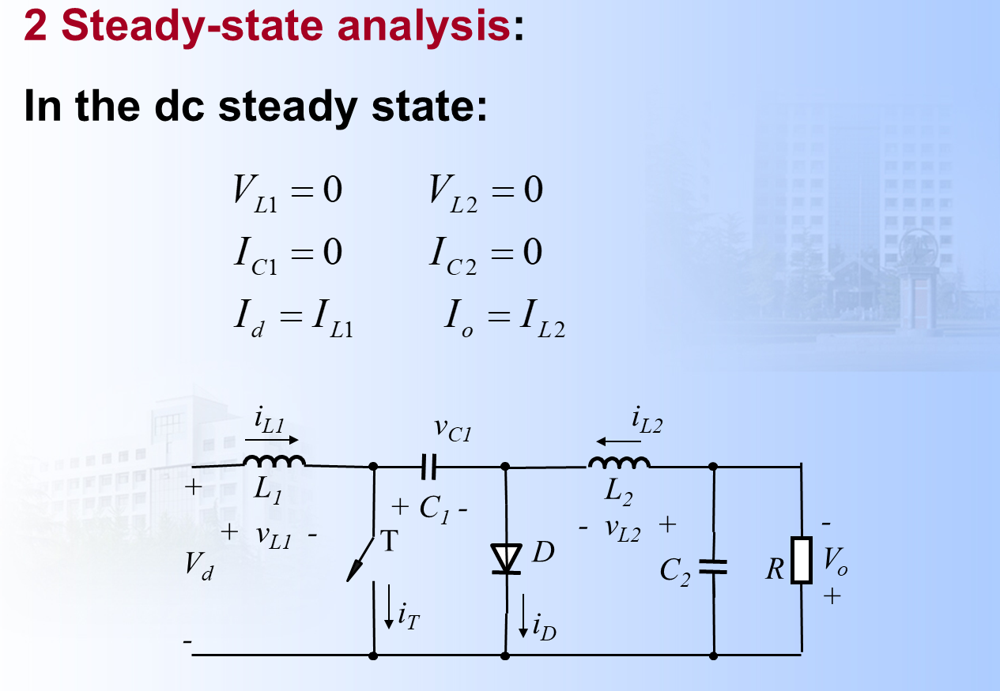
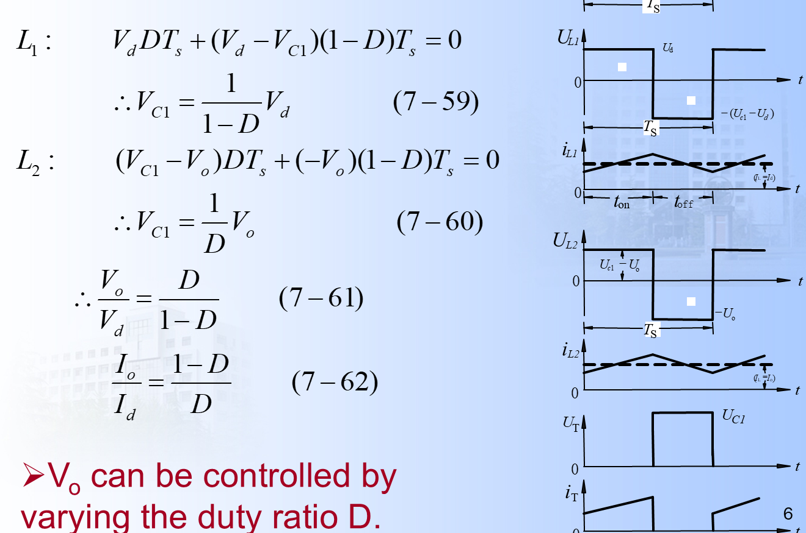
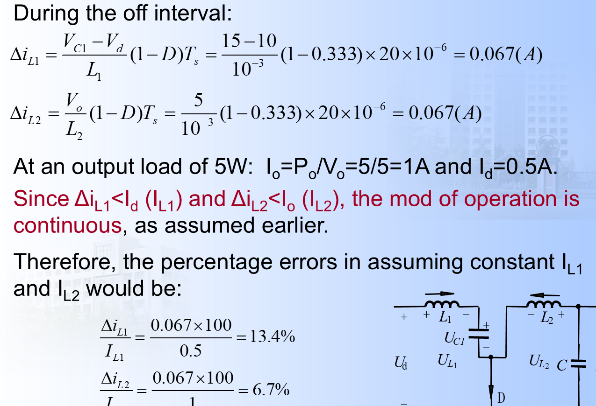
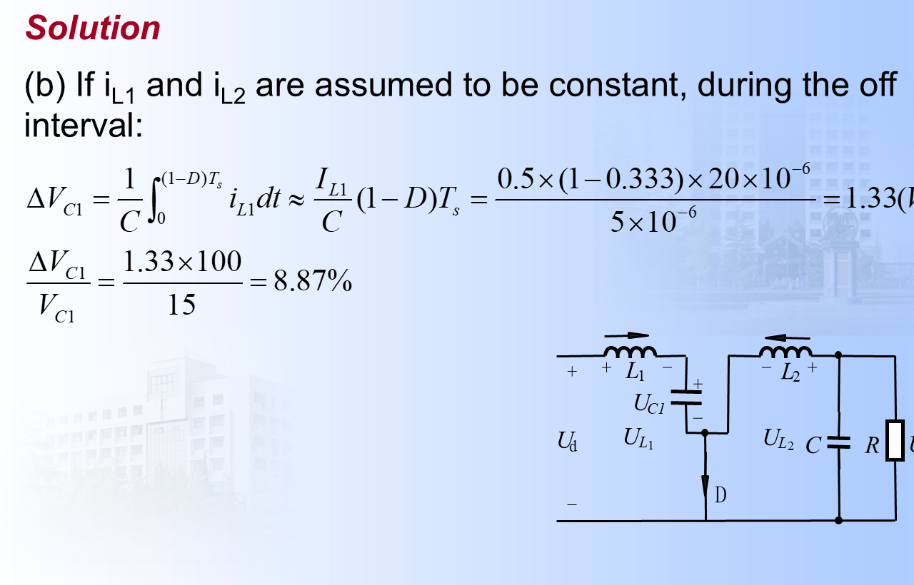
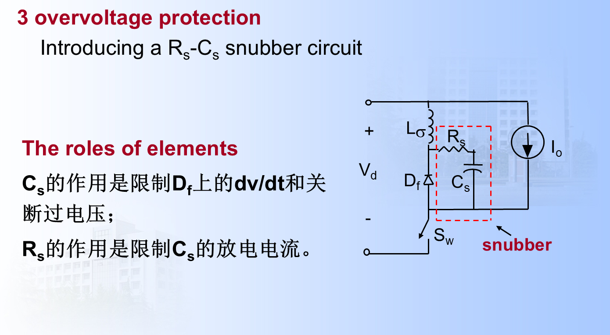
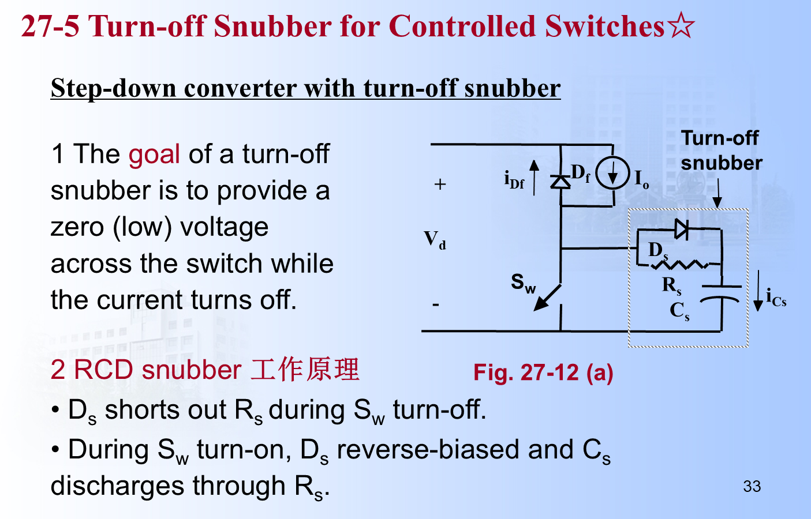
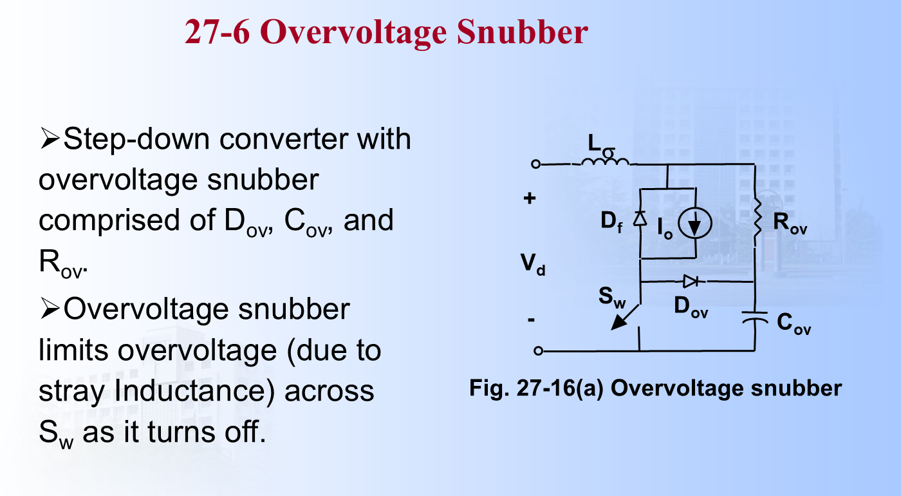
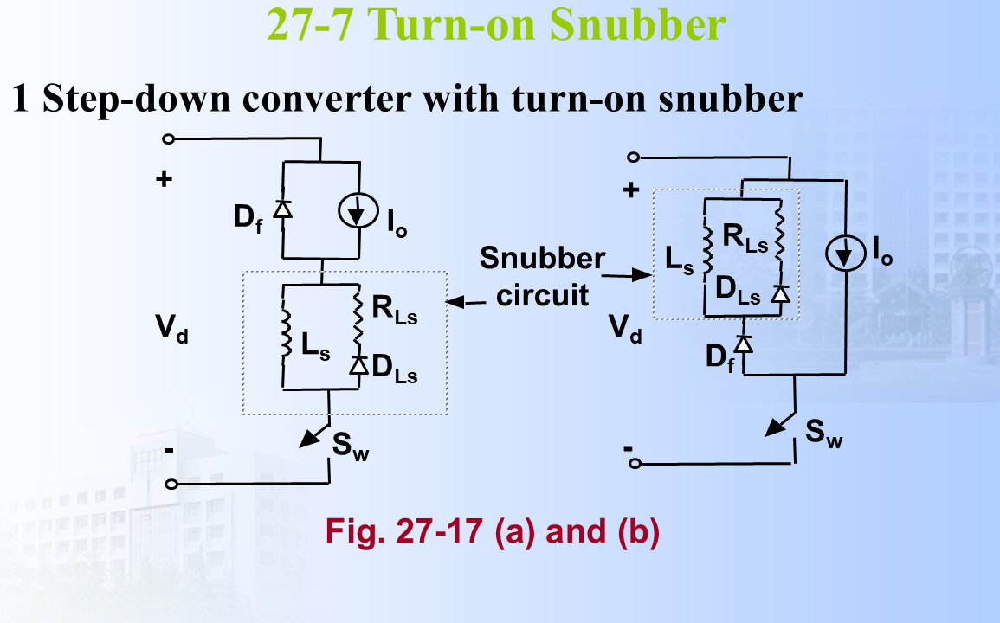

# 7 Cuk 变换器与缓冲电路基础笔记

## 一、这一讲的主线

这一讲前半部分讲 Cuk 变换器，后半部分引入 snubber 缓冲电路。

Cuk 与 Buck-Boost 的共同点：

- 都能升降压；
- 输出电压与输入反极性。

Cuk 的突出优点：

> 输入电流和输出电流都比较连续，纹波特性优于基本 Buck-Boost。

和 PE06 的 Buck-Boost 一样，这份课件里的 $V_o$ 按输出端标出的 $+$、$-$ 极性取正值。  
如果另定义输出节点对公共端的电压为 $v_{\text{out}}$，则：

$$
v_{\text{out}}=-V_o
$$

所以说“反极性”是指输出节点对公共端为负，不是说课件公式里的 $V_o$ 自己是负数。

---

## 二、Cuk 变换器的结构特点

课件中的 Cuk 拓扑和稳态平均关系如下：

基本 Cuk 变换器包含：

- 输入电感 $L_1$；
- 输出电感 $L_2$；
- 能量传递电容 $C_1$；
- 输出电容 $C_2$；
- 开关；
- 二极管；
- 负载。

其中 $C_1$ 不是普通滤波电容，而是能量转移的关键元件。

---

## 三、Cuk 的基本电压关系

理想稳态下：

$$
V_{C1}=V_d+V_o
$$

CCM 下输出电压增益为：

$$
\frac{V_o}{V_d}=\frac{D}{1-D}
$$

如果用输出节点对公共端的带符号电压 $v_{\text{out}}$ 表示，则：

$$
\frac{v_{\text{out}}}{V_d}=-\frac{D}{1-D}
$$

也就是说，Cuk 与 Buck-Boost 的“幅值增益形式”相同，并且都反极性。

课件中的稳态波形和推导式如下：

推导核心仍然是两个电感的伏秒平衡。

对 $L_1$：

导通时：

$$
v_{L1}=V_d
$$

关断时，$L_1$ 通过二极管给 $C_1$ 充电：

$$
v_{L1}=V_d-V_{C1}
$$

稳态伏秒平衡：

$$
V_dDT_s+(V_d-V_{C1})(1-D)T_s=0
$$

约去 $T_s$：

$$
V_dD+V_d(1-D)-V_{C1}(1-D)=0
$$

所以：

$$
V_{C1}=\frac{V_d}{1-D}
$$

对 $L_2$：

导通时，$C_1$ 向输出侧和 $L_2$ 供能：

$$
v_{L2}=V_{C1}-V_o
$$

关断时，$L_2$ 向负载供能：

$$
v_{L2}=-V_o
$$

伏秒平衡：

$$
(V_{C1}-V_o)DT_s+(-V_o)(1-D)T_s=0
$$

约去 $T_s$：

$$
V_{C1}D-V_oD-V_o(1-D)=0
$$

即：

$$
V_{C1}D=V_o
$$

所以：

$$
V_{C1}=\frac{V_o}{D}
$$

把两个 $V_{C1}$ 表达式相等：

$$
\frac{V_d}{1-D}=\frac{V_o}{D}
$$

得到：

$$
\frac{V_o}{V_d}=\frac{D}{1-D}
$$

同时也可推出：

$$
V_{C1}=\frac{V_d}{1-D}=V_d+V_o
$$

---

## 四、两种开关状态

### 1. 开关导通

开关导通时：

- 输入电源给 $L_1$ 充能，$i_{L1}$ 上升；
- 二极管反偏；
- $C_1$ 通过开关向输出侧和 $L_2$ 转移能量；
- $i_{L2}$ 上升。

这时：

- $L_1$ 从输入取能；
- $C_1$ 向输出侧放能。

电感电压可以写成：

$$
v_{L1}=V_d
$$

$$
v_{L2}=V_{C1}-V_o
$$

因此：

$$
\frac{di_{L1}}{dt}=\frac{V_d}{L_1}
$$

$$
\frac{di_{L2}}{dt}=\frac{V_{C1}-V_o}{L_2}
$$

两个电感电流都上升。

### 2. 开关关断

开关关断时：

- 二极管导通；
- $L_1$ 给 $C_1$ 充电；
- $L_2$ 向负载供能；
- 电感电流变化方向与导通阶段相反。

电感电压为：

$$
v_{L1}=V_d-V_{C1}
$$

$$
v_{L2}=-V_o
$$

因为 $V_{C1}>V_d$，所以 $v_{L1}<0$，$i_{L1}$ 下降；  
同时 $v_{L2}<0$，$i_{L2}$ 也下降。

这里 Cuk 的能量路径与 Buck-Boost 不一样：Buck-Boost 主要靠电感储能再放能，而 Cuk 的主要能量转移元件是 $C_1$。

---

## 五、为什么 Cuk 输入输出电流更平滑

Buck-Boost 中，输入电流和输出电流都有明显脉动。  
Cuk 在输入和输出各放一个电感：

- $L_1$ 平滑输入电流；
- $L_2$ 平滑输出电流。

因此它更适合对输入/输出纹波要求较高的场合。

---

## 六、Cuk 例题思路

课件例题给出：

$$
f_s=50\ \mathrm{kHz}
$$

$$
L_1=L_2=1\ \mathrm{mH}
$$

$$
C_1=5\ \mu\mathrm{F}
$$

$$
V_d=10\ \mathrm{V},\qquad V_o=5\ \mathrm{V}
$$

输出功率：

$$
P_o=5\ \mathrm{W}
$$

### 第一步：求占空比

由：

$$
\frac{V_o}{V_d}=\frac{D}{1-D}
$$

代入：

$$
\frac{5}{10}=\frac{D}{1-D}
$$

解得：

$$
D=\frac13\approx0.33
$$

### 第二步：估算 $C_1$ 平均电压

$$
V_{C1}=V_d+V_o=10+5=15\ \mathrm{V}
$$

### 第三步：求输出电流

$$
I_o=\frac{P_o}{V_o}
=\frac{5}{5}=1\ \mathrm{A}
$$

### 第四步：理解题目要考什么

这类题不是只让你套增益公式，还要检查：

- 能否把 $C_1$ 近似成恒压；
- 能否把 $i_{L1},i_{L2}$ 近似成恒流；
- 纹波百分比是否足够小。

### 第五步：估算 $i_{L1}$ 纹波百分比

周期：

$$
T_s=\frac1{50\ \mathrm{kHz}}=20\ \mu s
$$

导通时间：

$$
t_{\mathrm{on}}=DT_s
=\frac13\times20
\approx6.67\ \mu s
$$

关断时间：

$$
t_{\mathrm{off}}=(1-D)T_s
=\frac23\times20
\approx13.33\ \mu s
$$

输入平均电流由功率守恒估算：

$$
I_d=\frac{P_o}{V_d}
=\frac{5}{10}
=0.5\ \mathrm{A}
$$

所以：

$$
I_{L1}\approx0.5\ \mathrm{A}
$$

开关导通时：

$$
v_{L1}=V_d=10\ \mathrm{V}
$$

电感电流上升量：

$$
\Delta i_{L1}
=\frac{V_dt_{\mathrm{on}}}{L_1}
=\frac{10\times6.67\times10^{-6}}{1\times10^{-3}}
\approx0.0667\ \mathrm{A}
$$

相对于平均输入电感电流的比例：

$$
\frac{\Delta i_{L1}}{I_{L1}}
=\frac{0.0667}{0.5}
\approx13.3\%
$$

### 第六步：估算 $i_{L2}$ 纹波百分比

输出平均电流：

$$
I_{L2}\approx I_o=1\ \mathrm{A}
$$

导通时，输出电感电压幅值约为：

$$
v_{L2,on}
=V_{C1}-V_o
=15-5
=10\ \mathrm{V}
$$

所以：

$$
\Delta i_{L2}
=\frac{10\times6.67\times10^{-6}}{1\times10^{-3}}
\approx0.0667\ \mathrm{A}
$$

相对于平均输出电感电流：

$$
\frac{\Delta i_{L2}}{I_{L2}}
=\frac{0.0667}{1}
\approx6.7\%
$$

### 第七步：估算 $C_1$ 电压纹波

如果近似认为 $i_{L1}$ 和 $i_{L2}$ 恒定，则 $C_1$ 在一个阶段充电、另一个阶段放电。  
以关断阶段充电估算：

$$
\Delta v_{C1}
\approx\frac{I_{L1}t_{\mathrm{off}}}{C_1}
$$

代入：

$$
\Delta v_{C1}
\approx\frac{0.5\times13.33\times10^{-6}}{5\times10^{-6}}
\approx1.33\ \mathrm{V}
$$

相对于平均电压：

$$
\frac{\Delta v_{C1}}{V_{C1}}
=\frac{1.33}{15}
\approx8.9\%
$$

因此，对本例而言，把 $C_1$ 看成近似恒压、把两个电感电流看成近似恒流，误差量级在几个到十几个百分点，不是完全精确，但可用于一阶分析。

课件中的例题计算如下：

---

## 七、为什么需要 Snubber

实际电力电子电路中总有：

- 杂散电感；
- 器件结电容；
- 二极管反向恢复；
- 开关有限速度。

这些会导致：

- 过电压；
- 过电流；
- 过大的 $dv/dt$；
- 过大的 $di/dt$；
- EMI；
- 超出 SOA。

Snubber 的目的就是把这些瞬态应力拉回安全范围。

可以把 Snubber 理解成“给瞬态电压/电流找一条可控路径”：

- 电容提供电流暂时流入的地方，因此常用于限制 $dv/dt$ 和过电压；
- 电感阻碍电流突变，因此常用于限制 $di/dt$ 和开通过电流；
- 电阻把吸收来的能量耗散掉，并限制电容或电感的放电电流；
- 二极管决定缓冲支路在哪个阶段导通，使缓冲作用只在需要的方向出现。

---

## 八、器件可能承受的五类过应力

课件总结为：

1. 关断过电压；
2. 关断时高 $dv/dt$；
3. 开通过电流；
4. 开通时高 $di/dt$；
5. 过大功率损耗。

---

## 九、Snubber 的基本作用

Snubber 可以：

- 限制器件关断过电压；
- 限制器件关断 $dv/dt$；
- 限制器件开通过电流；
- 限制器件开通 $di/dt$；
- 改变开关轨迹；
- 降低瞬时开关损耗峰值。

---

## 十、三类常见缓冲电路

课件中的典型缓冲电路如下：

| 类型 | 主要用途 |
| :--- | :--- |
| 无极性 RC snubber | 二极管、晶闸管反向恢复过压保护 |
| 有极性 RC / RCD snubber | 受控开关关断保护、过压钳位 |
| 有极性 LR snubber | 开通时限制 $di/dt$ |

---

## 十一、二极管反向恢复与 RC 缓冲

### 1. 反向恢复电荷

$$
Q_{rr}\approx\frac12I_{rr}t_{rr}
$$

### 2. 过电压来源

若二极管反向恢复电流突然中断，杂散电感产生：

$$
v=L_\sigma\frac{di}{dt}
$$

### 3. RC 缓冲中元件作用

- $C_s$：限制二极管两端 $dv/dt$ 和关断过电压；
- $R_s$：限制 $C_s$ 放电电流，并耗散能量。

物理过程可以这样理解：

1. 二极管反向恢复结束时，反向电流突然减小；
2. 回路杂散电感 $L_\sigma$ 中的电流不能突变；
3. 若没有缓冲，$L_\sigma$ 会用很高的感应电压强迫电流继续流动；
4. 加上 $C_s$ 后，电流可以先给 $C_s$ 充电，电压上升速度变慢；
5. $R_s$ 给 $C_s$ 提供放电通路，并限制下次导通时的放电电流。

因此 RC 缓冲不是改变整流电路的稳态输出，而是削弱反向恢复引起的尖峰电压。

---

## 十二、RCD 关断缓冲

RCD snubber 常用于 MOSFET、IGBT 等受控开关。

元件作用：

- $C_s$：限制开关关断时电压上升；
- $R_s$：开通时泄放 $C_s$ 能量；
- $D_s$：关断时旁路 $R_s$，使 $C_s$ 快速承接电流。

关断过程：

1. 开关电流开始下降；
2. $D_s$ 导通，旁路 $R_s$；
3. 原本要流过开关的电流转移到 $C_s$；
4. $C_s$ 电压逐渐上升，使开关电压不会瞬间跳高；
5. 开关关断轨迹被拉到较低损耗区域。

开通过程：

1. 开关重新导通；
2. $D_s$ 反偏；
3. 已充电的 $C_s$ 通过 $R_s$ 放电；
4. $R_s$ 限制放电电流，并把 $C_s$ 中的能量耗散掉。

所以 RCD 关断缓冲的核心目标是：开关电流下降时，让开关电压暂时保持较低，从而降低关断瞬时功耗。

---

## 十三、过电压 Snubber 与开通 Snubber

### 1. 过电压 Snubber

过电压 Snubber 主要处理开关关断时由杂散电感引起的过压。

当开关关断时：

$$
v_L=L_\sigma\frac{di}{dt}
$$

如果电流下降很快，$\frac{di}{dt}$ 很大，开关两端可能出现超过直流母线电压 $V_d$ 的尖峰。

过电压 RCD 支路的作用是：

- $D_{ov}$：当开关电压升高到一定程度时导通，给 $C_{ov}$ 提供快速充电通路；
- $C_{ov}$：吸收杂散电感能量，限制开关电压峰值；
- $R_{ov}$：泄放 $C_{ov}$ 上的能量，并限制放电电流。

它和 RCD 关断缓冲很像，但侧重点不同：

- RCD 关断缓冲更强调“塑造关断轨迹、降低关断损耗”；
- 过电压缓冲更强调“钳位杂散电感造成的电压尖峰”。

### 2. 开通 Snubber

开通 Snubber 常用有极性 LR 支路。

开关开通时，电流本来可能快速上升，尤其还可能叠加二极管反向恢复电流。  
加入串联电感 $L_s$ 后：

$$
v=L_s\frac{di}{dt}
$$

所以在一定电压下，电流上升率被限制为：

$$
\frac{di}{dt}\approx\frac{v}{L_s}
$$

各元件作用：

- $L_s$：限制开通时电流上升率；
- $R_{Ls}$：在开通结束后释放 $L_s$ 中的能量；
- $D_{Ls}$：为 $L_s$ 的能量释放提供单向通路。

简单记忆：

$$
C\Rightarrow 限制\ dv/dt
$$

$$
L\Rightarrow 限制\ di/dt
$$

---

## 十四、这一讲最容易错的点

1. Cuk 的输出也是反极性；
2. Cuk 的能量主要通过 $C_1$ 转移；
3. Cuk 与 Buck-Boost 增益相同，但输入输出纹波特性不同；
4. Snubber 不是为了改变稳态增益，而是保护瞬态过程；
5. 限制 $dv/dt$ 常用电容，限制 $di/dt$ 常用电感；
6. $R_s$ 常常是为了放电和耗能，不是主能量传输元件。

---

## 课件对齐补充：Cuk 例题的判分点

Cuk 题目常考的不是一个公式，而是“近似是否合理”。写答案时按这四步最稳：

1. 用 $V_o/V_d=D/(1-D)$ 求 $D$；
2. 用 $V_{C1}=V_d+V_o$ 求能量传递电容平均电压；
3. 用 $\Delta i_{L1}/I_{L1}$ 和 $\Delta i_{L2}/I_{L2}$ 判断电感电流是否可近似恒定；
4. 用 $\Delta v_{C1}/V_{C1}$ 判断 $C_1$ 是否可近似恒压。

课件例题的最终量级可直接记：

$$
\frac{\Delta i_{L1}}{I_{L1}}\approx13.4\%,
\qquad
\frac{\Delta i_{L2}}{I_{L2}}\approx6.7\%
$$

$$
\frac{\Delta v_{C1}}{V_{C1}}\approx8.9\%
$$

所以该题结论不是“完全没有纹波”，而是“纹波不大，可作一阶近似”。

## Snubber 元件作用补充

RCD turn-off snubber 和 overvoltage snubber 容易混。可以这样记：

| 电路 | 电容作用 | 电阻作用 | 二极管作用 |
| :--- | :--- | :--- | :--- |
| RC snubber | 限制 $dv/dt$ 和峰值过压 | 限制放电电流、耗能 | 无 |
| RCD turn-off snubber | 开关关断时承接电流，限制 $dv/dt$ | 开通时泄放电容能量 | 关断时旁路电阻，让电容快速充电 |
| RCD overvoltage snubber | 吸收漏感能量、钳位过压 | 泄放电容能量 | 提供电容快速充电通路 |

考试答“各元件作用”时，关键词是：$C_s$ 吸收/限压，$R_s$ 放电/耗能，$D_s$ 定向快速充电或旁路电阻。

## 十五、考前速记

1. Cuk 增益：

$$
\frac{V_o}{V_d}=\frac{D}{1-D}
$$

若用输出节点对公共端电压 $v_{\text{out}}$：

$$
\frac{v_{\text{out}}}{V_d}=-\frac{D}{1-D}
$$

2. 能量传递电容平均电压：

$$
V_{C1}=V_d+V_o
$$

3. 反向恢复电荷：

$$
Q_{rr}\approx\frac12I_{rr}t_{rr}
$$

4. 过电压来源：

$$
v=L_\sigma\frac{di}{dt}
$$

5. Snubber 关键词：
   - 过压；
   - 过流；
   - $dv/dt$；
   - $di/dt$；
   - SOA；
   - 开关轨迹。
