# 8 Snubber 与驱动电路笔记

## 一、这一讲的主线

这一讲继续讨论实际电路问题：

1. 如何用缓冲电路保护功率器件；
2. 如何设计 MOSFET、IGBT 的门极驱动；
3. 驱动电阻、隔离和布局如何影响开关过程。

这部分的核心不是推稳态增益，而是让电路真实可用、可靠。

---

## 二、为什么实际应用必须考虑缓冲

实际电路会遇到：

- $di/dt$ 或 $dv/dt$ 超限；
- EMI；
- 电压电流尖峰；
- SOA 超限；
- 开关损耗过大。

过高的：

$$
\frac{dv}{dt}
$$

可能通过寄生电容耦合到控制端，造成误触发。

过高的：

$$
\frac{di}{dt}
$$

会通过寄生电感产生过电压：

$$
v=L_\sigma\frac{di}{dt}
$$

课件中的杂散电感与开关过冲示意如下：

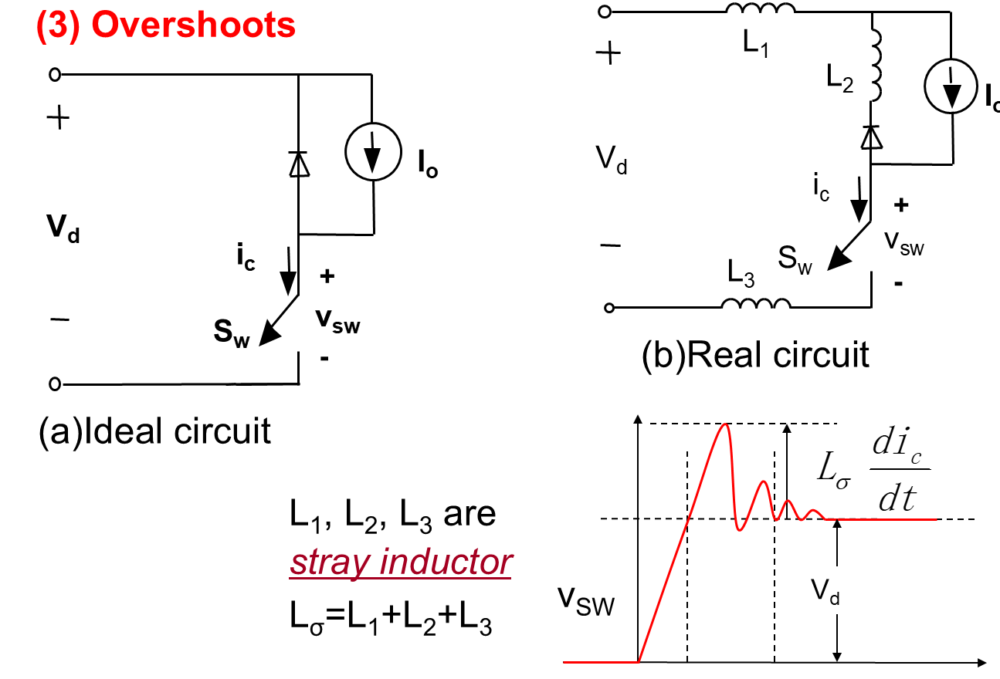

理想电路中开关电压只需要从 0 上升到直流母线电压 $V_d$。  
实际电路中，电流回路里有杂散电感：

$$
L_\sigma=L_1+L_2+L_3
$$

关断时电流下降，杂散电感会产生附加电压：

$$
v_\sigma=L_\sigma\frac{di}{dt}
$$

所以开关两端电压近似变成：

$$
v_{sw}\approx V_d+L_\sigma\frac{di}{dt}
$$

这就是关断尖峰和振铃的主要来源。  
如果 $\frac{di}{dt}$ 很大，即使 $L_\sigma$ 只有几十 nH，也可能产生明显过压。

---

## 三、缓冲电路分类与作用

课件对 Snubber 功能的总结如下：

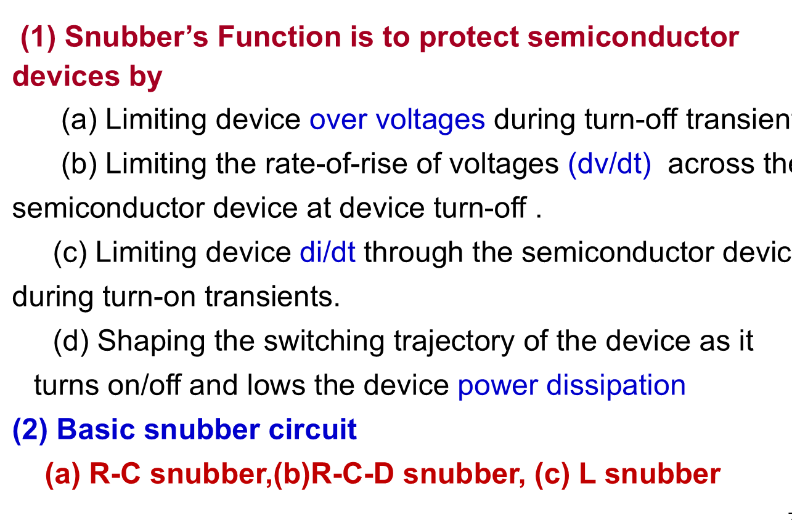

### 1. RC snubber

常用于二极管、晶闸管，限制反向恢复期间的过电压和 $dv/dt$。

元件作用：

- $C_s$：吸收瞬态电流，限制电压上升；
- $R_s$：限制电容放电电流，耗散能量。

### 2. RCD turn-off snubber

用于受控开关关断保护。

课件中的 RCD turn-off snubber 和 overvoltage snubber 对比如下：

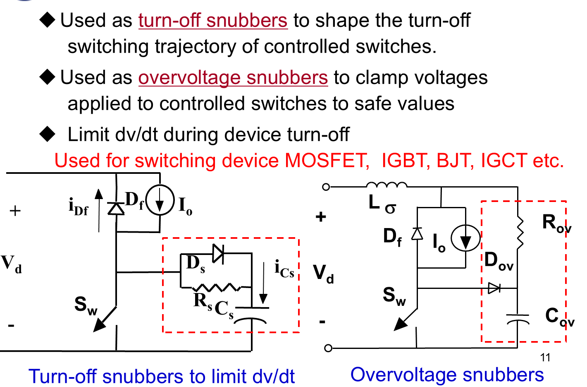

目标：

> 在开关电流下降时，使开关两端电压保持较低或上升较慢。

关断时：

- $D_s$ 导通，旁路 $R_s$；
- 开关电流转移到 $C_s$；
- $C_s$ 电压逐渐上升，限制开关两端 $dv/dt$；
- 开关电流下降过程中电压不至于立刻升高，关断损耗峰值减小。

开通时：

- $D_s$ 反偏；
- $C_s$ 通过 $R_s$ 放电；
- $R_s$ 限制放电电流并耗散 $C_s$ 储能。

### 3. Overvoltage snubber

用于吸收杂散电感能量，限制开关关断过电压。

它和 RCD turn-off snubber 的区别在于：

- turn-off snubber 更强调塑造开关轨迹、降低关断损耗；
- overvoltage snubber 更强调钳位由 $L_\sigma$ 引起的电压尖峰。

元件作用：

- $C_{ov}$：吸收漏感/杂散电感能量，限制峰值电压；
- $R_{ov}$：泄放 $C_{ov}$ 能量并限制放电电流；
- $D_{ov}$：给 $C_{ov}$ 提供快速充电通路。

### 4. LR turn-on snubber

课件中的 LR 开通缓冲如下：

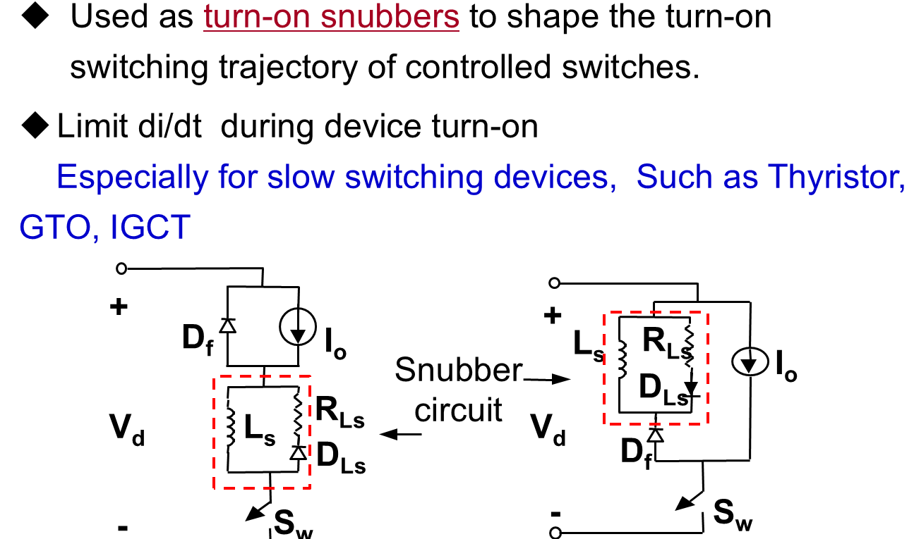

通过串联电感限制开通时电流上升率：

$$
\frac{di}{dt}
$$

若开通时加在缓冲电感上的电压约为 $v_L$，则：

$$
\frac{di}{dt}=\frac{v_L}{L_s}
$$

所以 $L_s$ 越大，电流上升越慢。  
但 $L_s$ 中储存的能量：

$$
E_L=\frac12L_si^2
$$

需要通过 $R_{Ls}$、$D_{Ls}$ 等支路释放，因此 LR 缓冲不能只看限流，还要考虑能量复位。

---

## 四、门极驱动电路的功能

课件中的门极驱动功能框图如下：

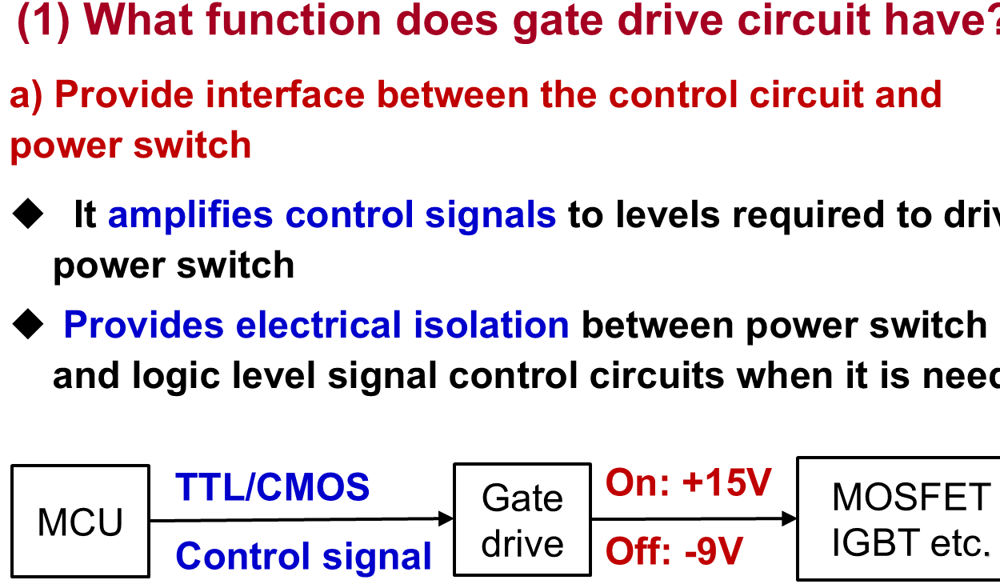

门极驱动电路不是简单“给一个高低电平”。  
它需要：

1. 把控制信号放大到器件所需电平；
2. 给栅极/门极电容快速充放电；
3. 必要时提供电气隔离；
4. 设置负压关断，增强抗干扰；
5. 提供过流、短路、欠压保护；
6. 给互补开关提供 dead time。

门极驱动面对的对象本质上是一个电容性输入。  
以 MOSFET 为例，驱动器要给栅极电荷 $Q_g$ 充放电：

$$
I_G\approx\frac{dQ_G}{dt}
$$

因此峰值驱动电流越大，完成充放电所需时间越短：

$$
t_{sw}\approx\frac{Q_g}{I_G}
$$

这就是为什么课件强调 output peak current capability。

---

## 五、MOSFET / IGBT 驱动电压

课件中的驱动设计考虑如下：

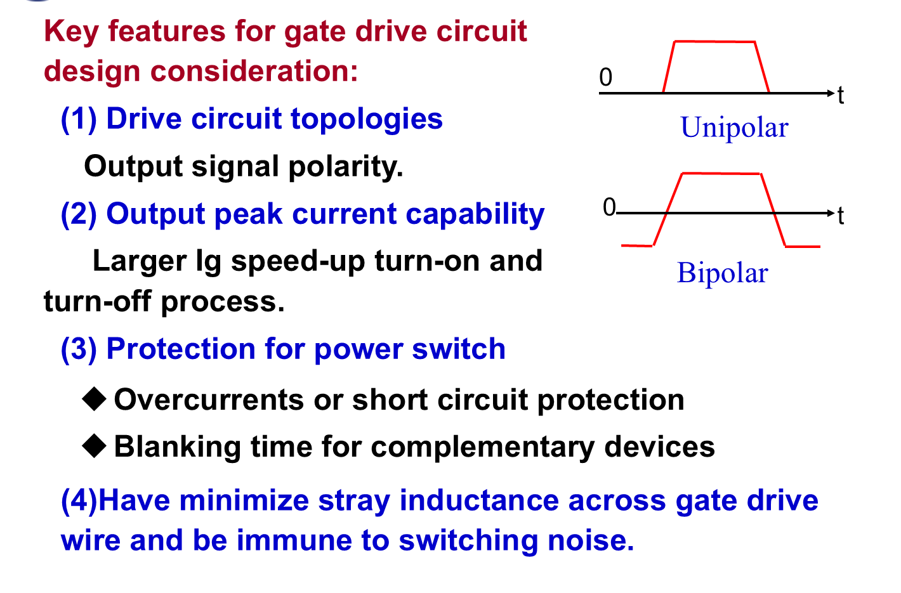

常见 IGBT/MOSFET 驱动：

- 开通：约 $+15\ \mathrm{V}$；
- 关断：可用 $0\ \mathrm{V}$ 或负压，如 $-5\sim-10\ \mathrm{V}$。

负压关断的作用：

- 抵抗 Miller 电容耦合；
- 避免高 $dv/dt$ 下误导通；
- 提高桥臂可靠性。

误导通的路径主要来自 Miller 电容 $C_{gc}$ 或 $C_{gd}$。  
当开关管漏极/集电极电压快速变化时：

$$
i_M=C_{gc}\frac{dv}{dt}
$$

这个电流流入门极回路，在门极电阻上形成电压：

$$
v_G\approx i_MR_G
$$

如果这个电压把 $V_{GE}$ 或 $V_{GS}$ 抬到阈值以上，就可能误导通。  
负压关断相当于给门极留出更大的安全裕量。

---

## 六、驱动电阻 $R_G$

### 1. $R_G$ 影响什么

门极电阻决定栅极充放电速度。

课件给出的驱动电压、负压关断和 $R_G$ 取值如下：

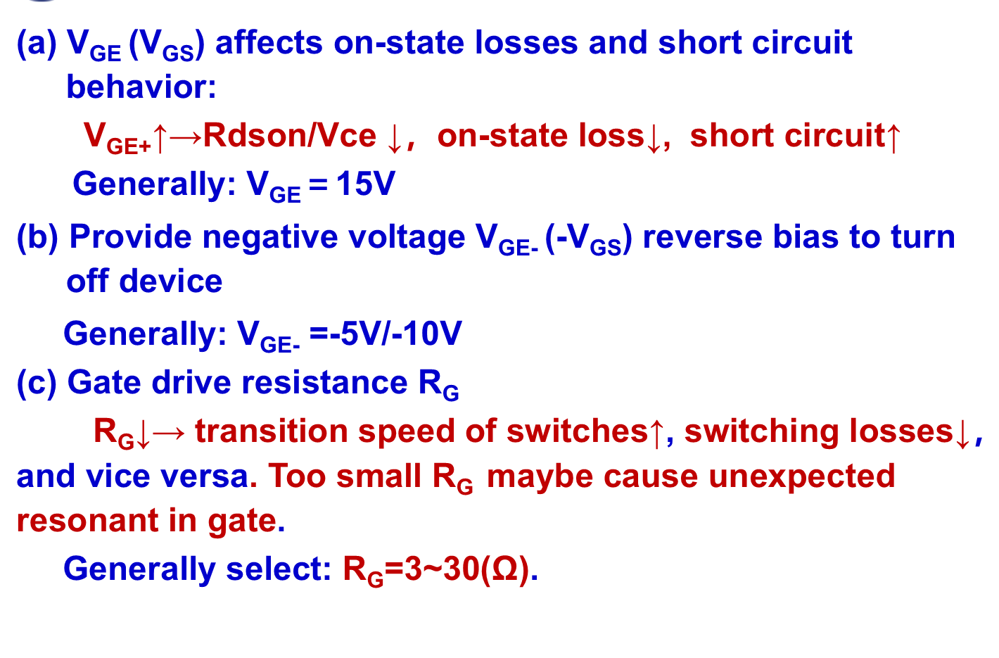

$$
R_G\downarrow
\Rightarrow
\text{开关速度提高}
\Rightarrow
\text{开关损耗降低}
$$

但同时：

$$
R_G\downarrow
\Rightarrow
dv/dt,di/dt\uparrow
\Rightarrow
EMI、振荡、过冲风险增加
$$

### 2. 常见范围

课件给出经验范围：

$$
R_G\approx3\sim30\ \Omega
$$

### 3. 做题/设计时怎么说

如果题目问“门极电阻影响”：

- 小电阻：快、损耗低、尖峰和 EMI 大；
- 大电阻：慢、损耗高、尖峰和 EMI 小。

更完整地说：

$$
R_G\downarrow\Rightarrow I_G\uparrow\Rightarrow t_{sw}\downarrow
$$

所以开关损耗下降；但同时：

$$
\frac{dv}{dt},\frac{di}{dt}\uparrow
$$

使寄生电感电压、Miller 误导通、EMI 和栅极振荡风险上升。

因此 $R_G$ 不是越小越好，而是在损耗、过冲、EMI、振荡之间折中。

---

## 七、隔离驱动

### 1. 为什么要隔离

控制电路通常是低压逻辑，功率电路可能高压浮动。  
隔离可以：

- 保护控制电路；
- 解决高侧开关参考点浮动；
- 提高抗干扰能力。

### 2. 常见隔离方式

课件中的隔离驱动方式示意如下：

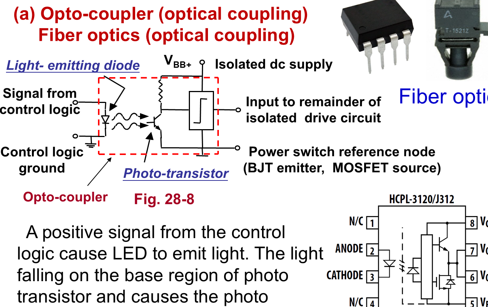

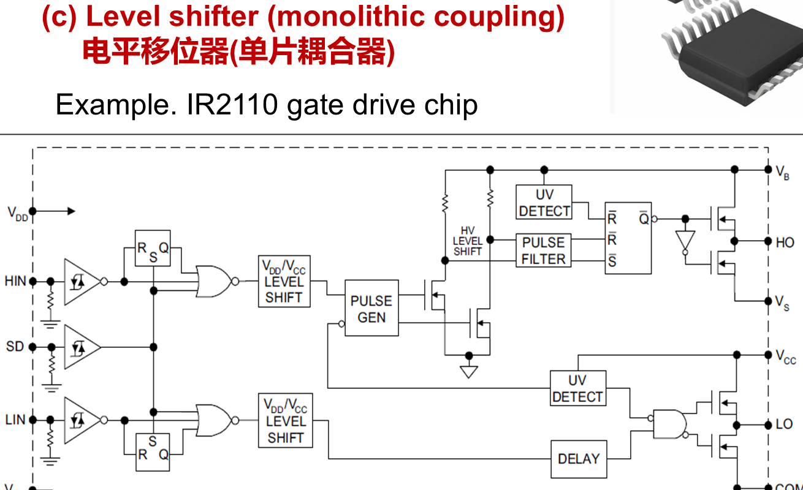

| 方式 | 特点 |
| :--- | :--- |
| 光耦 | 常见，隔离直观 |
| 光纤 | 抗干扰强 |
| 脉冲变压器 | 适合较高频驱动，但不能传直流占空比太极端的信号 |
| Coreless transformer | 集成化程度高 |
| 电容耦合 | 高速隔离芯片常用 |
| 电平移位 | 高低侧驱动芯片常用 |

几个容易混的点：

- 光耦/光纤：隔离能力强，抗共模干扰好，但速度和延迟一致性要看器件；
- 脉冲变压器：能量传递能力强，但不能传递直流，极端占空比会有磁复位问题；
- 电平移位：常用于半桥高低侧驱动，严格说不一定提供像光耦那样的安全隔离；
- 电容耦合/无芯变压器：常见于集成隔离驱动芯片，速度快、集成度高。

---

## 八、短路与过流保护

功率器件不能指望普通保险丝快速保护。  
常见保护方法是监测：

- IGBT 的 $V_{CE}$；
- MOSFET 的 $V_{DS}$。

课件中的 $V_{CE}$ 短路检测和软关断示意如下：

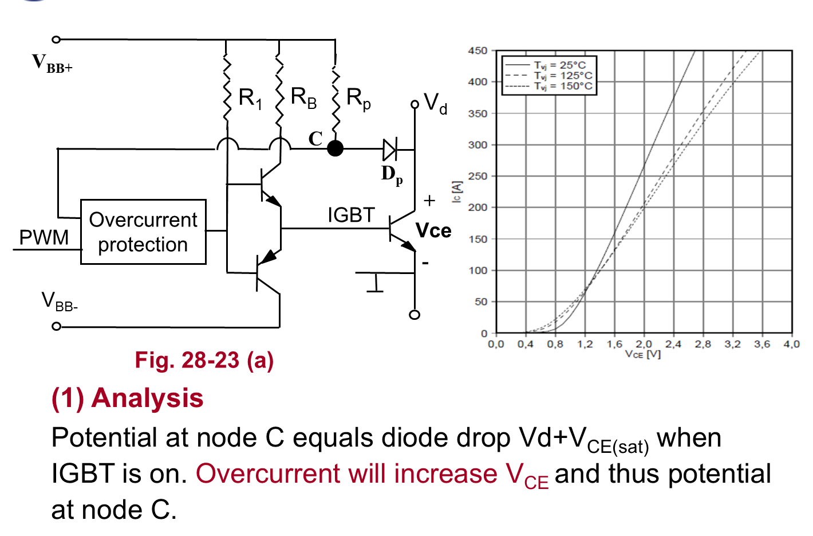

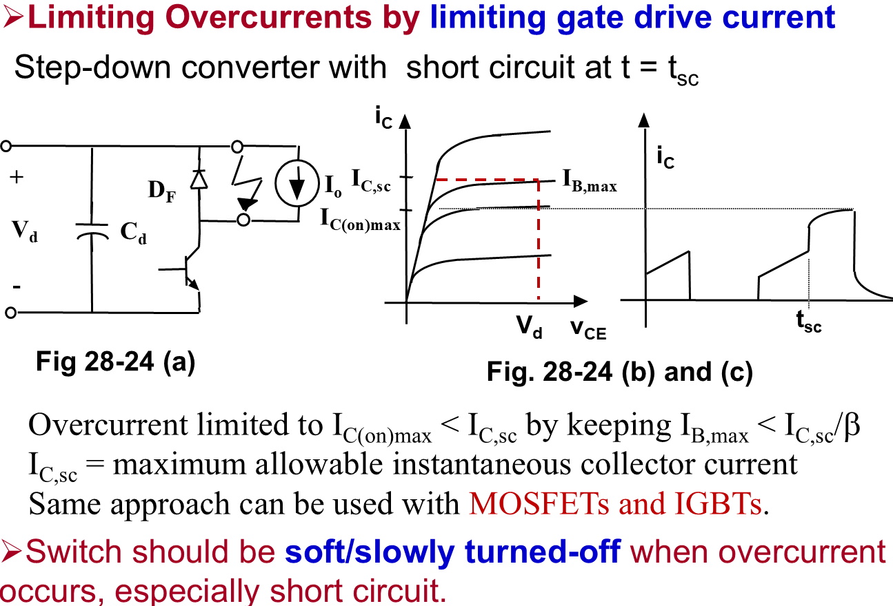

### 1. 原理

正常导通时：

$$
V_{CE}\approx V_{CE(sat)}
$$

若发生短路或过流，电流增大，器件退出正常饱和/导通状态，  
$V_{CE}$ 或 $V_{DS}$ 升高。

驱动电路检测到异常后关断器件。

以 IGBT 为例，检测点 C 的电位近似与：

$$
V_D+V_{CE}
$$

有关。正常导通时：

$$
V_{CE}\approx V_{CE(sat)}
$$

如果短路或过流，集电极电流急剧增大，IGBT 退出正常饱和区，$V_{CE}$ 明显升高，检测电路据此判断异常。

MOSFET 同理，常看导通时的：

$$
V_{DS}=I_DR_{DS(on)}
$$

当电流异常变大时，$V_{DS}$ 会升高。

### 2. 为什么短路要软关断

如果短路时猛然关断，  
大电流经过杂散电感会产生很高过电压：

$$
v=L_\sigma\frac{di}{dt}
$$

所以短路保护常要求：

- 快速检测；
- 限流；
- 软关断；
- 报警锁存。

软关断的本质是让关断过程变慢一点，减小：

$$
\frac{di}{dt}
$$

从而降低：

$$
v_\sigma=L_\sigma\frac{di}{dt}
$$

如果短路电流很大还硬关断，虽然器件电流迅速降下来了，但过压可能反而把器件击穿。

---

## 九、栅极过压保护

MOSFET/IGBT 的栅极氧化层不能承受过高电压。  
常用 TVS 或齐纳管并在栅极与源极/发射极之间。

作用：

- 钳位 $V_{GS}$ 或 $V_{GE}$；
- 防止驱动尖峰击穿栅极。

TVS 应尽量靠近器件栅极放置。

---

## 十、布局对驱动的影响

课件特别强调杂散电感。

课件中的布局和 Kelvin emitter/source 示意如下：

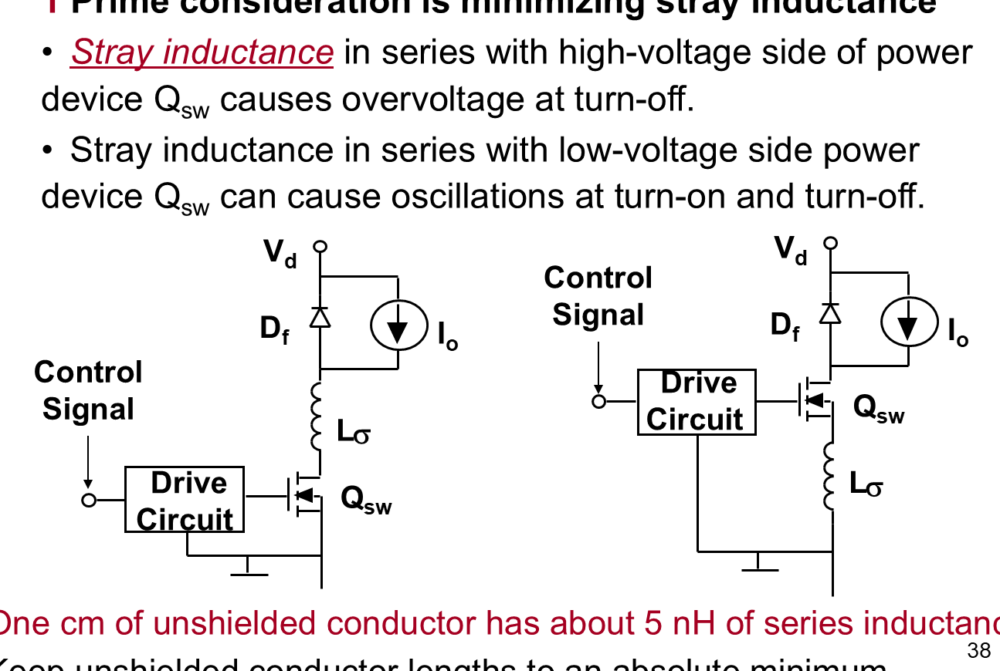

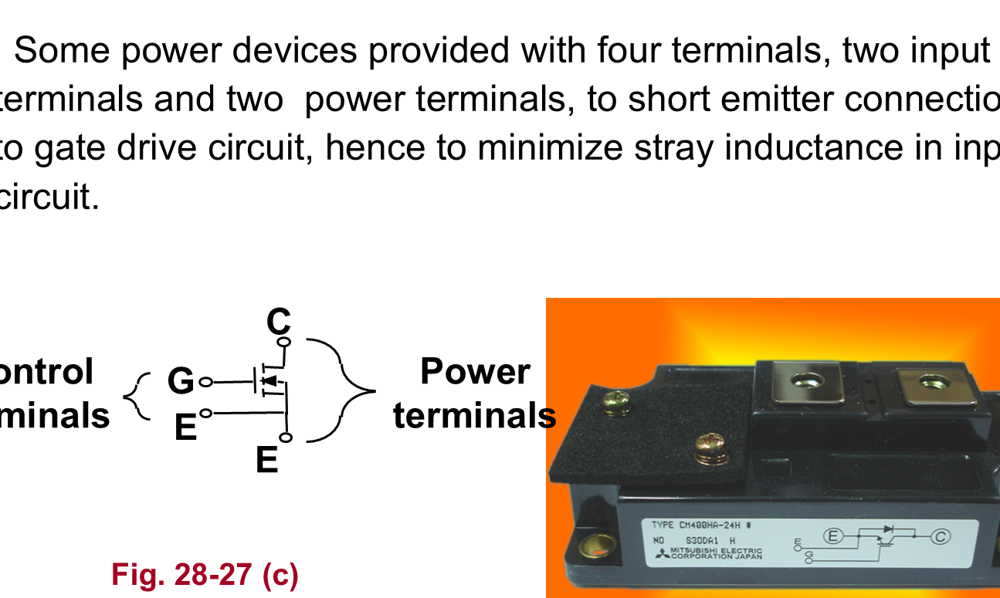

经验：

> 1 cm 未屏蔽导线可能有约 5 nH 串联电感。

高 $di/dt$ 下，即使很小电感也会产生明显尖峰。

### 布局建议

- 驱动板尽量靠近功率模块；
- 缩短栅极回路；
- 使用双绞线或屏蔽线；
- 功率回路与控制回路分开；
- Kelvin emitter/source 单独接驱动参考点。

为什么 Kelvin emitter/source 重要：

功率发射极/源极引线上有大电流变化，寄生电感会产生：

$$
v_L=L_e\frac{di}{dt}
$$

如果驱动参考点也接在这条功率引线上，门极实际看到的电压会被这个寄生电压扰动：

$$
V_{GE,\mathrm{actual}}=V_G-V_E
$$

于是可能出现：

- 开通时实际门压降低，开通变慢；
- 关断时门压被抬高，出现误导通；
- 栅极回路振荡。

Kelvin emitter/source 把驱动回路的参考点单独引出，避开主电流压降，能显著改善驱动稳定性。

---

## 十一、这一讲最容易错的点

1. 驱动电路不仅是放大电平，还承担保护和波形整形；
2. $R_G$ 不是越小越好；
3. 负压关断主要是为了抗误导通；
4. 短路不能简单硬关断，要考虑杂散电感过压；
5. Snubber 和 gate driver 都与实际寄生参数强相关；
6. 布局不好会让理论正确的电路在实物中失效。

---

## 课件对齐补充：驱动电路拓扑怎么记

课件里的驱动例子可以按输出极性和驱动能力来归类：

| 类型 | 特点 | 适用口径 |
| :--- | :--- | :--- |
| Unipolar drive | 只在 0 和正驱动电压间切换 | 单管、低频或简单场合 |
| Bipolar drive | 正压开通、负压关断 | 抗干扰更强，适合 IGBT/MOSFET 高 $dv/dt$ 场合 |
| Totem-pole drive | 推挽输出，充放电都快 | 常用栅极驱动输出级 |
| 集成驱动芯片/驱动核 | 集成隔离、保护、欠压锁定等 | 工业功率模块常见 |

一个常见问法是“为什么不能只用很大的上拉电阻直接驱 MOSFET”。答：电阻大虽然静态损耗小，但栅极充放电慢，开关损耗大；推挽/图腾柱驱动可以提供较大峰值充放电电流，而且稳态几乎不消耗栅极电流。

课件中的图腾柱驱动如下：

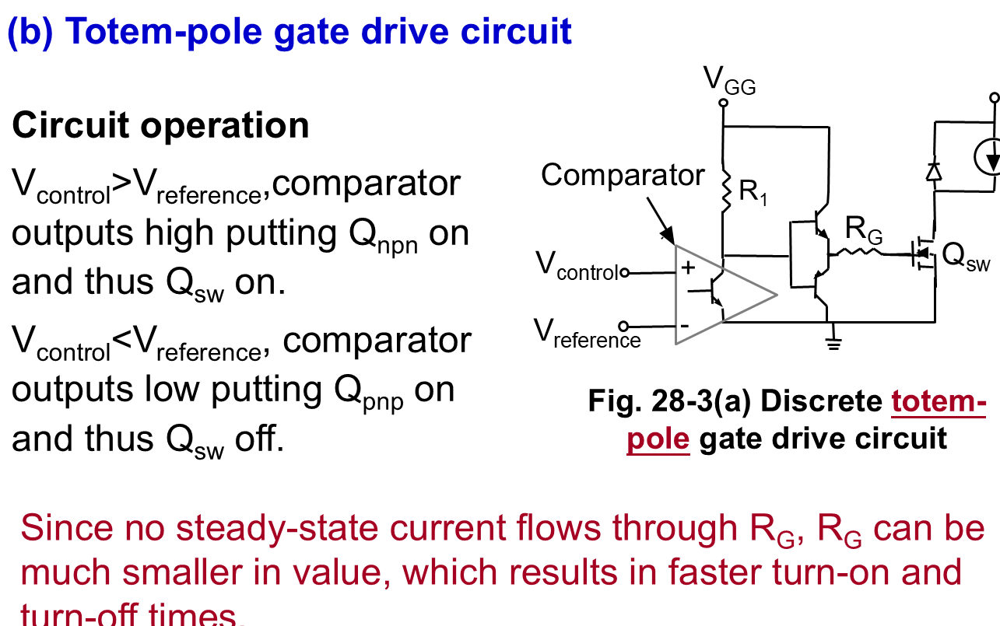

图腾柱驱动的优势是：

- 上管导通时向栅极快速充电；
- 下管导通时从栅极快速放电；
- 稳态时栅极几乎不需要直流电流；
- 因此 $R_G$ 可以取得更小，开通和关断都更快。

课件还提到 front porch / back porch 驱动电流：本质是开通初期给较大驱动电流加速开通，随后降低维持驱动，避免器件过深饱和导致关断延迟变长。

## 复习例题：Buck 开关尖峰与 RCD 缓冲

题意：Buck 开关电压 $v_{sw}$ 上出现尖峰，问加什么电路、各元件作用、门极驱动作用。

答题模板：

1. 可加 RCD 缓冲/吸收电路，跨接在开关管或对应尖峰能量路径上，用于吸收漏感能量和限制关断过电压；
2. $C_s$：吸收瞬态能量，限制开关两端 $dv/dt$ 和过电压；
3. $R_s$：为 $C_s$ 提供放电通路，并耗散吸收的能量；
4. $D_s$：提供 $C_s$ 快速充电通路，或在关断瞬间旁路 $R_s$，让缓冲电容更快接管电流；
5. Gate drive：控制与主电路接口、信号放大、隔离、栅极快速充放电、波形整形、dead time、过流/短路/欠压保护。

这类题不要只写“保护开关管”，要把每个元件的动作说出来，分数通常就在这些关键词上。

## 驱动设计补充：$V_{GE}$ 与短路能力

课件给出的设计取舍：

$$
V_{GE+}\uparrow\Rightarrow R_{DS(on)}\text{ 或 }V_{CE(sat)}\downarrow\Rightarrow\text{导通损耗下降}
$$

但正驱动太强会使短路电流能力变差，短路时峰值电流更高。因此 IGBT 常用 $+15\ \mathrm{V}$ 左右开通，关断用 $0\ \mathrm{V}$ 或 $-5\sim-10\ \mathrm{V}$。

短路保护的复习句式：检测 $V_{CE}$ 或 $V_{DS}$ 异常升高，确认过流后软关断，避免 $L_\sigma di/dt$ 造成更高过压。

## 十二、考前速记

1. 杂散电感过压：

$$
v=L_\sigma\frac{di}{dt}
$$

2. 驱动电阻小：
   - 开关快；
   - 损耗低；
   - EMI 与过冲大。
3. 驱动电阻大：
   - 开关慢；
   - 损耗高；
   - EMI 与过冲小。
4. 常见门极驱动：

$$
V_{GE+}\approx15\ \mathrm{V},\qquad V_{GE-}\approx-5\sim-10\ \mathrm{V}
$$

5. 过流保护常看 $V_{CE}$ 或 $V_{DS}$ 是否异常升高。
