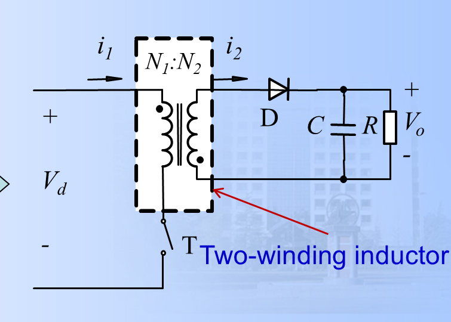
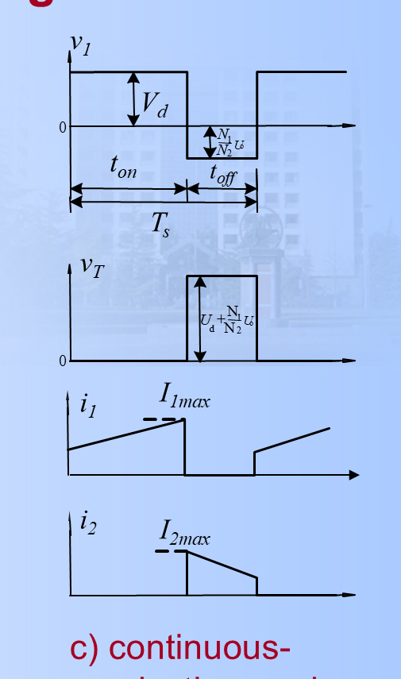
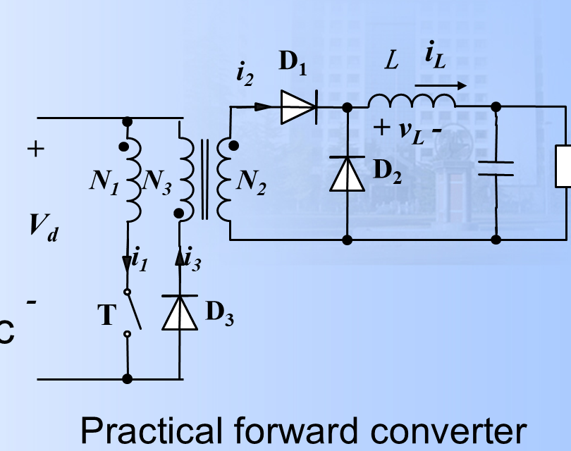
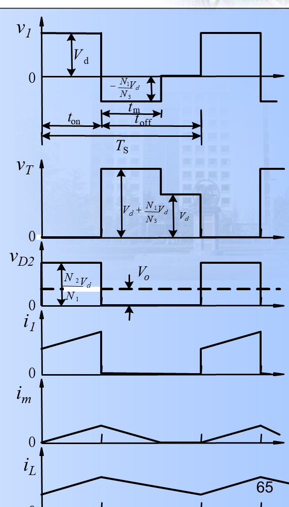
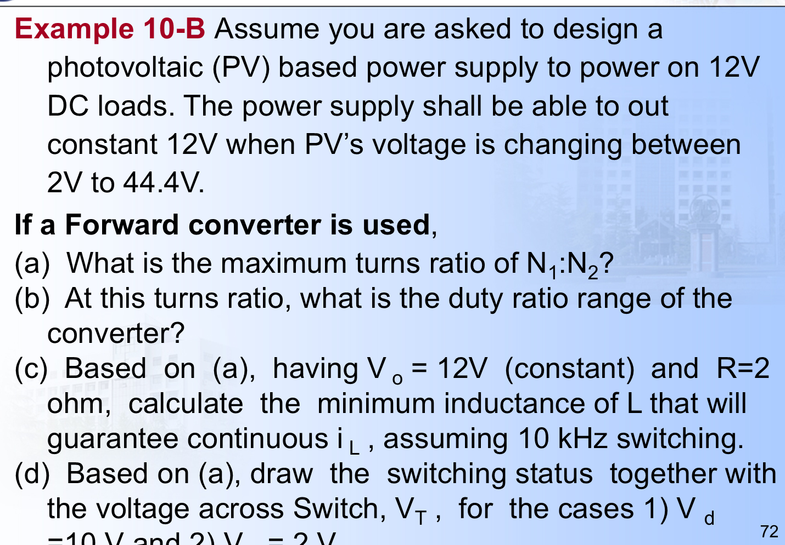
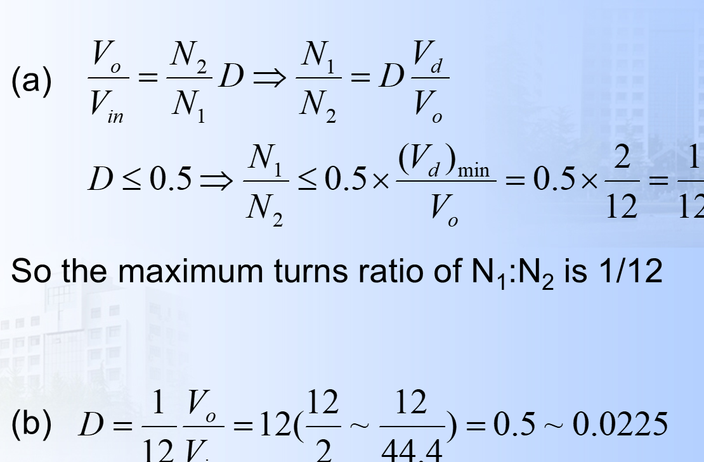
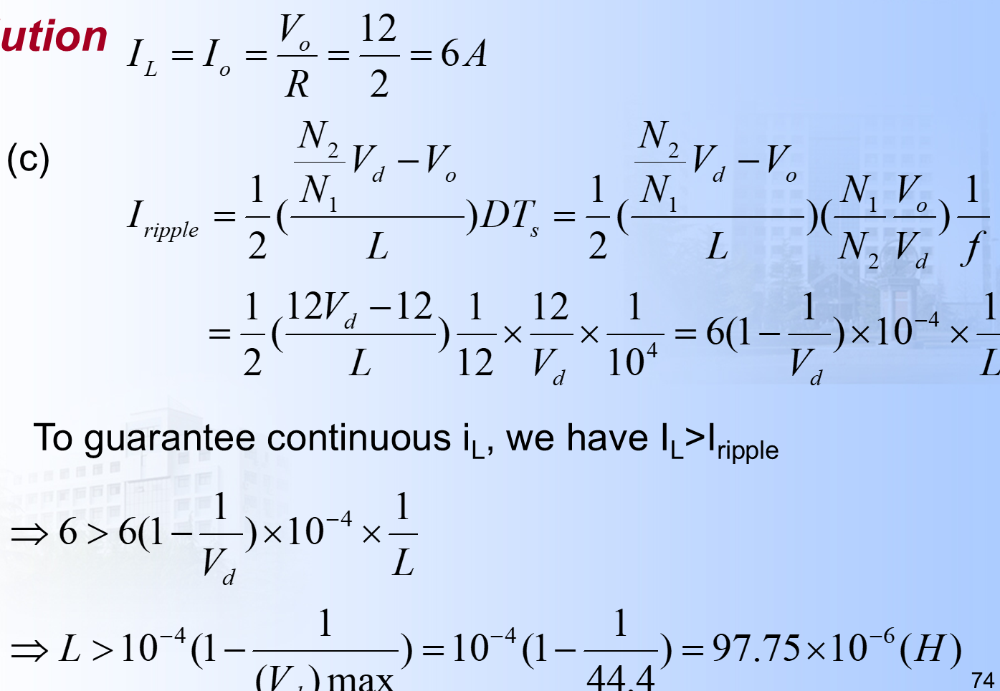
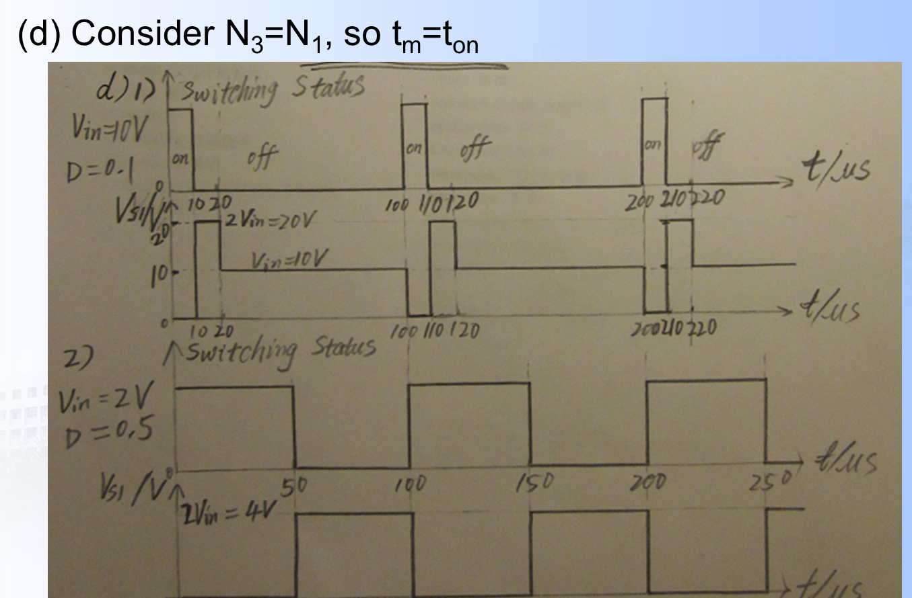

# 9 Flyback 与 Forward 变换器（完善版）

## 一、本章主线

本章讨论隔离型 DC-DC 变换器，重点是：

- 需要电气隔离；
- 需要较高的电压变换比；
- 需要较高效率和较小体积；
- 需要能理解磁通、磁化电流、绕组电压这些波形量。

本章核心器件是两类：

- Flyback：反激变换器；
- Forward：正激变换器。

它们都使用高频变压器，但能量传递方式完全不同。

---

## 二、磁路与变压器基础

隔离型变换器里，很多限制不是从电路图直接看出来的，而是由磁路决定的。

### 1. 常用物理量

| 符号 | 含义 |
| :--- | :--- |
| `F = NI` | 磁动势 |
| `H` | 磁场强度 |
| `B` | 磁通密度 |
| `Phi` | 磁通 |
| `lambda = N Phi` | 磁链 |
| `Rm` | 磁阻 |
| `Lm` | 磁化电感 |

### 2. 基本电磁关系

由法拉第定律：

```text
v = N dPhi/dt
```

由电感定义：

```text
vL = L di/dt
W = 1/2 L i^2
```

所以只要绕组上有电压，磁通就会变化；只要电感两端有电压，电流就会线性变化。

### 3. 物理量如何对应到波形图

- `v1` / `v2`：原边、次边绕组电压；
- `i1`：原边绕组电流；
- `i2`：次边绕组电流；
- `im`：磁化电流，表示磁芯中储能状态；
- `iD`：二极管电流；
- `vT`：开关管两端电压；
- `Phi`：磁通。

要注意：

```text
im 不总是等于 i1
```

在反激中，开关导通时 `i1 = im`；开关关断后，`i1 = 0`，但 `im` 通过副边电流继续释放。

更一般地说，变压器绕组上“有电压”和“有电流”不是一回事：

```text
绕组有感应电压：说明磁通在变化；
绕组有电流：还要求外部回路导通。
```

所以可能出现：

```text
v2 存在，但 D1 反偏，i2 = 0
```

这在正激去磁阶段尤其容易混淆。

---

## 三、Flyback 反激变换器

### 1. 本质

反激不是“变压器直接传能”，而是：

```text
先储能，再放能
```

更准确地说，它更像一个带隔离的 Buck-Boost。



### 2. 导通阶段 `0 < t < ton`

开关 `T` 导通时：

```text
v1 = Vd
```

磁化电感两端加正电压，磁化电流线性上升：

```text
dim/dt = Vd/Lm
im(t) = im(0) + (Vd/Lm)t
```

磁通也线性上升：

```text
phi(t) = phi(0) + (Vd/N1)t
```

这时副边二极管反偏：

```text
i2 = iD = 0
```

所以负载由输出电容单独供电。

这一阶段为什么 `i1 = im`？

在反激等效模型中，磁化电感 `Lm` 与理想变压器并联在原边。导通时副边二极管截止，所以副边没有电流：

```text
i2 = 0
```

原边电流只流入磁化电感，因此：

```text
i1 = im
```

这说明导通阶段输入源并没有直接把能量送到负载，而是把能量储存在磁化电感中。

### 3. 关断阶段 `ton < t < Ts`

开关关断后，原边回路断开，`i1 = 0`。但磁化电流不能突变，所以磁场能量必须通过副边释放。

此时副边电压翻转：

```text
v2 = -Vo
v1 = -(N1/N2)Vo
```

因此磁化电流线性下降：

```text
dim/dt = -(N1/N2)Vo / Lm
```

对应的电流关系是：

```text
i2 = iD = (N1/N2)im
```

所以关断时的关键结论是：

```text
i1 = 0
im 线性下降
i2 线性下降
```

这里的 `i1 = 0` 和 `im` 下降并不矛盾。`i1` 是原边外部支路电流，开关断开后原边没有闭合回路，所以：

```text
i1 = 0
```

但 `im` 是磁芯储能状态对应的磁化电流，它不能突变。原边通路断开后，磁通使副边电压极性翻转，二极管导通，于是磁化能量通过副边释放。

用等效关系看：

```text
im = i1 - (N2/N1)i2
```

导通时：

```text
i2 = 0 -> im = i1
```

关断时：

```text
i1 = 0 -> im = -(N2/N1)i2
```

负号表示参考方向相反，按大小可写为：

```text
i2 = (N1/N2)im
```

因此，反激关断时不是“磁化电流消失”，而是“磁化电流从原边电流的表现形式，转移为副边电流的表现形式”。

### 4. 开关管电压应力

关断时开关管承受：

```text
vT = Vd + (N1/N2)Vo
```

这也是反激开关管应力较高的原因之一。

推导思路如下：

开关导通时，开关近似短路：

```text
vT ≈ 0
```

开关关断时，副边二极管导通，输出电压 `Vo` 被反射到原边，反射电压大小为：

```text
V_reflected = (N1/N2)Vo
```

这个反射电压与输入电压 `Vd` 叠加在开关管两端，所以：

```text
vT = Vd + V_reflected
   = Vd + (N1/N2)Vo
```

实际电路还会叠加漏感尖峰，所以真实开关耐压要留裕量。

### 5. CCM 电压增益推导

稳态时磁通一个周期回到原值，故伏秒平衡成立：

```text
(Vd/N1) ton - (Vo/N2) toff = 0
```

令：

```text
ton = D Ts
toff = (1-D)Ts
```

则：

```text
(Vd/N1) D Ts = (Vo/N2)(1-D)Ts
```

化简得：

```text
Vo/Vd = (N2/N1) * D/(1-D)
```

这就是反激在 CCM 下的电压传输比。

### 6. 三种工作模式



- DCM：电感电流在一个周期内降到 0；
- 临界模式：刚好降到 0；
- CCM：电感电流始终大于 0。

### 7. Flyback 小结

- 导通时储能；
- 关断时放能；
- 本质是“隔离 Buck-Boost”；
- 变压器更像“双绕组电感”；
- 设计时常要考虑漏感尖峰和吸收电路。

---

## 四、Forward 正激变换器

### 1. 本质

正激可以看成：

```text
隔离型 Buck + 变压器
```

也就是开关导通时，能量直接传到输出；输出电感负责平滑电流。



### 2. 导通阶段 `0 < t < ton`

此时：

```text
D1 导通
D2 反偏
D3 反偏
```

副边向输出传能，输出电感电压为：

```text
vL = (N2/N1)Vd - Vo
```

所以：

```text
diL/dt = [(N2/N1)Vd - Vo]/L
```

输出电感电流 `iL` 线性上升。

同时磁化电感也在储能：

```text
dim/dt = Vd/Lm
```

### 3. 关断与去磁阶段 `ton < t < ton + tm`

开关关断后，`D1` 反偏，主传能通路断开；但磁化电流 `im` 不能突变，所以必须通过去磁绕组 `N3` 和二极管 `D3` 复位。

此时：

```text
D2 导通，输出电感续流
D3 导通，磁化能量回馈输入
D1 关断
```

这一段最容易混淆的是 `i2`、`i3`、`iL`：

```text
i2：变压器副边 N2 / D1 主传能支路电流
i3：去磁绕组 N3 / D3 复位支路电流
iL：输出电感电流
```

在 `ton < t < ton + tm`：

```text
D1 反偏 -> i2 = 0
D3 导通 -> i3 存在
D2 导通 -> iL 续流
```

也就是说，`i3` 存在是因为磁化电流需要通过去磁绕组释放；`i2 = 0` 是因为副边主整流二极管 `D1` 截止。输出侧仍有电流，但那是 `iL` 经 `D2` 续流，不是变压器副边电流 `i2`。

此时 `v2` 仍然可以存在。原因是只要磁通在变化，所有耦合绕组都会感应电压；但 `v2` 的极性使 `D1` 反偏，所以有电压、无电流：

```text
v2 exists, but i2 = 0
```

磁化绕组电压变为：

```text
v1 = -(N1/N3)Vd
```

于是：

```text
dim/dt = -(N1/N3)Vd / Lm
```

这条式子的含义是：磁化电感两端加了一个反向电压，所以磁化电流以固定斜率下降。它来自电感基本公式：

```text
v = L di/dt
```

所以：

```text
di/dt = v/L
```

去磁阶段折算到原边的磁化电感电压为负：

```text
vLm = -(N1/N3)Vd
```

所以：

```text
dim/dt = vLm/Lm
       = -(N1/N3)Vd/Lm
```

输出电感此时只有负载回路：

```text
vL = -Vo
diL/dt = -Vo/L
```

### 4. 为什么正激要加去磁绕组

如果没有去磁绕组，磁芯中的磁通不能回到初值，`im` 会一周期比一周期高，最后进入饱和。

因此正激必须提供一个复位通道：

```text
N3 + D3
```

### 5. 去磁时间与最大占空比

由导通和去磁的磁通变化量相等：

```text
(Vd/N1) ton = (Vd/N3) tm
```

得到：

```text
tm = (N3/N1) ton
```

这个式子也可以从磁化电流变化量理解。

导通阶段：

```text
Delta im_on = (Vd/Lm)ton
```

去磁阶段：

```text
Delta im_reset = [(N1/N3)Vd/Lm]tm
```

稳态时，磁化电流每周期必须回到原来的值，所以：

```text
Delta im_on = Delta im_reset
```

即：

```text
(Vd/Lm)ton = [(N1/N3)Vd/Lm]tm
```

化简后仍然得到：

```text
tm = (N3/N1)ton
```

这说明“伏秒平衡”本质上是在保证磁通不累积，也等价于保证磁化电流不一周期比一周期高。

为了在一个周期内完成复位，需要：

```text
tm <= Ts - ton
```

所以：

```text
Dmax = ton/Ts = 1 / (1 + N3/N1)
```

若常取：

```text
N3 = N1
```

则：

```text
Dmax = 0.5
tm = ton
```

注意：`N3 = N1` 不是物理定律，而是 PPT 和许多单管正激电源常用的设计取法。这样做有三个直接结果：

```text
1. tm = ton，复位时间和导通时间相等；
2. Dmax = 0.5，便于保证磁芯每周期复位；
3. vT(reset) = 2Vd，开关电压应力清楚且常见。
```

如果 `N3` 不等于 `N1`，也可以工作，但 `tm`、`Dmax`、`vT` 都会改变。

### 6. 开关电压

去磁期间开关管两端电压为：

```text
vT = Vd + (N1/N3)Vd = (1 + N1/N3)Vd
```

去磁结束后，开关仍关断，但去磁电流已归零，此时开关只承受输入电压：

```text
vT = Vd
```

因此正激开关电压有三个典型平台：

```text
T 导通：vT = 0
T 关断且正在去磁：vT = (1 + N1/N3)Vd
去磁结束但仍关断：vT = Vd
```

若 `N3 = N1`，去磁平台就是：

```text
vT = 2Vd
```

### 7. CCM 电压增益推导

对输出电感做伏秒平衡：

```text
(nVd - Vo)DTs + (-Vo)(1-D)Ts = 0
```

其中：

```text
n = N2/N1
```

化简得到：

```text
Vo/Vd = nD
```

也就是正激的电压传输比和 Buck 完全一致，只是前面多了变压器匝比。



### 8. Forward 小结

- 导通时直接传能；
- 输出电感负责连续电流；
- 磁化电感必须每周期复位；
- 常见设计取 `N3 = N1`，因此 `Dmax = 0.5`。

---

## 五、Example 10-B 详细解答

题目：

> 设计一个基于 Forward converter 的光伏电源，输出 `Vo = 12V`，输入 `Vd` 在 `2V ~ 44.4V` 之间变化，要求输出恒定 12V。已知 `R = 2 ohm`，开关频率 `f = 10 kHz`。



### (a) 最大匝比 `N1:N2`

正激 CCM 下：

```text
Vo/Vd = (N2/N1)D
```

又因为正激必须满足：

```text
D <= 0.5
```

在最低输入电压 `Vd_min = 2V` 时，需要最大的占空比，所以：

```text
N1/N2 <= Dmax * Vd_min / Vo
```

代入：

```text
N1/N2 <= 0.5 * 2 / 12 = 1/12
```

所以：

```text
N1:N2 最大为 1:12
```

为什么要用最低输入电压 `2V` 来求？

因为：

```text
Vo = (N2/N1)D Vd
```

当 `Vo` 固定为 12V 时，`Vd` 越低，就越需要更大的占空比 `D` 来补偿。正激又要求 `D <= 0.5`，所以最困难的工况一定是：

```text
Vd = Vd_min = 2V
```

题目问的是“最大 `N1:N2`”，也就是最大 `N1/N2`。由：

```text
N1/N2 = D Vd / Vo
```

可知在最低输入、最大允许占空比下得到上限：

```text
N1/N2 <= 1/12
```

如果 `N1:N2` 比 `1:12` 更大，例如 `1:10`，则 `N2/N1` 变小，2V 输入时必须使用超过 0.5 的占空比才能输出 12V，这会破坏正激复位条件。

### (b) 占空比范围

由 `N1:N2 = 1:12` 得：

```text
N2/N1 = 12
```

所以：

```text
Vo/Vd = 12D
D = Vo/(12Vd)
```

代入 `Vo = 12V`：

```text
D = 12/(12Vd)
```

也就是：

```text
D = 1/Vd
```

这里的 `Vd` 以伏特为数值代入，所以 `Vd = 10V` 时 `D = 0.1`，`Vd = 2V` 时 `D = 0.5`。

因此：

```text
Vd = 2V  -> D = 0.5
Vd = 44.4V -> D = 0.0225
```

所以占空比范围为：

```text
D = 0.0225 ~ 0.5
```

PPT 中 (a)(b) 的原解截图：



### (c) 保证 `iL` 连续的最小电感

输出电流为：

```text
IL = Io = Vo/R = 12/2 = 6A
```

这里 `IL` 是输出电感电流的平均值。在连续导通模式下，`iL` 围绕平均值上下波动。若峰峰值纹波为 `Delta iL`，则最低电流为：

```text
iL_min = IL - Delta iL/2
```

为了保证连续，要求：

```text
iL_min > 0
```

所以：

```text
IL > Delta iL/2
```

PPT 中把：

```text
Iripple = Delta iL/2
```

所以连续条件写成：

```text
IL > Iripple
```

输出电感在导通阶段的纹波峰峰值可写成：

```text
Delta iL = [(N2/N1)Vd - Vo] * D Ts / L
```

PPT 中把半纹波记为：

```text
Iripple = Delta iL / 2
```

连续导通条件：

```text
IL > Iripple
```

代入 `N2/N1 = 12`、`Ts = 1/f = 10^-4 s`：

```text
Iripple = 1/2 * (12Vd - 12)/L * D * 10^-4
```

又因为：

```text
D = 1/Vd
```

所以：

```text
Iripple = 6(1 - 1/Vd) * 10^-4 / L
```

令 `IL > Iripple`：

```text
6 > 6(1 - 1/Vd) * 10^-4 / L
```

化简得到：

```text
L > 10^-4 (1 - 1/Vd)
```

最严格情况取最大输入电压 `Vd_max = 44.4V`：

```text
Lmin = 10^-4 (1 - 1/44.4)
```

为什么取最大输入电压？

因为：

```text
L > 10^-4(1 - 1/Vd)
```

其中 `1 - 1/Vd` 随 `Vd` 增大而增大。输入电压越高，导通时输出电感电压：

```text
vL_on = 12Vd - 12
```

越大，电流上升斜率越大，纹波越大，因此为了仍保持连续，需要更大的电感。

所以：

```text
Lmin = 97.75 uH
```

PPT 中 (c) 的原解截图：



### (d) 开关状态与开关管电压 `vT`

这里按 PPT 的标准设计取：

```text
N3 = N1
```

因此：

```text
tm = ton
vT(reset) = (1 + N1/N3)Vd = 2Vd
```

为什么 (d) 可以这样做？

题目没有另外给 `N3` 的匝数，所以按照 PPT 前面讲的标准单管正激设计：

```text
Typically, N3 = N1
```

这不是唯一选择，但它是课件默认假设。取这个值后，去磁时间和开通时间相等，波形就可以直接按：

```text
ton 后立刻进入同样长度的 reset 区间
```

来画。

#### 情况 1：`Vd = 10V`

```text
D = Vo/(12Vd) = 12/(12*10) = 0.1
Ts = 100 us
ton = D Ts = 10 us
tm = ton = 10 us
```

于是：

```text
0 ~ 10 us    : T on, vT = 0
10 ~ 20 us   : reset, vT = 2Vd = 20V
20 ~ 100 us  : T off, vT = Vd = 10V
```

第三段为什么是 `vT = Vd`？

因为去磁已经结束，`i3 = 0`，去磁绕组不再把额外的反射电压加到开关管上。开关仍然关断，所以它只承受输入电压：

```text
vT = Vd = 10V
```

#### 情况 2：`Vd = 2V`

```text
D = 12/(12*2) = 0.5
ton = 50 us
tm = 50 us
```

于是：

```text
0 ~ 50 us    : T on, vT = 0
50 ~ 100 us  : reset, vT = 2Vd = 4V
```

这里没有 `vT = Vd = 2V` 的平台，因为：

```text
ton + tm = 50 us + 50 us = 100 us = Ts
```

也就是去磁刚好占满整个关断时间。下一个周期一开始，开关又导通，`vT` 回到 0。

对应波形可参考：



---

## 六、Flyback 与 Forward 对比速记

| 项目 | Flyback | Forward |
| :--- | :--- | :--- |
| 能量流向 | 先储能，后放能 | 导通时直接传能 |
| 关键电感 | 磁化电感储能 | 输出电感储能 |
| 电压增益 | `Vo/Vd = (N2/N1) D/(1-D)` | `Vo/Vd = (N2/N1) D` |
| 占空比限制 | 理想上无 0.5 限制 | 常见单管结构 `Dmax = 0.5` |
| 变压器本质 | 更像双绕组电感 | 主要是传能与隔离，磁化支路需复位 |

### 一句话总结

- Flyback：导通储能，关断放能；
- Forward：导通传能，关断复位。

---

## 七、最后记忆版

### Flyback

```text
on:
v1 = Vd, im 上升, D 截止, i2 = 0

off:
v1 = -(N1/N2)Vo, im 下降, D 导通, i1 = 0

Vo/Vd = (N2/N1) D/(1-D)
```

### Forward

```text
on:
D1 导通, D2/D3 关断, iL 上升, im 上升

off:
D1 关断, D2/D3 导通, iL 续流, im 复位

Vo/Vd = (N2/N1) D
N3 = N1 时 Dmax = 0.5
```
