# 10 Push-Pull、Half-Bridge 与 Full-Bridge 变换器笔记

## 一、这一讲的主线

这一讲继续隔离型开关电源，重点是三类双向励磁拓扑：

- Push-Pull；
- Half-Bridge；
- Full-Bridge。

它们共同特点：

> 原边把直流输入变成高频方波交流，经高频变压器隔离和变比变换，再由副边整流滤波得到直流输出。

---

## 二、为什么需要双向励磁

Flyback 和单管 Forward 中，变压器磁通复位问题很突出。  
Push-Pull、Half-Bridge、Full-Bridge 通过正负交替给变压器加电压，让磁通在两个方向摆动。

好处：

- 变压器利用率提高；
- 更适合中大功率；
- 输出纹波频率更高；
- 输出滤波器可以更小。

---

## 三、Push-Pull 变换器

### 1. 电路特点

Push-Pull 原边通常使用中心抽头变压器和两个开关。  
两个开关交替导通，每次导通一个。

副边常接全波整流。

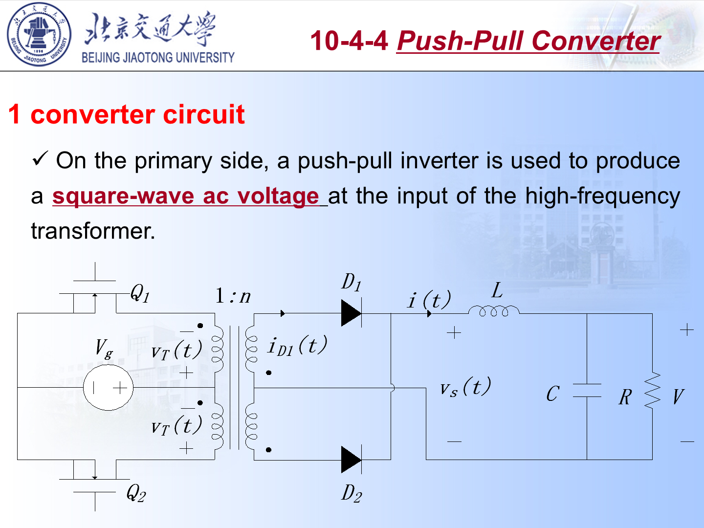

### 2. 工作过程

#### $Q_1$ 导通

- 输入加到原边上半绕组；
- 变压器副边产生对应极性电压；
- 一个整流二极管导通；
- 输出电感获得能量。

此时若按课件记号令：

$$
n=\frac{N_2}{N_1}
$$

则副边整流后的输入电压为：

$$
v_{oi}=nV_d
$$

输出电感两端电压为：

$$
v_L=v_{oi}-V_o=nV_d-V_o
$$

所以电感电流斜率为：

$$
\frac{di_L}{dt}=\frac{nV_d-V_o}{L}
$$

只要 $nV_d>V_o$，$i_L$ 就线性上升。

#### $Q_2$ 导通

- 输入加到原边下半绕组；
- 磁通方向相反；
- 副边另一个整流二极管导通；
- 输出侧仍得到同极性的脉动电压。

注意：原边电压方向反了，但副边经过中心抽头全波整流以后，输出电感看到的 $v_{oi}$ 仍是正脉冲，所以这一段 $i_L$ 也是上升。

#### 两个开关都关断

- 变压器副边整流电压近似为 0；
- 输出电感不能让电流突变，会通过两个副边二极管续流；
- 理想对称时，两只二极管各承担约一半电感电流；
- 输出电感两端电压为 $v_L=-V_o$，因此 $i_L$ 线性下降。

即：

$$
\frac{di_L}{dt}=-\frac{V_o}{L}
$$

#### 开关状态汇总

按课件记号，$N_1$ 是每个原边半绕组匝数，$N_2$ 是每个副边半绕组匝数，令：

$$
n=\frac{N_2}{N_1}
$$

| 区间 | 开关状态 | 原边电压 | 副边整流电压 $v_{oi}$ | 输出电感电压 $v_L$ | 导通器件 |
| :--- | :--- | :--- | :--- | :--- | :--- |
| $0<t<t_{on}$ | $T_1$ 导通，$T_2$ 关断 | 上半原边加 $+V_d$ | $nV_d$ | $nV_d-V_o$ | $T_1,D_1$ |
| 下一半周期 $0<t<t_{on}$ | $T_2$ 导通，$T_1$ 关断 | 下半原边加 $+V_d$，磁通方向相反 | $nV_d$ | $nV_d-V_o$ | $T_2,D_2$ |
| $t_{on}<t<t_{on}+\Delta$ | $T_1,T_2$ 都关断 | 近似无外加原边电压 | $0$ | $-V_o$ | $D_1,D_2$ 续流 |

这张表是后面增益推导的基础：有效传能时 $v_L=nV_d-V_o$，续流时 $v_L=-V_o$。  
两个导通区虽然原边励磁方向相反，但副边全波整流后给输出电感的电压方向相同，所以 $v_{oi}$ 都是正脉冲。

### 3. 电压增益

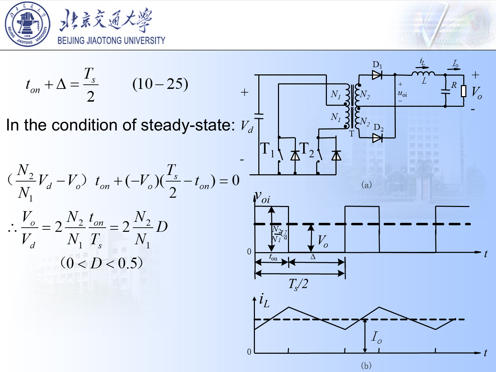

设每个开关占空比为 $D$，两开关交替工作，且：

$$
D<0.5
$$

输出整流后的有效加能时间为：

$$
2DT_s
$$

若匝比：

$$
n=\frac{N_2}{N_1}
$$

则理想 CCM 下：

$$
V_o=2DnV_d
$$

详细推导如下。

每半个周期内只有一次有效加能，时间关系为：

$$
t_{on}+\Delta=\frac{T_s}{2}
$$

其中 $t_{on}$ 是某一个开关的导通时间，$\Delta$ 是两个开关都关断、输出电感续流的时间。  
在 $t_{on}$ 内：

$$
v_L=nV_d-V_o
$$

在 $\Delta$ 内：

$$
v_L=-V_o
$$

稳态时电感伏秒平衡：

$$
(nV_d-V_o)t_{on}+(-V_o)\left(\frac{T_s}{2}-t_{on}\right)=0
$$

展开：

$$
nV_dt_{on}-V_ot_{on}-\frac{V_oT_s}{2}+V_ot_{on}=0
$$

中间两项抵消，得到：

$$
nV_dt_{on}=\frac{V_oT_s}{2}
$$

因此：

$$
\frac{V_o}{V_d}=2n\frac{t_{on}}{T_s}=2nD
$$

这就是：

$$
V_o=2DnV_d
$$

物理上可以理解成：每个周期有两次高度为 $nV_d$ 的整流脉冲，每次持续 $DT_s$，所以输出电感前端电压的平均值为：

$$
\overline{v_{oi}}=nV_d\cdot 2D
$$

理想 CCM 下电感平均电压为 0，所以：

$$
V_o=\overline{v_{oi}}
$$

### 4. 器件应力

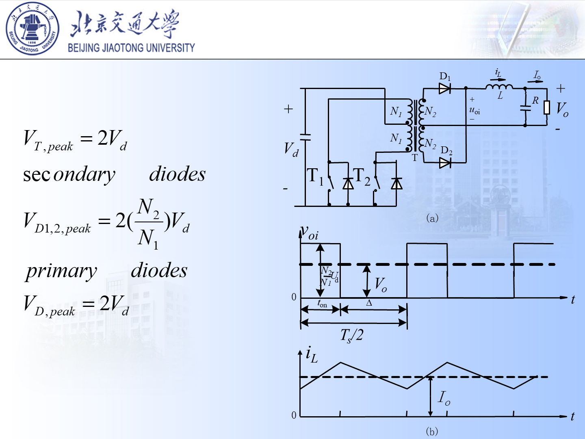

Push-Pull 的问题是开关关断时常要承受约：

$$
2V_d
$$

再叠加漏感尖峰。  
因此器件耐压和吸收电路很重要。

为什么是 $2V_d$：

- 假设 $T_1$ 导通，原边上半绕组加 $V_d$；
- 由于两个原边半绕组匝数相同，另一个半绕组上会感应出同幅值电压；
- 对关断的 $T_2$ 来说，它看到的是输入电压 $V_d$ 与另一个半绕组感应电压叠加；
- 所以理想情况下关断管峰值电压约为 $2V_d$。

副边中心抽头整流二极管的反向峰值也类似：一只二极管导通时，另一只二极管承受两段副边绕组电压之和，因此：

$$
V_{D1,2,\mathrm{peak}}\approx 2nV_d
$$

实际电路还要考虑漏感尖峰，所以器件选型不能只卡在理想值上。

### 5. 反并联二极管的作用

PPT 特别提示：实际电路中需要反并联二极管，为变压器漏磁通引起的电流提供通路。  
如果没有合适续流路径，漏感能量会在开关关断时造成很高电压尖峰。

### 6. 优缺点

优点：

- 只需要两个开关；
- 变压器双向励磁；
- 适合中等功率。

缺点：

- 原边中心抽头绕组要求较高；
- 两开关不对称会造成磁偏；
- 开关电压应力较高。

---

## 四、Half-Bridge 变换器

### 1. 电路特点

Half-Bridge 原边由两个开关串联构成半桥。  
输入电容分压后，中点给变压器提供：

$$
\frac{V_d}{2}
$$

量级的方波电压。

两个分压电容的作用是：

- 形成直流输入中点；
- 让变压器原边获得正负交替电压；
- 在一定程度上抑制直流偏磁。

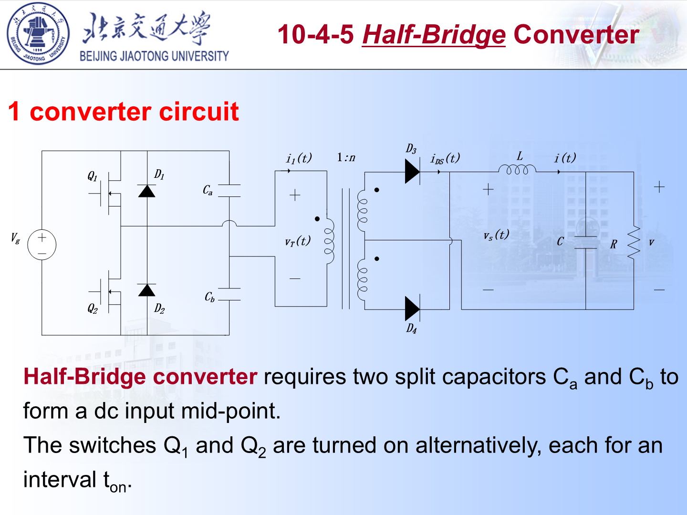

### 2. 工作过程

- 上管导通时，原边加 $+V_d/2$；
- 下管导通时，原边加 $-V_d/2$；
- 副边整流后得到同极性脉动电压；
- 输出电感滤波得到直流。

上管导通时：

$$
v_1=\frac{V_d}{2}
$$

副边整流后的脉冲幅值为：

$$
v_{oi}=n\frac{V_d}{2}
$$

所以输出电感电压为：

$$
v_L=n\frac{V_d}{2}-V_o
$$

电感电流斜率为：

$$
\frac{di_L}{dt}=\frac{nV_d/2-V_o}{L}
$$

下管导通时，原边电压方向变为 $-V_d/2$，但副边整流后仍向输出给出正脉冲，所以电感电流同样上升。  
两管都关断时，副边整流电压近似为 0，输出电感经二极管续流：

$$
v_L=-V_o,\qquad \frac{di_L}{dt}=-\frac{V_o}{L}
$$

#### 开关状态汇总

令：

$$
n=\frac{N_2}{N_1}
$$

| 区间 | 开关状态 | 原边电压 $v_1$ | 副边整流电压 $v_{oi}$ | 输出电感电压 $v_L$ | 导通器件 |
| :--- | :--- | :--- | :--- | :--- | :--- |
| $0<t<t_{on}$ | 上管 $T_1$ 导通，下管 $T_2$ 关断 | $+V_d/2$ | $nV_d/2$ | $nV_d/2-V_o$ | $T_1,D_1$ |
| 下一半周期 $0<t<t_{on}$ | 下管 $T_2$ 导通，上管 $T_1$ 关断 | $-V_d/2$ | $nV_d/2$ | $nV_d/2-V_o$ | $T_2,D_2$ |
| $t_{on}<t<t_{on}+\Delta$ | $T_1,T_2$ 都关断 | 近似 0 | $0$ | $-V_o$ | $D_1,D_2$ 续流 |

Half-Bridge 和 Push-Pull 的状态逻辑很像，区别只有一个：Half-Bridge 原边每次只能得到半个母线电压，所以有效脉冲高度是 $nV_d/2$，不是 $nV_d$。

### 3. 电压增益

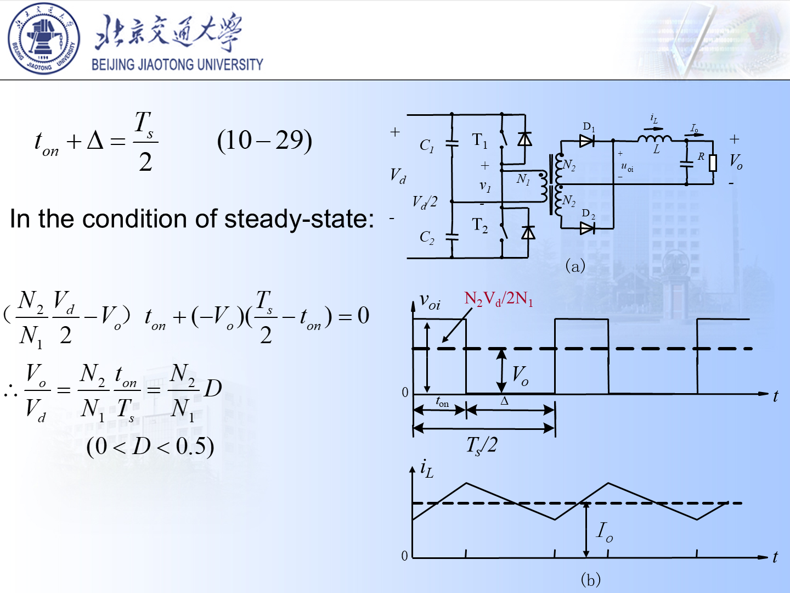

若每个开关占空比为 $D$，则整流后平均：

$$
V_o=D n V_d
$$

这是因为每次加到原边的幅值只有 $V_d/2$，但每周期有两次能量脉冲。

用伏秒平衡推导：

$$
\left(n\frac{V_d}{2}-V_o\right)t_{on}
+(-V_o)\left(\frac{T_s}{2}-t_{on}\right)=0
$$

展开：

$$
n\frac{V_d}{2}t_{on}-V_ot_{on}
-\frac{V_oT_s}{2}+V_ot_{on}=0
$$

抵消 $-V_ot_{on}$ 与 $+V_ot_{on}$：

$$
n\frac{V_d}{2}t_{on}=\frac{V_oT_s}{2}
$$

所以：

$$
\frac{V_o}{V_d}
=n\frac{t_{on}}{T_s}
=nD
$$

即：

$$
V_o=DnV_d
$$

这里最容易错的是把 Half-Bridge 写成 $2DnV_d$。它确实一周期有两次脉冲，但每次脉冲高度只有 $nV_d/2$，两个因素相乘后正好剩下 $DnV_d$。

### 4. 器件应力

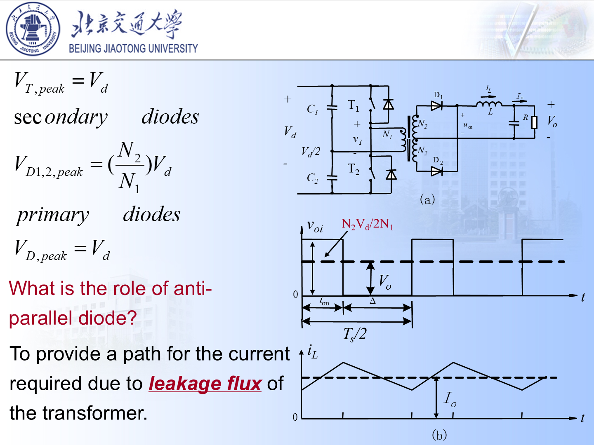

Half-Bridge 的每个开关电压应力约为：

$$
V_d
$$

比 Push-Pull 的 $2V_d$ 低。

原因是上、下管串接在同一直流母线上。某一管关断时，理想情况下它最多承受整个母线电压：

$$
V_{T,\mathrm{peak}}\approx V_d
$$

副边二极管的反压口径按课件为：

$$
V_{D1,2,\mathrm{peak}}\approx nV_d
$$

它比 Push-Pull 的 $2nV_d$ 小一半，是 Half-Bridge 的一个重要优点。

### 5. 优缺点

优点：

- 开关电压应力较低；
- 不需要原边中心抽头；
- 适合较高输入电压场合。

缺点：

- 原边电压利用率只有半个输入；
- 需要分压电容；
- 同等功率下电流较大。

---

## 五、Full-Bridge 变换器

### 1. 电路特点

Full-Bridge 使用四个开关构成桥臂。  
对角开关成对导通：

- $Q_1,Q_4$；
- $Q_2,Q_3$。

原边可得到：

$$
+V_d,\quad -V_d
$$

两种电压。

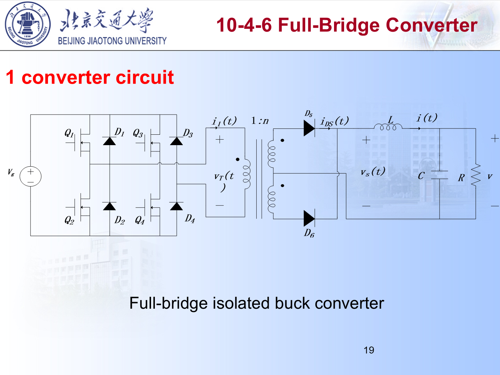

注意课件图中导通配对写法可能按 $T_3,T_4$ 和 $T_1,T_2$ 成组描述，本质都是“对角桥臂成组导通，使变压器原边获得正、负 $V_d$”。实际分析时先看电流路径，不要只背开关编号。

### 2. 开关状态分析

令：

$$
n=\frac{N_2}{N_1}
$$

Full-Bridge 每次是一个对角开关组导通。课件图中常把一组写为 $T_3,T_4$，另一组写为 $T_1,T_2$；不同教材编号可能不同，但分析方法不变。

| 区间 | 开关状态 | 原边电压 $v_1$ | 副边整流电压 $v_{oi}$ | 输出电感电压 $v_L$ | 导通器件 |
| :--- | :--- | :--- | :--- | :--- | :--- |
| $0<t<t_{on}$ | 一组对角管导通，另一组关断 | $+V_d$ | $nV_d$ | $nV_d-V_o$ | 对角开关组，$D_1$ |
| 下一半周期 $0<t<t_{on}$ | 另一组对角管导通 | $-V_d$ | $nV_d$ | $nV_d-V_o$ | 另一对角开关组，$D_2$ |
| $t_{on}<t<t_{on}+\Delta$ | 两组对角管都关断 | 近似 0 | $0$ | $-V_o$ | $D_1,D_2$ 续流 |

因此 Full-Bridge 的输出侧看到的情况和 Push-Pull 一样：每周期两个正脉冲，每个正脉冲幅值都是 $nV_d$。  
区别在原边实现方式：Push-Pull 用中心抽头原边和两个开关；Full-Bridge 用四个开关把整个 $V_d$ 正反向加到同一原边绕组上。

### 3. 电压增益

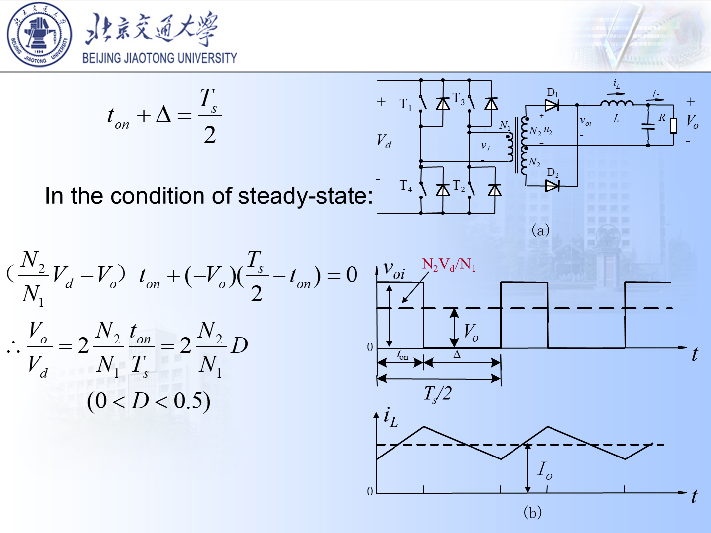

若每组对角开关占空比为 $D$，则：

$$
V_o=2DnV_d
$$

与 Push-Pull 的理想增益形式相同，  
但 Full-Bridge 不需要中心抽头原边，开关电压应力也较低。

推导和 Push-Pull 完全平行。某一组对角开关导通时：

$$
v_1=V_d,\qquad v_{oi}=nV_d
$$

所以：

$$
v_L=nV_d-V_o
$$

两组开关都关断、输出电感续流时：

$$
v_L=-V_o
$$

半周期伏秒平衡：

$$
(nV_d-V_o)t_{on}
+(-V_o)\left(\frac{T_s}{2}-t_{on}\right)=0
$$

整理得到：

$$
\frac{V_o}{V_d}=2n\frac{t_{on}}{T_s}=2nD
$$

即：

$$
V_o=2DnV_d
$$

所以 Full-Bridge 的增益和 Push-Pull 一样，是因为二者每次加到变压器原边的电压幅值都是 $V_d$，并且每周期都有两次有效加能。

### 4. 器件应力

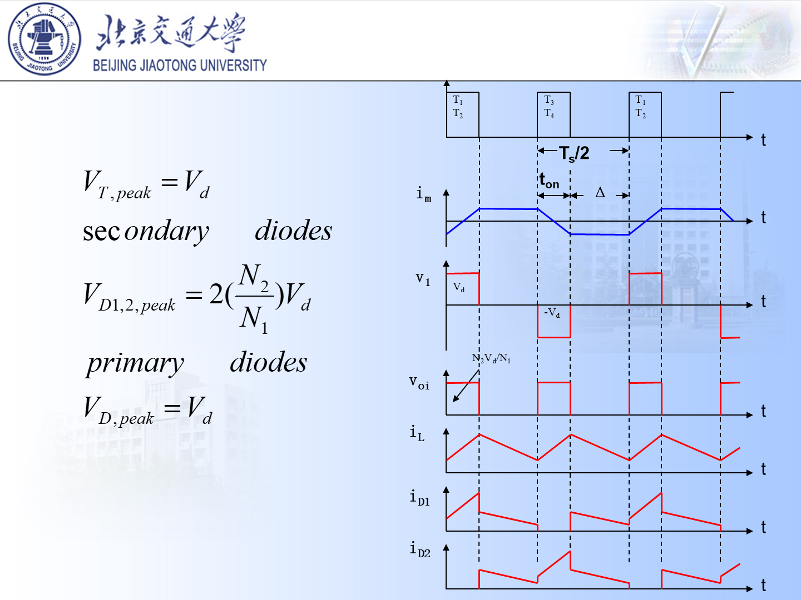

每个开关关断时承受约：

$$
V_d
$$

这使 Full-Bridge 特别适合较大功率场合。

和 Push-Pull 不同，Full-Bridge 没有关断管叠加另一个半原边绕组感应电压的问题。每个桥臂开关主要承受直流母线电压，所以：

$$
V_{T,\mathrm{peak}}\approx V_d
$$

副边中心抽头整流二极管仍然存在“两段副边绕组叠加”的反压，因此：

$$
V_{D1,2,\mathrm{peak}}\approx 2nV_d
$$

课件波形中：

- $v_1$ 是变压器原边电压，正负交替；
- $v_{oi}$ 是整流后的输出电感前端电压，只出现正脉冲；
- $i_L$ 在有效脉冲期间上升，在续流期间下降；
- $i_{D1}$、$i_{D2}$ 交替导通，在续流区间可同时分担电感电流。

### 5. 优缺点

优点：

- 变压器利用率高；
- 开关电压应力较低；
- 适合大功率；
- 原边电压利用充分。

缺点：

- 需要四个开关和复杂驱动；
- 必须设置死区；
- 控制和保护复杂。

### 6. 与 Half-Bridge 的功率等级差别

PPT 中强调：在相同输入、输出电压和功率等级下，Full-Bridge 往往更适合较大功率。  
原因是 Full-Bridge 可以把整个输入电压加到变压器原边，而 Half-Bridge 原边只有约 $V_d/2$。在输出功率相同的情况下，Half-Bridge 往往需要更大的原边电流，器件和变压器电流应力更高。

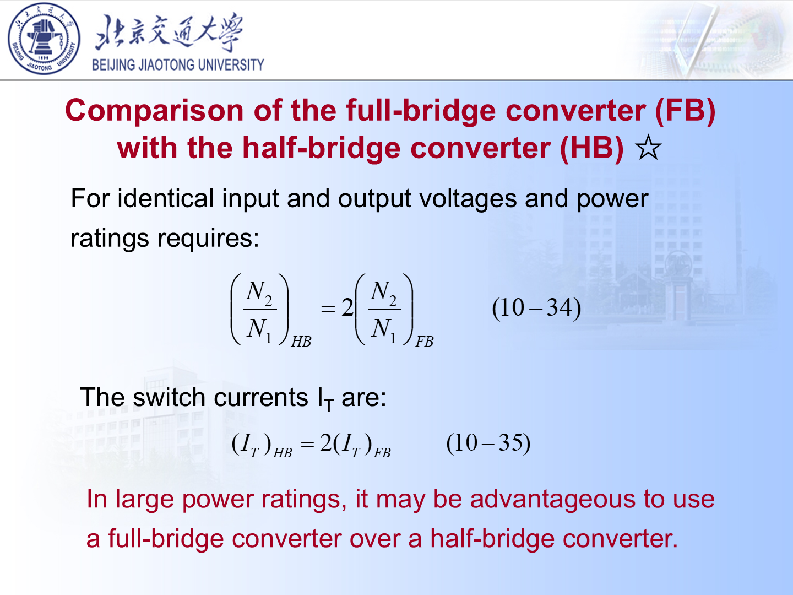

---

## 六、三种拓扑对比

| 拓扑 | 原边电压幅值 | 理想 CCM 增益 | 开关电压应力 | 特点 |
| :--- | :--- | :--- | :--- | :--- |
| Push-Pull | $V_d$ | $2DnV_d$ | 约 $2V_d$ | 两开关，中心抽头，易磁偏 |
| Half-Bridge | $V_d/2$ | $DnV_d$ | 约 $V_d$ | 两开关，电压利用率低 |
| Full-Bridge | $V_d$ | $2DnV_d$ | 约 $V_d$ | 四开关，大功率常用 |

从“隔离 Buck”的角度记忆更稳：

| 拓扑 | 有效整流脉冲高度 $v_{oi}$ | 每周期有效脉冲总时间 | 平均关系 |
| :--- | :--- | :--- | :--- |
| Push-Pull | $nV_d$ | $2DT_s$ | $V_o=nV_d\cdot2D$ |
| Half-Bridge | $nV_d/2$ | $2DT_s$ | $V_o=(nV_d/2)\cdot2D$ |
| Full-Bridge | $nV_d$ | $2DT_s$ | $V_o=nV_d\cdot2D$ |

---

## 七、为什么桥式类电路需要 dead time

桥臂上下管不能同时导通。  
若同时导通，会造成直流母线短路，称为 shoot-through。

因此控制中必须加入 dead time。

但 dead time 过大也会带来：

- 输出电压误差；
- 二极管续流时间增加；
- 损耗增加；
- 波形畸变。

在波形上，dead time 通常落在“两个开关组都关断”的区间。  
这时输出电感仍要维持电流连续，因此二极管续流区会变长。若 dead time 太大，有效脉冲面积减小，等效输出电压会偏低。

---

## 八、磁偏问题

Push-Pull 和桥式变换器都要注意变压器磁通平衡。  
如果正负半周伏秒不相等，会产生直流偏磁。

长期偏磁会导致：

- 磁芯饱和；
- 开关电流急剧上升；
- 器件损坏。

防止方法：

- 对称驱动；
- 电流模式控制；
- 加隔直电容；
- 做好变压器设计。

用伏秒语言描述就是：

$$
\int_0^{T_s}v_1(t)\,dt=0
$$

如果正半周面积长期大于负半周面积，磁通会一周期一周期往同一方向偏移：

$$
\Delta B\propto \int v_1(t)\,dt
$$

磁通偏到磁芯饱和区后，励磁电感等效变小，励磁电流会突然变大，开关电流峰值也会失控。  
Push-Pull 对这个问题更敏感，因为两个半原边绕组、两个开关、驱动延时只要略有不对称，就可能形成直流偏磁。

---

## 九、例题式分析模板

### 1. 先判断拓扑

看原边：

- 两开关 + 中心抽头：Push-Pull；
- 两开关串联 + 分压电容：Half-Bridge；
- 四开关全桥：Full-Bridge。

### 2. 写原边电压幅值

| 拓扑 | 原边电压 |
| :--- | :--- |
| Push-Pull | $\pm V_d$ |
| Half-Bridge | $\pm V_d/2$ |
| Full-Bridge | $\pm V_d$ |

### 3. 乘匝比

副边电压幅值：

$$
V_s=nV_p
$$

### 4. 看一个周期内有几次加能

Push-Pull 和 Full-Bridge 每周期两次有效脉冲，  
Half-Bridge 也是两次，但每次幅值只有一半。

### 5. 得出输出平均电压

理想 CCM 下：

- Push-Pull：

$$
V_o=2DnV_d
$$

- Half-Bridge：

$$
V_o=DnV_d
$$

- Full-Bridge：

$$
V_o=2DnV_d
$$

### 6. 看波形时先分清几个电流

这类题里最容易混的是 $i_L$、$i_D$、$i_1$、$i_m$：

- $i_L$：输出滤波电感电流，CCM 下通常连续，不会因为开关关断立刻变 0；
- $i_{D1},i_{D2}$：副边整流二极管电流，哪个二极管导通就在哪一路出现；
- $i_1$：变压器原边某个绕组电流，通常由“负载折算电流 + 励磁电流”组成；
- $i_m$：励磁电流，只对应励磁电感，不等于负载电流。

若把副边负载电流折算到原边，量级为：

$$
i_{\mathrm{load,ref}}=n\,i_L
$$

更精确地说，某个原边开关导通时开关电流大致为：

$$
i_T\approx n\,i_L+i_m
$$

其中 $n=N_2/N_1$ 按课件记号。大负载时 $n i_L\gg i_m$，所以二极管/开关电流主要由输出电感电流决定；轻载时 $i_m$ 的影响才会明显。

---

## 十、这一讲最容易错的点

1. Push-Pull 的每个开关占空比不能超过 0.5；
2. Push-Pull 开关电压应力约 $2V_d$；
3. Half-Bridge 原边只有 $\pm V_d/2$；
4. Full-Bridge 原边可得到 $\pm V_d$；
5. 桥臂必须有 dead time；
6. 隔离拓扑都要警惕磁偏和漏感尖峰。

---

## 例题 10-7：Push-Pull 有励磁电感时的波形

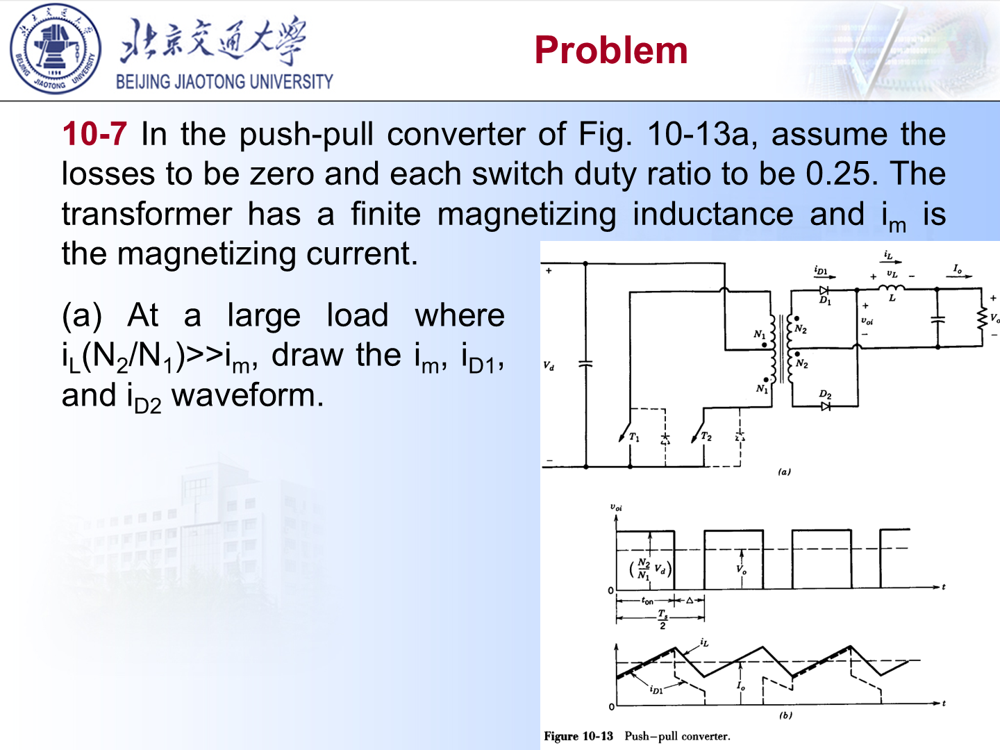

题目条件：

- Push-Pull 变换器；
- 损耗为 0；
- 每个开关占空比 $D=0.25$；
- 变压器有有限励磁电感，$i_m$ 是励磁电流；
- 大负载条件：

$$
i_L\frac{N_2}{N_1}\gg i_m
$$

要求画 $i_m$、$i_{D1}$、$i_{D2}$。

### 1. 先确定时间关系

每个开关导通：

$$
t_{on}=DT_s=0.25T_s=\frac{T_s}{4}
$$

两次导通分别位于两个半周期，所以每半周期：

$$
\frac{T_s}{2}=t_{on}+\Delta
$$

因此：

$$
\Delta=\frac{T_s}{2}-\frac{T_s}{4}=\frac{T_s}{4}
$$

也就是说，一半周期内有一段加能，一段续流；加能和续流时间相等。

### 2. $i_m$ 怎么画

励磁电流由变压器励磁电感决定：

$$
v_1=L_m\frac{di_m}{dt}
$$

所以：

$$
\frac{di_m}{dt}=\frac{v_1}{L_m}
$$

当 $T_1$ 导通时，某半原边绕组加 $+V_d$：

$$
\frac{di_m}{dt}=+\frac{V_d}{L_m}
$$

$i_m$ 线性上升。

当 $T_2$ 导通时，另一半原边绕组加反向电压，相当于：

$$
\frac{di_m}{dt}=-\frac{V_d}{L_m}
$$

$i_m$ 线性下降。

当两个开关都关断、输出侧续流时，副边由二极管续流，原边励磁电流则要通过反并联二极管、寄生电容或钳位通路处理。不同实际电路中这段细节会不同。按课件题目的理想化波形要求，画图重点是：$T_1$ 导通段 $i_m$ 线性上升，$T_2$ 导通段 $i_m$ 线性下降，一个周期后回到原值；关断间隔内可按钳位后的近似平台/过渡段表示。

### 3. 为什么题目说大负载

大负载条件：

$$
i_L\frac{N_2}{N_1}\gg i_m
$$

意思是副边电感电流折算到原边以后，远大于励磁电流。  
因此画 $i_{D1}$、$i_{D2}$ 时，主要看输出电感电流经过哪只二极管，而不用把 $i_m$ 对二极管电流的影响画得很复杂。

### 4. $i_{D1}$、$i_{D2}$ 怎么画

当 $T_1$ 导通时，副边极性使 $D_1$ 导通，$D_2$ 截止：

$$
i_{D1}\approx i_L,\qquad i_{D2}=0
$$

这段 $i_L$ 上升，所以 $i_{D1}$ 也随之上升。

当 $T_2$ 导通时，副边极性反过来，$D_2$ 导通，$D_1$ 截止：

$$
i_{D2}\approx i_L,\qquad i_{D1}=0
$$

这段 $i_L$ 也上升，所以 $i_{D2}$ 也随之上升。

当两个开关都关断时，输出电感需要续流，两只副边二极管同时导通并分担电流：

$$
i_{D1}\approx i_{D2}\approx \frac{i_L}{2}
$$

这段输出电感电压为 $-V_o$，所以 $i_L$ 下降，两个二极管电流也随 $i_L/2$ 下降。

### 5. 最后得到的波形特征

- $i_m$：正向导通期间线性上升，反向导通期间线性下降，稳态时一个周期后回到原值；
- $i_{D1}$：$T_1$ 导通时约等于 $i_L$，关断续流时约等于 $i_L/2$，$T_2$ 导通时为 0；
- $i_{D2}$：$T_2$ 导通时约等于 $i_L$，关断续流时约等于 $i_L/2$，$T_1$ 导通时为 0；
- 因为 $D=0.25$，有效导通段和续流段长度都为 $T_s/4$。

一句话：$i_m$ 是变压器励磁支路电流，按原边电压积分变化；$i_{D1}$、$i_{D2}$ 是副边整流电流，按副边极性和输出电感续流路径分配。

## 课件对齐补充：每周期两次加能的时间关系

Push-Pull、Half-Bridge、Full-Bridge 的课件推导里都有一个容易漏掉的时间关系：每半个周期内有一次有效加能，且

$$
t_{on}+\Delta=\frac{T_s}{2}
$$

其中 $\Delta$ 是输出电感续流、二极管续流的下降区间。每个开关或每组桥臂的占空比都必须满足：

$$
0<D<0.5
$$

所以公式里的 $D$ 不是整个桥“合计导通占空比”，而是单个开关或单个对角开关组的导通占空比。

输出电感纹波可按 Buck 思路写：

Push-Pull / Full-Bridge：

$$
\Delta i_L=\frac{(nV_d-V_o)DT_s}{L}
$$

Half-Bridge：

$$
\Delta i_L=\frac{(nV_d/2-V_o)DT_s}{L}
$$

## 课件补充：桥式电路中的隔直电容 $C_b$

课件在 Half-Bridge / Full-Bridge 实用电源图里问 $C_b$ 的作用。可以这样答：

- 隔断变压器原边可能出现的直流分量；
- 帮助实现正负半周伏秒平衡；
- 减少直流偏磁，防止磁芯饱和；
- 在实际桥式电源中也可作为耦合/谐振/软开关网络的一部分，具体要看电路位置。

考试若没有给复杂软开关背景，优先答“隔直、防偏磁、保持伏秒平衡”。

## Full-Bridge 与 Half-Bridge 对比公式

课件强调：相同输入、输出电压和功率等级下，Full-Bridge 比 Half-Bridge 更适合大功率。原因可以用两个公式记：

$$
\left(\frac{N_2}{N_1}\right)_{HB}
=2\left(\frac{N_2}{N_1}\right)_{FB}
$$

$$
I_{T,HB}=2I_{T,FB}
$$

直观解释：Half-Bridge 原边只有约 $V_d/2$，要传同样功率就需要更大的电流；Full-Bridge 能把整个 $V_d$ 加到原边，电压利用率更高，器件电流压力更小。

## 器件应力速查

| 拓扑 | 原边开关电压应力 | 副边二极管反压口径 |
| :--- | :--- | :--- |
| Push-Pull | 约 $2V_d$ | 约 $2nV_d$ |
| Half-Bridge | 约 $V_d$ | 约 $nV_d$ |
| Full-Bridge | 约 $V_d$ | 约 $2nV_d$ |

这里 $n=N_2/N_1$，与课件记号一致。实际选型还要叠加漏感尖峰、输入过压和安全裕量。

## 十一、考前速记

1. Push-Pull：

$$
V_o=2DnV_d,\qquad V_{\mathrm{sw}}\approx2V_d
$$

2. Half-Bridge：

$$
V_o=DnV_d,\qquad V_{\mathrm{sw}}\approx V_d
$$

3. Full-Bridge：

$$
V_o=2DnV_d,\qquad V_{\mathrm{sw}}\approx V_d
$$

4. $D<0.5$ 是双管交替类拓扑的重要限制。
5. 大功率时 Full-Bridge 往往更有优势。
